# The MVP Execution Trace

When a package manager requests `somePackage` from the host adapter:

```mermaid
flowchart TD
    START([Package request]) --> LOCAL_CACHE{LOCAL_CACHE<br/>Plaintext in CAS?}
    LOCAL_CACHE -- Hit --> SERVE_RETAINED([SERVE_RETAINED<br/>Serve retained plaintext])
    LOCAL_CACHE -- Miss --> LEDGER_LOOKUP{LEDGER_LOOKUP<br/>Canonical asset present?}

    LEDGER_LOOKUP -- Present --> LOAD_DEPLOYMENT[LOAD_DEPLOYMENT<br/>Load authenticated descriptor, hash-card, and live parameter sets]
    LEDGER_LOOKUP -- Absent --> FF_FETCH[FF_FETCH<br/>Fetch exact NPM tgz]
    FF_FETCH --> FF_VERIFY{FF_VERIFY<br/>Upstream integrity valid?}
    FF_VERIFY -- No --> HALT([HALT<br/>Hard failure])
    FF_VERIFY -- Yes --> UPSTREAM_READY[UPSTREAM_READY<br/>Verified NPM plaintext available]
    UPSTREAM_READY --> CAS_COMMIT_UPSTREAM[CAS_COMMIT_UPSTREAM<br/>Persist upstream plaintext in global CAS]
    CAS_COMMIT_UPSTREAM --> SERVE_UPSTREAM([SERVE_UPSTREAM<br/>Serve initiating install])
    UPSTREAM_READY -. Start asynchronous bootstrap .-> FF_BUILD[FF_BUILD<br/>Allocate deployment identity, generate master scalar,<br/>parameter set, capsule randomness, and IV;<br/>encrypt per piece group, build sidecar and hash-card]
    FF_BUILD --> REGISTRATION_RACE{REGISTRATION_RACE<br/>State-locked registration result}
    REGISTRATION_RACE -- Lost --> RACE_LOSS_DESTROY[RACE_LOSS_DESTROY<br/>Destroy local ciphertext, sidecar,<br/>master scalar, and decrypt-capable state]
    RACE_LOSS_DESTROY --> BOOTSTRAP_DONE([BOOTSTRAP_DONE])
    REGISTRATION_RACE -- Won --> PARAMSET_REGISTER[PARAMSET_REGISTER<br/>Parameter set marked live; sidecar root registered]
    PARAMSET_REGISTER --> ESCROW_CUSTODY[ESCROW_CUSTODY<br/>First Finder retains master scalar as escrow custodian]
    ESCROW_CUSTODY --> FF_SEED[FF_SEED<br/>Hand ciphertext and sidecar to seed host]
    FF_SEED --> BOOTSTRAP_DONE

    LOAD_DEPLOYMENT --> MANIFEST_GATE{MANIFEST_GATE<br/>Suite compatible, manifest valid, sidecar authenticated?}
    MANIFEST_GATE -- No --> HALT
    MANIFEST_GATE -- Yes --> CIPHERTEXT_ACQUIRE[CIPHERTEXT_ACQUIRE<br/>Use local ciphertext and sidecar or fetch from peers]
    CIPHERTEXT_ACQUIRE --> CIPHERTEXT_VERIFY{CIPHERTEXT_VERIFY<br/>Bao paths match ciphertext and sidecar roots?}
    CIPHERTEXT_VERIFY -- No --> HALT
    CIPHERTEXT_VERIFY -- Yes --> SEED_CIPHERTEXT[SEED_CIPHERTEXT<br/>Persist ciphertext and sidecar in seed host]
    SEED_CIPHERTEXT --> ENTITLEMENT_CHECK{ENTITLEMENT_CHECK<br/>Asset-bound entitlement held?}

    ENTITLEMENT_CHECK -- No --> ENVELOPE_KEYS{ENVELOPE_KEYS<br/>Envelope keys registered?}
    ENVELOPE_KEYS -- No --> KEY_REGISTER[KEY_REGISTER<br/>Register envelope key pair with proofs of possession]
    KEY_REGISTER --> ENTITLEMENT_ACQUIRE
    ENVELOPE_KEYS -- Yes --> ENTITLEMENT_ACQUIRE[ENTITLEMENT_ACQUIRE<br/>Mint or purchase; author posts envelope and delivery proof]
    ENTITLEMENT_ACQUIRE --> DELIVERY_VERIFY{DELIVERY_VERIFY<br/>Contract verifies proof, records interval, transfers}
    DELIVERY_VERIFY -- Rejected --> HALT
    DELIVERY_VERIFY -- Settled --> CREDENTIAL_LOAD
    ENTITLEMENT_CHECK -- Yes --> CREDENTIAL_LOAD[CREDENTIAL_LOAD<br/>Decrypt envelope into memory; check validity]
    CREDENTIAL_LOAD --> ATTEMPT_CONTEXT[ATTEMPT_CONTEXT<br/>Construct AttemptContext for this piece group]
    ATTEMPT_CONTEXT --> STATE_VIEW{STATE_VIEW<br/>Fresh view at declared tier, age within τ_soft?}
    STATE_VIEW -- PENDING_SETTLEMENT --> SETTLEMENT_WAIT[SETTLEMENT_WAIT<br/>Wait, then re-read]
    SETTLEMENT_WAIT --> STATE_VIEW
    STATE_VIEW -- DENIED --> HALT
    STATE_VIEW -- AUTHORIZED --> DECAPSULATE[DECAPSULATE<br/>Decapsulate this group's capsule; derive piece-group key]
    DECAPSULATE --> DECRYPT_GROUP[DECRYPT_GROUP<br/>Decrypt and verify the group's pieces]
    DECRYPT_GROUP -- More groups --> ATTEMPT_CONTEXT
    DECRYPT_GROUP -- Asset complete --> PLAINTEXT_VERIFY{PLAINTEXT_VERIFY<br/>Plaintext root valid?}
    PLAINTEXT_VERIFY -- No --> HALT
    PLAINTEXT_VERIFY -- Yes --> CAS_COMMIT[CAS_COMMIT<br/>Persist plaintext in global CAS]
    CAS_COMMIT --> SERVE_DECRYPTED([SERVE_DECRYPTED<br/>Serve newly decrypted plaintext])
    SERVE_DECRYPTED -. Transfer out observed later .-> INTERVAL_END[INTERVAL_END<br/>Stop attempts at declared tier;<br/>destroy decrypt-capable state at HARD]

    ESCROW_CUSTODY -. Maintainer claim presented later .-> CLAIM_VERIFY{CLAIM_VERIFY<br/>Claim valid and settled?}
    CLAIM_VERIFY -- No --> ESCROW_CUSTODY
    CLAIM_VERIFY -- Yes --> AUTHORITY_TRANSFER[AUTHORITY_TRANSFER<br/>Transfer administration, issuance,<br/>and standing to supersede; register claimant parameter set]
    AUTHORITY_TRANSFER --> ESCROW_ERA_CONTINUES[ESCROW_ERA_CONTINUES<br/>Escrow-era credentials keep working;<br/>later bodies carry a sidecar per live set;<br/>handover optional]
```

The graph's state identifiers define the execution trace; the descriptions below specify what each state does:

* **`LOCAL_CACHE` / `SERVE_RETAINED`.** If the plaintext CAS contains the asset, serve it without network access or authorization. Retained plaintext is outside the authorization boundary.
* **`LEDGER_LOOKUP` / `LOAD_DEPLOYMENT`.** Compute `BLAKE3(packageName@version)` and resolve the canonical asset record. An existing record supplies the authenticated deployment descriptor, hash-card, live parameter sets with their sidecar roots, and transport locator set.
* **`FF_FETCH` / `FF_VERIFY` / `UPSTREAM_READY`.** If the asset is absent, require only that the supported NPM adapter can retrieve it. Fetch the exact `.tgz` and verify its NPM integrity attestation as provenance rather than a safety attestation. Successful verification makes the upstream plaintext available simultaneously to the foreground install and the asynchronous First Finder bootstrap.
* **`CAS_COMMIT_UPSTREAM` / `SERVE_UPSTREAM`.** Persist the verified NPM plaintext in the global CAS and serve the initiating installation. This foreground path waits only for the NPM response and its integrity verification; it does not wait for encryption, registration, seeding, entitlement acquisition, credential delivery, or decryption.
* **`FF_BUILD`.** Asynchronous to the initiating install, obtain a registry-assigned deployment identity under state lock, generate a random master scalar and parameter set if none is live for the asset, random capsule randomness per piece group and a random IV, encrypt with `AesCtrAdapter` keyed per piece group, and construct the header sidecar, the commitments, and the authenticated hash-card.
* **`REGISTRATION_RACE` / `RACE_LOSS_DESTROY` / `BOOTSTRAP_DONE`.** The first state-locked escrow registration wins. A loser destroys its local ciphertext, sidecar, master scalar, expanded cipher state, buffered keystream, and other decrypt-capable derivatives, then ends its bootstrap attempt. Neither result affects the plaintext already supplied to the initiating install.
* **`PARAMSET_REGISTER` / `ESCROW_CUSTODY` / `FF_SEED`.** The winner's parameter set is marked live for the asset and the sidecar root is registered under it. The First Finder retains the master scalar under `IKeyCustodyAdapter` as escrow custodian, authors credentials only for grants the escrow contract authorizes, and hands ciphertext and sidecar to `ISeedHostAdapter`, reaching `BOOTSTRAP_DONE`. The First Finder never obtains publisher authority, nobody contacts it to read or transfer, and none of these states block the initiating install.
* **`MANIFEST_GATE`.** Authenticate the canonical record and hash-card, resolve every suite component, validate piece geometry, piece-group size, addressable extent, and index bounds, and authenticate the header sidecar against its root with each capsule's well-formedness check. Any failure reaches `HALT` before acquisition or any credential is exercised.
* **`CIPHERTEXT_ACQUIRE` / `CIPHERTEXT_VERIFY` / `SEED_CIPHERTEXT`.** Use locally produced ciphertext and sidecar or fetch them through the active transport and discovery adapters, verify Bao authentication paths against the ciphertext and sidecar roots, and persist the verified objects in the seed host.
* **`ENTITLEMENT_CHECK` / `ENVELOPE_KEYS` / `KEY_REGISTER` / `ENTITLEMENT_ACQUIRE` / `DELIVERY_VERIFY`.** Check for an asset-bound entitlement and acquire one only when absent. An identity registers its envelope key pair once, with proofs of possession under a wallet signature, before its first acquisition. The credential author — the issuer at mint, the seller at purchase — posts the envelope and delivery proof; the contract verifies the proof through the pairing precompiles, records the interval, the recipient's keys, and the envelope digest, emits the envelope, and transfers the entitlement in one settlement. First Finder/NPM assets mint at $0.00 with the First Finder as author; the explicit-publisher dogfood deployment follows its declared paid settlement policy. A rejected delivery reaches `HALT` and, for a purchase, refunds the lock at expiry.
* **`CREDENTIAL_LOAD`.** Decrypt the envelope under the identity's own envelope keys into memory, check the credential against the parameter set's validity equation, and keep the envelope, keys, and interval index as the persistent credential. A missing envelope is recovered from chain history.
* **`ATTEMPT_CONTEXT` / `STATE_VIEW` / `SETTLEMENT_WAIT`.** For each piece group construct the `AttemptContext` and read `evaluateAuthorization` or its semantics-preserving paginated batch form at the deployment's declared tier, requiring a view no older than `τ_soft` and a wallet-control assertion no older than `τ_wallet`. `PENDING_SETTLEMENT` waits and re-reads, `DENIED` reaches `HALT`, and only `AUTHORIZED` reaches decapsulation.
* **`DECAPSULATE` / `DECRYPT_GROUP`.** Decapsulate the group's capsule with the credential, derive the piece-group key, decrypt the group's pieces at their continuous-stream offsets, and verify them. More groups cycle back through a fresh attempt; completing the asset moves to plaintext verification.
* **`PLAINTEXT_VERIFY` / `CAS_COMMIT` / `SERVE_DECRYPTED`.** Verify the plaintext root, store the plaintext in the global CAS, and serve it. Ciphertext and sidecar remain separately in the seed host.
* **`INTERVAL_END`.** When a transfer out of the identity is observed at the declared tier, stop new attempts; when it reaches `HARD`, destroy the decrypted credential, piece-group keys, expanded cipher state, buffered keystream, and every live context. The persistent envelope and keys may remain, since the ledger authorizes nothing they decrypt.
* **`CLAIM_VERIFY` / `AUTHORITY_TRANSFER` / `ESCROW_ERA_CONTINUES`.** A later valid, settled maintainer claim transfers administration, issuance control, and standing to supersede, and registers the claimant's own parameter set as live; the First Finder need not be present. Escrow-era credentials keep working, every later body carries a sidecar for each live set, escrow-era holders may voluntarily migrate to the claimant's set, and handover of the escrow master scalar is an optional encrypted shortcut after which the First Finder erases its copy.
