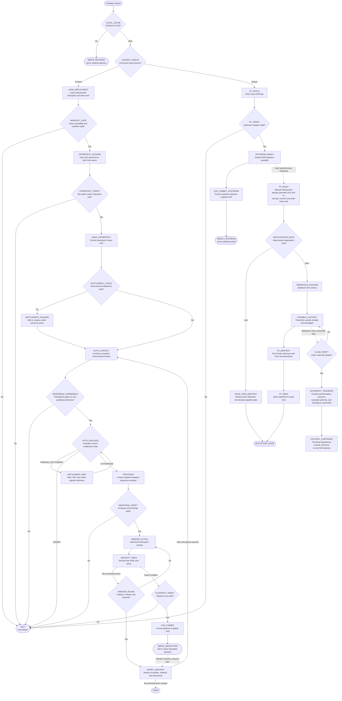

# The MVP Execution Trace

When a package manager requests `somePackage` from the host adapter:

The graph's state identifiers define the execution trace; the descriptions below specify what each state does:

* **`LOCAL_CACHE` / `SERVE_RETAINED`.** If the plaintext CAS contains the asset, serve it without network access or authorization. Retained plaintext is outside the authorization boundary.
* **`LEDGER_LOOKUP` / `LOAD_DEPLOYMENT`.** Compute `BLAKE3(packageName@version)` and resolve the canonical asset record. An existing record supplies the authenticated deployment descriptor, hash-card, and transport locator set.
* **`FF_FETCH` / `FF_VERIFY` / `UPSTREAM_READY`.** If the asset is absent, require only that the supported NPM adapter can retrieve it. Fetch the exact `.tgz` and verify its NPM integrity attestation as provenance rather than a safety attestation. Successful verification makes the upstream plaintext available simultaneously to the foreground install and the asynchronous First Finder bootstrap.
* **`CAS_COMMIT_UPSTREAM` / `SERVE_UPSTREAM`.** Persist the verified NPM plaintext in the global CAS and serve the initiating installation. This foreground path waits only for the NPM response and its integrity verification; it does not wait for encryption, registration, threshold custody, seeding, entitlement acquisition, authorization, provisioning, or decryption.
* **`FF_BUILD`.** Asynchronous to the initiating install, obtain a registry-assigned deployment identity under state lock, generate a random content key and IV, encrypt with `AesCtrAdapter`, and construct the commitments and authenticated hash-card.
* **`REGISTRATION_RACE` / `RACE_LOSS_DESTROY` / `BOOTSTRAP_DONE`.** The first state-locked escrow registration wins. A loser destroys its local ciphertext, content key, expanded cipher state, buffered keystream, and other decrypt-capable derivatives, then ends its bootstrap attempt. Neither result affects the plaintext already supplied to the initiating install.
* **`THRESHOLD_ESCROW` / `DURABLE_CUSTODY` / `FF_DESTROY` / `FF_SEED`.** The winner distributes content-key shares into the real threshold suite and waits for durable acknowledgment. It then destroys every local content-key copy and derivative, hands ciphertext to `ISeedHostAdapter`, and reaches `BOOTSTRAP_DONE`. The First Finder never obtains publisher authority, and none of these states block the initiating install.
* **`MANIFEST_GATE`.** Authenticate the canonical record and hash-card, resolve every suite component, and validate piece geometry, addressable extent, and index bounds. Any failure reaches `HALT` before acquisition or authorization.
* **`CIPHERTEXT_ACQUIRE` / `CIPHERTEXT_VERIFY` / `SEED_CIPHERTEXT`.** Use locally produced ciphertext or fetch it through the active transport and discovery adapters, verify Bao authentication paths against the ciphertext root, and persist the verified object in the seed host.
* **`ENTITLEMENT_CHECK` / `ENTITLEMENT_ACQUIRE`.** Check for an asset-bound entitlement and mint or acquire one only when absent. First Finder/NPM assets mint at $0.00; the explicit-publisher dogfood deployment follows its declared paid settlement policy.
* **`AUTH_CONTEXT` / `REFERENCE_AGREEMENT`.** Construct the complete `AuthorizationContext`. Threshold participants must authenticate and agree on one exact settlement reference satisfying the deployment's tier; disagreement reaches `HALT`.
* **`AUTH_EVALUATE` / `SETTLEMENT_WAIT`.** Call `evaluateAuthorization` or its semantics-preserving paginated batch form. `PENDING_SETTLEMENT` waits and cycles back against the same agreed reference, `DENIED` reaches `HALT`, and only `AUTHORIZED` reaches provisioning.
* **`PROVISION` / `RESPONSE_VERIFY`.** Produce a fresh response envelope wrapped to the requester's key-agreement public key. Verify the context commitment, recipient, suite, keyset, decryption-material type, authentication, and both window bounds before entering `WINDOW_ACTIVE`.
* **`WINDOW_ACTIVE` / `DECRYPT_PIECE` / `WINDOW_BOUND`.** Decrypt pieces at their continuous-stream offsets and verify them. More protected bytes cycle through the active window while neither bound has been reached. Reaching the settlement-reference ceiling or volume cap moves to destruction; completing the asset moves to plaintext verification.
* **`PLAINTEXT_VERIFY` / `CAS_COMMIT` / `SERVE_DECRYPTED`.** Verify the plaintext root, store the plaintext in the global CAS, and serve it. Ciphertext remains separately in the seed host; the live window still proceeds to `EXPIRY_DESTROY` when a bound is reached.
* **`EXPIRY_DESTROY`.** At the first window bound, destroy the response envelope, decryption material, expanded cipher state, verification derivatives, buffered keystream, and every live context. Further protected decryption cycles back to `AUTH_CONTEXT`; otherwise the trace reaches `DONE`.
* **`CLAIM_VERIFY` / `AUTHORITY_TRANSFER` / `CUSTODY_CONTINUES`.** A later valid, settled maintainer claim transfers custodial authority, administration, issuance control, and standing to supersede. Operational threshold custody continues uninterrupted under the claimant's authority; no raw content key is delivered, and the First Finder has no remaining copy to transfer.
