<!-- Template: antithesis_dependency_map.md -->
# Dependency Map

## Overview

Draft, 2026-09-23. How the parts of the ChainTorrent MVP fit together and in what order they are built, drawn from the [revised business case](business-case-revised.md), the [technical approach](technical-approach.md), the [workplan](../workplans/current/ChainTorrent%20MVP.md)'s build sequence, and the [MVP Application Requirements](../research/MVP%20Application%20Requirements.md). Groupings are addressed by delivery role: **foundation**, **cryptographic validation harness**, **protocol core and contract suite**, **local daemon and package serving**, **onboarding shells and services**, and **acceptance and release**.

Resolution decays with distance, deliberately. The foundation and harness groupings are mapped at **ticket** resolution: one ticket per source file, which is the node template's unit, so that each ticket is a candidate node the workplan author can promote. Inside the protocol core, the hashing, signature, and swarm milestones are also at ticket resolution, because they depend on nothing the harness measures and run beside it; the remaining protocol core milestones are mapped as **sprints** named by dependency role. Beyond that the map holds **epics**, then **milestones**, then **objectives**. The reason is that implementation of the nearest work will produce discoveries that revise the anticipated order of everything after it, and detail authored now for distant groupings would be rewritten rather than used. When the harness closes, the remaining protocol core milestones are re-mapped to ticket resolution from what was learned, and the decay shifts outward.

Tickets are candidates, not nodes. No node exists in the workplan and none is authored here; a ticket names the source file's role and its dependencies so a node can be written from it through the ordinary authoring path. A ticket is named `crate/module`: the crate directory as the [technical requirements](technical-requirements.md)' file tree spells it, hyphenated, and the module directory, underscored; a Solidity contract is `contracts/ContractName`; a configuration-only ticket is named by its directory.

## Components

Grouped by role. Within a grouping at ticket resolution each row is a ticket; elsewhere each row is a sprint, epic, milestone, or objective as the decay dictates.

### Foundation, at ticket resolution

The workspace every node builds on, the encoding everything hashed or signed shares, the tracing layer that cannot format a secret, and the continuous integration that proves each ticket where the completion boundary requires.

| Ticket | Owns | Depends on | Proves |
| --- | --- | --- | --- |
| `workspace/cargo` | The workspace manifest, `rust-toolchain.toml`, `deny.toml` with the license allowlist, `foundry.toml`, and crate skeletons for `domain`, `workflows`, every `adapters/*` family, and every `apps/*` entry; configuration files with no types and no tests | nothing | The workspace builds and passes the allowlisted checks on Windows, macOS, and Linux |
| `domain/encoding` | The canonical binary encoder and decoder for everything hashed, signed, or stored, with known-answer vectors the Solidity generator mirrors; owns the encoding types and guards | `workspace/cargo` | CR-03 complete-message binding, CR-09 statement encoding, the hash-card's encoding identifier |
| `telemetry/redaction` | The tracing layer: secret-typed values that cannot be formatted, per-request correlation identifiers | `workspace/cargo` | CR-07 exclusion of secrets from logs; RO-04 correlation |
| `workspace/ci` | The continuous-integration definition: the allowlisted checks, `cargo-audit`, `cargo-deny`, and the clean-runner end-to-end job on Windows, macOS, and Linux; a configuration file with no types and no tests | `workspace/cargo` | XA-07 facilities run in CI; NF-M07 |

### Cryptographic validation harness, at ticket resolution

The harness implements the credential KEM, envelope, and delivery proof on both pairing curves, exercises the deployed verifier on Base Sepolia, and records the measurements that fix the piece-group size and confirm the curve (CD-07, AS-21). Every ticket is one Rust source file with its full support system except where the row says otherwise; the row that owns an interface or a type says so.

| Ticket | Owns | Depends on | Proves |
| --- | --- | --- | --- |
| `pairing/bn254` | BN254 implementation with precompile-matching encodings and the declared first-group-only verifier capability; owns the `IPairingAdapter` contract (generators, add, mul, MSM, subgroup check, pairing-product check, capability declaration for second-group arithmetic, encoding) and the pairing types and guards | `workspace/cargo` | CR-10 contract and CR-10 on BN254 |
| `pairing/bls12_381` | BLS12-381 implementation with precompile-matching encodings, subgroup checks on every input, and the declared second-group capability | `pairing/bn254`, for the interface | CR-10 on BLS12-381 |
| `pairing/benchmark` | The arkworks-versus-`halo2curves` measurement of scalar multiplication, multi-scalar multiplication, and pairing on both curves that selects the library; a measurement driver | `pairing/bn254`, `pairing/bls12_381` | The recorded library choice |
| `kdf/hash_to_scalar` | BLAKE3 keyed derivation for the wrapping key from an encapsulated value and context and for every other off-chain derivation; keccak256 hash-to-scalar under domain tags for the identity mapping and the delivery challenge; the XOR wrap and unwrap of a piece-group key under a wrapping key; context strings, serialization, and output lengths frozen with known-answer vectors from an independent implementation | `pairing/bn254`, for the interface; `domain/encoding` | CR-05 derivation, CR-08 identity mapping, CR-11, cross-set agreement |
| `kem/setup` | Parameter set and master scalar generation, random for escrow lineage; owns the `ICredentialKemAdapter` contract with the declared identity-scope capability and the parameter-set, master-scalar, and identity-element types and guards with their encoding contract | `pairing/bn254` | CR-05, CR-08 contract and types, CD-08 |
| `kem/issue` | Credential issuance under the master scalar for one entitlement identity; trivial identity-element refusal; owns the credential and interval-index types and guards | `kem/setup`, `kdf/hash_to_scalar` | CR-08, LC-08 |
| `kem/rerandomize` | Seller-side rerandomization with a private offset, no master scalar | `kem/issue` | CR-08 |
| `kem/validity` | Public validity check of a credential against a parameter set, with encoding and subgroup validation | `kem/issue` | CR-08, EC-06 |
| `kem/encapsulate` | Capsule and encapsulated value per piece group; both identity scopes; owns the capsule, encapsulated-value, and piece-group-context types and guards | `kem/setup` | CR-08 |
| `kem/well_formed` | Capsule well-formedness check | `kem/encapsulate` | CR-08, EC-06 |
| `kem/decapsulate` | Recovery of the encapsulated value from a credential and capsule; the wrapping key through the KDF and the piece-group key by unwrap | `kem/validity`, `kem/well_formed`, `kdf/hash_to_scalar` | CR-08 cross-holder agreement, CR-11 cross-set agreement |
| `envelope/keygen` | Envelope key pair with independent secrets and Schnorr proofs of possession; identity-element rejection; owns the `IKeyAgreementAdapter` contract declaring the envelope algebra and the envelope key pair and envelope types and guards | `kem/issue`, for the credential types; `pairing/bn254` | CR-04 contract, CR-04, LC-08 |
| `envelope/wrap` | Pairing ElGamal encryption of a credential to two registered keys with independent coins | `envelope/keygen` | CR-04 |
| `envelope/unwrap` | Decryption under the recipient's secrets and local validity check | `envelope/wrap`, `kem/validity` | CR-04, EC-06 |
| `proof/challenge` | The keccak256 Fiat–Shamir challenge over the full context schema with domain separation; owns the `IDeliveryProofAdapter` contract declaring the supported envelope algebra and both verifier forms, the mint and transfer statement types with the challenge context schema and delivery-statement version, and their guards | `envelope/keygen`, for the envelope types; `kdf/hash_to_scalar`; `domain/encoding` | CR-09 contract, CR-09 statement binding and fields |
| `proof/prove_mint` | Mint relation prover | `proof/challenge`, `kem/issue`, `envelope/wrap` | CD-01 |
| `proof/prove_transfer` | Transfer relation prover from the seller's fresh decryption and total offset | `proof/challenge`, `kem/rerandomize`, `envelope/unwrap` | CD-02 |
| `proof/verify` | Rust reference verifier in both forms: second-group arithmetic, and hash-weighted pairing product with first-group arithmetic only | `proof/prove_mint`, `proof/prove_transfer` | CR-09 |
| `contracts/PairingLib` | Solidity library over the precompiles in both forms, with contract-side subgroup checks where the precompile does not perform them | `workspace/cargo`, for the Foundry configuration; mirrors `pairing/bn254` and `pairing/bls12_381` | CR-10 on chain |
| `harness-crypto/generate` | The generator emitting Solidity constants and test vectors from the Rust reference for the pairing library and the verifier, including the challenge and identity-mapping vectors | `proof/verify`, `domain/encoding` | CR-09 parity inputs; CR-11 on-chain vectors |
| `contracts/DeliveryVerifier` | Solidity mint and transfer verification over the statement fields, bit-for-bit with `proof/verify`, its constants and vectors generated | `contracts/PairingLib`, `harness-crypto/generate` | CD-03, CR-09 |
| `contracts/deploy` | Deployment script for the verifier on each curve form to Anvil and Base Sepolia, emitting addresses to configuration; exempt from the full support structure as a deployment script | `contracts/DeliveryVerifier` | CD-07 |
| `chain/verifier_client` | Rust binding that submits proofs to the deployed verifier and reads acceptance and gas | `proof/verify`, `contracts/deploy` | CD-03 cross-verification |
| `harness-crypto/vectors` | Algebraic and mutation vector sets: cross-holder agreement, cross-set agreement with two independently generated parameter sets unwrapping one piece-group key, rerandomized validity, non-convertibility, malformed capsules, mutated statement fields, replay | `kem/decapsulate`, `proof/verify` | CR-08, CR-09, CR-11 vectors |
| `harness-crypto/measure` | Size, timing, and gas capture per curve: capsule, envelope, proof bytes; decapsulation per group; prove and verify time; mint and transfer cost as L2 execution and L1 data fee | `harness-crypto/vectors`, `chain/verifier_client` | CD-07, RO-03 |
| `harness-crypto/report` | Release-evidence report; the piece-group size selected and the curve confirmed against the declared budget; the grouping's integration test across the whole chain and its commit | `harness-crypto/measure` | AS-21 |

### Protocol core and contract suite

The hashing, signature, and swarm milestones are at ticket resolution; they depend on nothing the harness measures and run beside it. The remaining milestones are sprints, re-mapped to tickets when the harness closes.

#### Hashing and commitments, at ticket resolution

| Ticket | Owns | Depends on | Proves |
| --- | --- | --- | --- |
| `hashing/blake3_root` | BLAKE3 root and Bao outboard construction over a byte stream; owns the root and outboard types and guards | `domain/encoding` | CR-02 construction |
| `hashing/bao_verify` | Streaming and random-access verification of chunks against a root with an authentication path | `hashing/blake3_root` | CR-02 verification; EC-02 |
| `hashing/bao_challenge` | Random chunk challenge and response for delegated custody and retention audit; carries the milestone's integration test and commit | `hashing/bao_verify` | CR-02 challenges; SW-04 |

#### Signature services and binding schema, at ticket resolution

| Ticket | Owns | Depends on | Proves |
| --- | --- | --- | --- |
| `signature/ed25519` | `Ed25519Adapter` with domain separation and complete-message binding; owns the `ISignatureAdapter` contract and the signature types and guards | `domain/encoding` | CR-03 |
| `signature/secp256k1` | `Secp256k1Adapter` through `alloy`, with EIP-712 typed data for registrations, bindings, and signed intents | `signature/ed25519`, for the interface | CR-03, IW-07, LC-13 intents |
| `signature/binding_schema` | DID Document types with the anchor hash and the verification relationships the binding uses; carries the milestone's integration test and commit | `signature/ed25519`, `domain/encoding` | The binding schema; IW-01 |

#### Swarm transport and seed host, at ticket resolution

| Ticket | Owns | Depends on | Proves |
| --- | --- | --- | --- |
| `transport/rqbit_overlay` | The `[patch.crates-io]` overlay onto tagged `librqbit` carrying the piece-completion hook, the peer-injection call, and the storage-backend trait, with each hook's upstream issue; a dependency configuration exempt from the full support structure | `workspace/cargo` | SW-01 substrate |
| `transport/bittorrent_rqbit` | `ISwarmTransportAdapter` over the overlay: root-to-infohash translation, torrent creation per object with the ciphertext and each sidecar as its own object and locator, Bao verification of every completed piece after the library's check, seeder-map peer injection; owns the transport interface, the locator types, and their guards | `transport/rqbit_overlay`, `hashing/bao_verify` | SW-01, SW-06, EC-02 |
| `discovery/aggregate` | `IPeerDiscoveryAdapter` aggregation over the library's DHT, PEX, and trackers: concurrent sources unioned and deduplicated, none authoritative; owns the discovery interface and the peer types and guards | `transport/bittorrent_rqbit` | SW-02 |
| `discovery/local` | Local-network discovery source | `discovery/aggregate` | SW-02 |
| `discovery/seeder_map` | The on-chain seeder map as a discovery source | `discovery/aggregate`; the chain adapters sprint | SW-02 |
| `seed-host/store` | The root-keyed ciphertext store with holding reason, quota, eviction, and the obligated-versus-voluntary distinction; owns the store types and guards | `hashing/bao_verify` | SW-05; PR-05 separation |
| `seed-host/owned` | `ISeedHostAdapter` owned implementation: persistent seeding independent of sessions, settings passthrough and enforcement, archive enumeration; owns the seed-host interface | `transport/bittorrent_rqbit`, `seed-host/store` | SW-03, SW-07, ST-06 |
| `seed-host/delegated` | Delegation to an external client through its API with Bao custody challenges; carries the milestone's integration test across owned and delegated retrieval and its commit | `seed-host/owned`, `hashing/bao_challenge` | SW-04 |

#### Remaining milestones, as sprints

| Sprint by role | Contents | Depends on |
| --- | --- | --- |
| Domain model | Canonical identity, hash-card, immutable suite, attempt context, entitlement and interval state, custody state, manifest and sidecar bounds, claims, lifecycle transitions; each type authored in the node of the file that first consumes it and housed in the domain crate | the types the harness tickets own; `domain/encoding` |
| Payload cipher and sidecar layer | `AesCtrAdapter` with counter layout and extent rules; the sidecar layer, per live set a capsule and wrapped piece-group key per group under that set's Bao root, each sidecar its own object; manifest and sidecar validation ordering; the `sample_deployment` generator for the site demonstration, which needs the cipher and so lives here rather than in the harness | domain model; the hashing tickets; `kdf/hash_to_scalar` for the wrap |
| Registry and entitlement contracts | Asset records with the per-name version index, deployments and hash-cards, on-chain attestation verification against the source-key table or recorded absence, later escrow deployments, parameter-set liveness with the sidecar-coverage rule and sidecar addition, envelope-key registry, entitlements with interval state and the ownership override that disables standard transfers, issuance and transfer calling the delivery verifier, batched grant requests readable by holders and closed by grant or withdrawal, escrow records per deployment, identity binding, claim-set state layout, batch and paginated views; every identity-bound mutation taking the acting identity and a signed intent verified by ECDSA or ERC-1271, the contracts enforcing lock expiry and no volume limit | harness contracts; domain model |
| Chain, settlement, and entitlement-state adapters | Contract bindings; tier mapping; `evaluateAuthorization` and batch with per-context bindings; quorum view aggregation, two of three at a common reference, stale ignored, divergence and views older than `τ_soft` failing closed; event and calldata reader; intent signing and submission | registry and entitlement contracts |
| Adapter registry and factory | The registry governed by a single project-held key, constructor injection, immutability once bound | registry and entitlement contracts |

### Local daemon and package serving, as epics

| Epic by role | Contents | Depends on |
| --- | --- | --- |
| Durable jobs and configuration | Job store, checkpointing, idempotent restart; versioned configuration registry and the settings catalogue; capability resolution failing closed; IPC with the control-principal and local-presence rules | domain model; `telemetry/redaction` |
| Identity and custody | `IKeyCustodyAdapter` default implementation with holder-seed derivation; identity creation; relayer-paid binding; envelope-key registration; wallet integrations; paired local transfer | the signature tickets; chain adapters; `envelope/keygen`; durable jobs and configuration |
| Plaintext CAS, resolution orchestrator, and package host | Verified atomic CAS of tarballs, extracted per project by the package manager with nothing linking into the store; quota, pinning, eviction; the hedged source order with the catalogue's source deadline and grant wait; upstream for any identity without a credential; the package metadata store; the npm registry protocol served locally with canonical tarball URLs; per-asset independence status | durable jobs and configuration; `hashing/blake3_root` |
| First Finder ingest | npm ingest adapter with attestation validation or recorded absence, metadata capture, and availability as eligibility; foreground serve; background bootstrap job; state-locked registration race; escrow custody of the master scalar; seeding; the finder's grant of the asset's first entitlement to itself | plaintext CAS and package host; the swarm tickets; registry contracts; chain adapters; identity and custody; the KEM, envelope, and mint-proof tickets |
| Credential delivery and per-attempt authorization | Envelope-key registration on first run; the batched grant request job and its pickup from chain events; the prefetch job with pinning, seeding, and set matching; mint and grant delivery, holders fulfilling requests for absent requesters; sale delivery; credential load and recovery; attempt rule with `τ_soft` and `τ_wallet`; decapsulation, unwrap, and decryption; interval-end destruction | chain adapters; identity and custody; the KEM, envelope, and proof tickets; payload cipher; First Finder ingest; the relayer's request endpoint, or self-funded submission on Base Sepolia until it exists |
| Demonstrable milestone | No new subsystem: a second identity on a second machine profile installs a pinned closure the First Finder ingested, at the registry's speed with requests registered and ciphertext prefetched, then with the registry unavailable, through the packaged daemon and package host over the swarm, on a grant fulfilled while it was offline; the north star, first-run independence, and the latency guardrail measured on the dogfood population | credential delivery and per-attempt authorization; plaintext CAS and package host; First Finder ingest; the swarm tickets |

### Onboarding shells and services, as milestones

| Milestone by role | Contents | Depends on |
| --- | --- | --- |
| Installation coordinator | Durable install plan, platform detection, signed artifacts, service lifecycle, reversible package-manager redirect, repair, update, uninstall, health probe, the consent items and the first-run cost disclosure | durable jobs and configuration; identity and custody |
| Visual Studio Code extension and npm bootstrap | Thin shells over the coordinator | installation coordinator |
| Desktop application and CLI | Tauri and Rust control surfaces | installation coordinator |
| Relayer or paymaster | Free-path sponsorship under a global per-window budget and maximum liability with per-identity limits as one layer; the identity's chain-level form and the sponsorship mechanism chosen here under LC-13; cost and budget reporting | chain adapters, so it may start before the daemon grouping closes |
| Explicit publisher path | Publisher-derived lineage; publisher proof adapters; swarm-native publication of the dependency closure; the issuance policy service | First Finder ingest; identity and custody |
| Claim verifier and escrow claim | Attestor service with revocable key; claim set established from upstream metadata at verification; claim-set vouchers; claimant parameter set; optional handover; sidecar addition; voluntary migration | registry contracts; explicit publisher path; credential delivery |
| Project seed host and site | Persistent first seeder of the core closure holding an entitlement and credential for every asset it seeds; static site; WebAssembly demonstration | `seed-host/owned`; explicit publisher path; payload cipher and sidecar layer, for the sample deployment |
| Observability | RO-03 metrics, RO-04 correlation, RO-05 health, latency budget evaluation | every component that emits |
| Demonstration harness | Controlled participants, wallets, chain state, failures, and the deliberately incompatible adapter declarations the incompatibility scenario rejects | every component under test |

### Acceptance and release, as objectives

| Objective by role | Contents | Depends on |
| --- | --- | --- |
| Transaction flow proof | Priced primary issuance and secondary transfer through the packaged applications on the Base mainnet pilot | explicit publisher path; credential delivery; relayer; external review dispositioned |
| Acceptance scenarios | Every acceptance scenario on clean machines through packaged applications | every milestone |
| External cryptographic review closed | Findings dispositioned before any priced deployment | harness report |
| Legal prerequisites | License text, regulatory review, export confirmation | none technical |
| Dogfood baseline and release | ChainTorrent published swarm-natively; baseline metrics recorded; release evidence complete | acceptance scenarios; review; legal |

## Integration Points

Where one component's output becomes another's input across a boundary that an integration test must cross, and the milestone whose integration test crosses it.

| Integration point | Producer | Consumer | Boundary crossed | Crossed in |
| --- | --- | --- | --- | --- |
| Verifier parity | `proof/verify` | `contracts/DeliveryVerifier` via `chain/verifier_client` | Rust to chain; bit-for-bit acceptance on every vector | Delivery proof and Solidity verifier |
| Precompile encoding | `pairing/bn254`, `pairing/bls12_381` | `contracts/PairingLib` | Rust encoding to precompile input | Delivery proof and Solidity verifier |
| Piece-group key | `kem/decapsulate` and `kdf/hash_to_scalar` | payload cipher | The decapsulation-to-cipher seam preserved for a future multi-key suite | Payload cipher and sidecar layer |
| Sidecar root | `kem/encapsulate` and the wrapped key from `kdf/hash_to_scalar` | commitments and hash-card | Per live set, capsule and wrapped key per group committed by that set's Bao root; each sidecar its own object | Payload cipher and sidecar layer |
| Envelope in settlement | `envelope/wrap` and `proof/prove_*` | registry and entitlement contracts | Calldata and event; digest stored | Registry and entitlement contracts |
| Signed intent | `signature/secp256k1` | registry and entitlement contracts | EIP-712 intent to ECDSA or ERC-1271 verification | Registry and entitlement contracts |
| Attempt context | domain model | entitlement-state adapter and credential delivery | View call at the declared tier from a quorum of configured nodes | Chain, settlement, and entitlement-state adapters |
| Resolution order | resolution orchestrator | plaintext CAS, ciphertext store, swarm transport, First Finder ingest | Local, encrypted, swarm, upstream, hedged | Plaintext CAS, resolution orchestrator, and package host |
| Package-manager protocol | package host adapter | npm | HTTP registry protocol; resolution stays in npm; canonical tarball URLs so lockfiles stay portable | Plaintext CAS, resolution orchestrator, and package host |
| Persistent credential | envelope and custody | credential delivery | Stored only under `IKeyCustodyAdapter` | Identity and custody |
| Grant request to holder | request job, through the relayer | registry request record; any holder's grant service | Batched sponsored request; holder reads open requests and fulfils them for absent requesters | Credential delivery and per-attempt authorization |
| Grant pickup from events | registry mint and grant events | request job and credential engine | Envelope recovered from chain history on the next run; set matched against held deployments | Credential delivery and per-attempt authorization |
| Installer to daemon | installation coordinator | daemon, package host, seed host | Service lifecycle and IPC | Installation coordinator |
| Shells to coordinator | extension, npm bootstrap, desktop, CLI | installation coordinator | One coordinator, identical postcondition | Extension and npm bootstrap; desktop and CLI |
| Relayer to contracts | relayer | identity binding, requests, mint | Sponsored transactions under policy | Relayer or paymaster |
| Verifier voucher to contract | claim verifier | escrow claim contract surface | Voucher bound to claimant, set, contract, chain, nonce, expiry | Claim verifier and escrow claim |
| Site demonstration | WebAssembly build of the client crates | browser | Same crates as the client; no service on the read path | Project seed host and site |

## Conflict Flags

- **Grouping membership versus dependency order.** The hashing, signature, and swarm tickets sit in the protocol core grouping and depend on no contract sprint, so they run in parallel with the harness and before the contracts.
- **The demonstrable milestone needs a grant.** Resolving against the swarm with the registry down requires a second identity to hold a credential, so the milestone sits after credential delivery and per-attempt authorization, not at the package host.
- **Escrow claim is last by dependency.** The escrow record carries no maintainer commitment and the verifier establishes the claim set at verification time, so the milestone waits only on the publisher path, the registry contracts, and credential delivery.
- **Two verifier forms, one primary.** `contracts/PairingLib` exists in both forms so the harness measures both; BLS12-381 ships as the primary form on Base and BN254 is retained.
- **The delivery verifier is built in the harness and consumed by the contract sprint.** It is the first shipped contract, written to production standard, with its constants and vectors generated from the Rust reference.
- **Identity and custody sits in the daemon grouping but the installer needs it.** The dependency runs the right way, coordinator depends on custody, and the epic is placed early in the grouping.
- **The identity's chain-level form is chosen at the relayer milestone.** The contract sprint takes every identity-bound mutation as a signed intent under LC-13, so neither a contract account under a paymaster nor an externally owned account under a relayer is precluded.

## Dependencies

The dependency graph across the groupings. Edges point from producer to consumer. Identifiers are descriptive; nothing is numbered.

```mermaid
flowchart TB
    subgraph foundation["Foundation"]
        direction TB
        f_ws["workspace/cargo"]
        f_enc["domain/encoding"]
        f_red["telemetry/redaction"]
        f_ci["workspace/ci"]
        f_ws --> f_enc
        f_ws --> f_red
        f_ws --> f_ci
    end

    subgraph harness["Cryptographic validation harness"]
        direction TB
        pair_bn["pairing/bn254"]
        pair_bls["pairing/bls12_381"]
        pair_bench["pairing/benchmark"]
        kdf["kdf/hash_to_scalar"]
        kem_setup["kem/setup"]
        kem_issue["kem/issue"]
        kem_rerand["kem/rerandomize"]
        kem_valid["kem/validity"]
        kem_encap["kem/encapsulate"]
        kem_wf["kem/well_formed"]
        kem_decap["kem/decapsulate"]
        env_keygen["envelope/keygen"]
        env_wrap["envelope/wrap"]
        env_unwrap["envelope/unwrap"]
        proof_chal["proof/challenge"]
        proof_mint["proof/prove_mint"]
        proof_xfer["proof/prove_transfer"]
        proof_verify["proof/verify"]
        sol_pair["contracts/PairingLib"]
        sol_gen["harness-crypto/generate"]
        sol_verify["contracts/DeliveryVerifier"]
        sol_deploy["contracts/deploy"]
        chain_vc["chain/verifier_client"]
        h_vectors["harness-crypto/vectors"]
        h_measure["harness-crypto/measure"]
        h_report["harness-crypto/report"]

        pair_bn --> pair_bls
        pair_bn --> pair_bench
        pair_bls --> pair_bench
        pair_bn --> kdf
        pair_bn --> kem_setup
        kem_setup --> kem_issue
        kdf --> kem_issue
        kem_issue --> kem_rerand
        kem_issue --> kem_valid
        kem_setup --> kem_encap
        kem_encap --> kem_wf
        kem_valid --> kem_decap
        kem_wf --> kem_decap
        kdf --> kem_decap
        kem_issue --> env_keygen
        pair_bn --> env_keygen
        env_keygen --> env_wrap
        env_wrap --> env_unwrap
        kem_valid --> env_unwrap
        env_keygen --> proof_chal
        kdf --> proof_chal
        proof_chal --> proof_mint
        kem_issue --> proof_mint
        env_wrap --> proof_mint
        proof_chal --> proof_xfer
        kem_rerand --> proof_xfer
        env_unwrap --> proof_xfer
        proof_mint --> proof_verify
        proof_xfer --> proof_verify
        proof_verify --> sol_gen
        sol_pair --> sol_verify
        sol_gen --> sol_verify
        sol_verify --> sol_deploy
        proof_verify --> chain_vc
        sol_deploy --> chain_vc
        kem_decap --> h_vectors
        proof_verify --> h_vectors
        h_vectors --> h_measure
        chain_vc --> h_measure
        h_measure --> h_report
    end

    subgraph core["Protocol core and contract suite"]
        direction TB
        h_root["hashing/blake3_root"]
        h_verify["hashing/bao_verify"]
        h_chal["hashing/bao_challenge"]
        sig_ed["signature/ed25519"]
        sig_k1["signature/secp256k1"]
        sig_did["signature/binding_schema"]
        tr_overlay["transport/rqbit_overlay"]
        tr_rqbit["transport/bittorrent_rqbit"]
        disc_agg["discovery/aggregate"]
        disc_local["discovery/local"]
        disc_map["discovery/seeder_map"]
        sh_store["seed-host/store"]
        sh_owned["seed-host/owned"]
        sh_deleg["seed-host/delegated"]
        s_domain["Sprint: domain model"]
        s_cipher["Sprint: payload cipher and sidecar layer"]
        s_registry["Sprint: registry and entitlement contracts"]
        s_chain["Sprint: chain, settlement, entitlement-state adapters"]
        s_adreg["Sprint: adapter registry and factory"]

        h_root --> h_verify
        h_verify --> h_chal
        sig_ed --> sig_k1
        sig_ed --> sig_did
        tr_overlay --> tr_rqbit
        h_verify --> tr_rqbit
        tr_rqbit --> disc_agg
        disc_agg --> disc_local
        disc_agg --> disc_map
        h_verify --> sh_store
        tr_rqbit --> sh_owned
        sh_store --> sh_owned
        sh_owned --> sh_deleg
        h_chal --> sh_deleg
        s_domain --> s_cipher
        h_root --> s_cipher
        s_domain --> s_registry
        s_registry --> s_chain
        s_registry --> s_adreg
        s_chain --> disc_map
    end

    subgraph daemon["Local daemon and package serving"]
        direction TB
        e_jobs["Epic: durable jobs and configuration"]
        e_identity["Epic: identity and custody"]
        e_cas["Epic: plaintext CAS, resolution orchestrator, and package host"]
        e_ff["Epic: First Finder ingest"]
        e_deliver["Epic: credential delivery and per-attempt authorization"]
        e_demo["Epic: demonstrable milestone"]

        e_jobs --> e_cas
        e_jobs --> e_identity
        e_cas --> e_ff
        e_identity --> e_ff
        e_identity --> e_deliver
        e_ff --> e_deliver
        e_deliver --> e_demo
        e_cas --> e_demo
        e_ff --> e_demo
    end

    subgraph shells["Onboarding shells and services"]
        direction TB
        m_installer["Milestone: installation coordinator"]
        m_ext["Milestone: extension and npm bootstrap"]
        m_desktop["Milestone: desktop application and CLI"]
        m_relayer["Milestone: relayer or paymaster"]
        m_publisher["Milestone: explicit publisher path"]
        m_claim["Milestone: claim verifier and escrow claim"]
        m_seedhost["Milestone: project seed host and site"]
        m_obs["Milestone: observability"]
        m_demo["Milestone: demonstration harness"]

        m_installer --> m_ext
        m_installer --> m_desktop
        m_publisher --> m_claim
        m_publisher --> m_seedhost
    end

    subgraph release["Acceptance and release"]
        direction TB
        o_txflow["Objective: transaction flow proof"]
        o_accept["Objective: acceptance scenarios"]
        o_review["Objective: external cryptographic review closed"]
        o_legal["Objective: legal prerequisites"]
        o_release["Objective: dogfood baseline and release"]

        o_txflow --> o_accept
        o_accept --> o_release
        o_review --> o_release
        o_legal --> o_release
    end

    f_ws --> pair_bn
    f_ws --> sol_pair
    f_ws --> tr_overlay
    f_enc --> kdf
    f_enc --> proof_chal
    f_enc --> sol_gen
    f_enc --> h_root
    f_enc --> sig_ed
    f_enc --> s_domain
    f_red --> e_jobs

    kem_issue --> s_domain
    h_report --> s_registry
    sol_verify --> s_registry
    kem_decap --> s_cipher
    kdf --> s_cipher

    s_domain --> e_jobs
    h_root --> e_cas
    sh_owned --> e_ff
    s_registry --> e_ff
    kem_setup --> e_ff
    proof_mint --> e_ff
    env_wrap --> e_ff
    s_chain --> e_deliver
    s_cipher --> e_deliver
    proof_xfer --> e_deliver
    env_unwrap --> e_deliver
    sig_k1 --> e_identity
    sig_did --> e_identity
    s_chain --> e_identity
    env_keygen --> e_identity
    sh_owned --> e_demo

    e_jobs --> m_installer
    e_identity --> m_installer
    s_chain --> m_relayer
    e_ff --> m_publisher
    e_identity --> m_publisher
    s_registry --> m_claim
    e_deliver --> m_claim
    sh_owned --> m_seedhost
    s_cipher --> m_seedhost
    e_cas --> m_obs
    e_deliver --> m_obs
    e_cas --> m_demo

    m_publisher --> o_txflow
    e_deliver --> o_txflow
    m_relayer --> o_txflow
    o_review --> o_txflow
    m_ext --> o_accept
    m_desktop --> o_accept
    m_claim --> o_accept
    m_seedhost --> o_accept
    m_obs --> o_accept
    m_demo --> o_accept
    h_report --> o_review
```

**Reading the graph.** Everything in the foundation and harness subgraphs, and every ticket-named node in the protocol core, is one source file. The harness's `contracts/DeliveryVerifier` is consumed directly by the registry sprint; the harness's `kem/*`, `envelope/*`, and `proof/*` files are consumed directly by the First Finder, credential delivery, and identity epics. The hashing, signature, and swarm tickets have no incoming edge from any contract sprint, which is the point that bytes can move before any chain exists. The relayer milestone depends only on the chain adapters and can be built as soon as they exist. The demonstrable milestone has incoming edges from credential delivery, the package host, First Finder ingest, and the seed host, and nothing depends on it.

## Sequencing

`workspace/cargo` precedes everything. Within the harness the starting points are `pairing/bn254` and `contracts/PairingLib`; every other ticket has a producer, the tracks converge at `chain/verifier_client` and `harness-crypto/vectors`, and the grouping closes at `harness-crypto/report`, whose node carries the integration test across the whole chain and the commit. The hashing tickets start from `domain/encoding`, the signature tickets from `domain/encoding`, and the swarm tickets from `transport/rqbit_overlay` and `hashing/bao_verify`; each of those milestones closes at the ticket its table names.

Across groupings the sequence is the [milestones](milestones.md)' order, with the parallelism the graph makes visible: the hashing, signature, and swarm tickets run beside the harness and the contract sprints; the identity and custody epic begins as soon as the signature tickets and the chain sprint exist, before the CAS epic, because the installation coordinator needs it; the relayer milestone begins on the chain adapters; the demonstrable milestone follows credential delivery.

The decay rule governs re-mapping. When the `harness-crypto/report` node commits, the remaining protocol core milestones are re-mapped from sprints to tickets using what the harness taught, the daemon grouping from epics to sprints, and so on outward. Each re-mapping is a revision of this document in place.

## Risk Mitigation

| Risk from the register | How the map addresses it |
| --- | --- |
| R-02, cost exceeds the latency budget | The harness grouping is entirely at ticket resolution and precedes every node that encrypts a registered deployment; `harness-crypto/report` records the piece-group size and confirms the curve before the remaining sprints are re-mapped |
| R-03, verifier flaw | `proof/verify` and `contracts/DeliveryVerifier` are separate tickets with `chain/verifier_client` as the parity integration point and `harness-crypto/generate` as the source of the contract's constants and vectors; `harness-crypto/vectors` carries the mutation and replay sets |
| R-04, execution breadth | Decaying resolution means no distant detail is authored to be rewritten; the demonstrable milestone is reachable before publishing and claims |
| R-09, open selections | Every node that encrypts a registered deployment waits on the harness report; the identity epic carries custody recovery UX |
| R-12, chain properties | Both curve implementations and both verifier forms are harness tickets, so a precompile change on Base selects the retained form rather than rebuilding |
| R-13, escrow record | No commitment and no custodian; the claim milestone has no policy gate |
| R-14, adapter registry governance | The adapter registry sprint is separate from the registry contracts sprint, so its single project-held key can be replaced without touching entitlements |

## Decisions

**Crate and path layout.** One workspace with a domain crate, a workflows crate, a crate per adapter family, and a crate per deployable; tickets are named by crate and module as the technical requirements' file tree spells them.

**Ticket granularity for the KEM.** One function per file as mapped.

**BitTorrent library.** `librqbit` compiled in as a soft fork through a `[patch.crates-io]` overlay onto tagged upstream releases, hooks submitted upstream, commit pinned; no owned transport in the MVP; the hard-fork trigger is recorded in the product requirements.

**The harness's delivery verifier.** The shipped contract, written to production standard from the start.

**Milestones at ticket resolution beside the harness.** Hashing, signatures, and the swarm, because they depend on nothing the harness measures.

**The demonstrable milestone.** After credential delivery and per-attempt authorization.

# Additional Content

**What a ticket is and is not.** A ticket here is a candidate for a workplan node: it names the source file's role, what it owns, what it depends on, and what requirement it proves. It is not a node. A node is authored through the ordinary path in the node template, with every element in the fixed order, and this document does not emit node structure. When a ticket is promoted, its row here is unchanged; the node is the instruction and this map is the overview.

**Why the harness has the tickets it has.** One source file per node, so the KEM, envelope, proof, both curves, the benchmark, the generator, the Solidity verifier, the chain client, and the measurement driver each get their own file with full support. The `sample_deployment` generator needs the payload cipher and belongs to the protocol core grouping. That list is the honest size of the harness grouping.

**Requirement coverage of the foundation and harness groupings.** CR-03 in part, CR-04, CR-05 in part, CR-07 in part, CR-08, CR-09, CR-10, CR-11, CD-03, CD-07, CD-08, LC-08 in part, XA-07 in part, and AS-21. Everything else the requirements name is in a later grouping.
