<!-- Template: antithesis_dependency_map.md -->
# Dependency Map

## Overview

Draft, 2026-09-23. How the parts of the ChainTorrent MVP fit together and in what order they are built, drawn from the [business case](business-case.md) delivery plan, the [technical approach](technical-approach.md), the [workplan](../workplans/current/ChainTorrent%20MVP.md)'s proposed build sequence, and the [MVP Application Requirements](../research/MVP%20Application%20Requirements.md). The map uses the business case's delivery phases as its groupings and addresses each by its dependency role: **cryptographic validation harness**, **protocol core and contract suite**, **local daemon and package serving**, **onboarding shells and services**, and **acceptance and release**.

Resolution decays with distance, deliberately. The nearest phase, the harness, is mapped at **ticket** resolution: one ticket per source file, which is the node template's unit, so that each ticket is a candidate node the workplan author can promote. The next phase is mapped as **sprints** named by dependency role. Beyond that the map holds **epics**, then **milestones**, then **objectives**. The reason is that implementation of the nearest phase will produce discoveries that revise the anticipated order of everything after it, and detail authored now for distant phases would be rewritten rather than used. When the harness phase completes, the protocol core phase is re-mapped to ticket resolution from what was learned, and the decay shifts outward by one phase.

Tickets are candidates, not nodes. No node exists in the workplan and none is authored here; a ticket names the source file's role and its dependencies so a node can be written from it through the ordinary authoring path. Paths are stated as role references, since the crate layout is not decided anywhere in the sources.

## Components

Grouped by phase role. Within the harness phase each row is a ticket; within later phases each row is a sprint, epic, milestone, or objective as the decay dictates.

### Cryptographic validation harness, at ticket resolution

The harness implements the credential KEM, envelope, and delivery proof on both candidate pairing curves, exercises the deployed verifier on a test chain, and records the measurements that fix the piece-group size and curve (CD-07, AS-21). Every ticket is one Rust source file with its full support system except where the row says otherwise; the row that owns an interface or a type says so. Ticket names are the deepest unique path segment the node would carry.

| Ticket | Owns | Depends on | Proves |
| --- | --- | --- | --- |
| `pairing/bn254` | BN254 implementation with precompile-matching encodings and the declared first-group-only verifier capability; owns the `IPairingAdapter` contract (generators, add, mul, MSM, subgroup check, pairing-product check, capability declaration for second-group arithmetic, encoding) and the pairing types and guards | nothing | CR-10 contract and CR-10 on BN254 |
| `pairing/bls12-381` | BLS12-381 implementation with precompile-matching encodings, subgroup checks on every input, and the declared second-group capability | `pairing/bn254`, for the interface | CR-10 on BLS12-381 |
| `kdf/hash-to-scalar` | Domain-separated hash-to-scalar for identity mapping and challenges; KDF from an encapsulated value and context to a set's wrapping key; wrap and unwrap of a piece-group key under it; context strings, serialization, and output lengths frozen with known-answer vectors from an independent implementation | `pairing/bn254`, for the interface | CR-05 derivation, CR-08 identity mapping, cross-set agreement |
| `kem/setup` | Parameter set and master scalar generation, random for escrow lineage; owns the `ICredentialKemAdapter` contract with the declared identity-scope capability and the parameter-set, master-scalar, and identity-element types and guards with their encoding contract | `pairing/bn254` | CR-05, CR-08 contract and types, CD-08 |
| `kem/issue` | Credential issuance under the master scalar for one entitlement identity; trivial identity-element refusal; owns the credential and interval-index types and guards | `kem/setup`, `kdf/hash-to-scalar` | CR-08, LC-08 |
| `kem/rerandomize` | Seller-side rerandomization with a private offset, no master scalar | `kem/issue` | CR-08 |
| `kem/validity` | Public validity check of a credential against a parameter set, with encoding and subgroup validation | `kem/issue` | CR-08, EC-06 |
| `kem/encapsulate` | Capsule and encapsulated value per piece group; both identity scopes; owns the capsule, encapsulated-value, and piece-group-context types and guards | `kem/setup` | CR-08 |
| `kem/well-formed` | Capsule well-formedness check | `kem/encapsulate` | CR-08, EC-06 |
| `kem/decapsulate` | Recovery of the encapsulated value from a credential and capsule; wrapping key via the KDF and the piece-group key by unwrap | `kem/validity`, `kem/well-formed`, `kdf/hash-to-scalar` | CR-08 cross-holder agreement and cross-set agreement |
| `envelope/keygen` | Envelope key pair with independent secrets and Schnorr proofs of possession; identity-element rejection; owns the `IKeyAgreementAdapter` contract declaring the envelope algebra and the envelope key pair and envelope types and guards | `kem/issue`, for the credential types; `pairing/bn254` | CR-04 contract, CR-04, LC-08 |
| `envelope/wrap` | Pairing ElGamal encryption of a credential to two registered keys with independent coins | `envelope/keygen` | CR-04 |
| `envelope/unwrap` | Decryption under the recipient's secrets and local validity check | `envelope/wrap`, `kem/validity` | CR-04, EC-06 |
| `proof/challenge` | Fiat–Shamir challenge over the full context schema with domain separation; owns the `IDeliveryProofAdapter` contract declaring the supported envelope algebra and both verifier forms, the mint and transfer statement types with the challenge context schema and delivery-statement version, and their guards | `envelope/keygen`, for the envelope types; `kdf/hash-to-scalar` | CR-09 contract, CR-09 statement binding and fields |
| `proof/prove-mint` | Mint relation prover | `proof/challenge`, `kem/issue`, `envelope/wrap` | CD-01 |
| `proof/prove-transfer` | Transfer relation prover from the seller's fresh decryption and total offset | `proof/challenge`, `kem/rerandomize`, `envelope/unwrap` | CD-02 |
| `proof/verify` | Rust reference verifier in both forms: second-group arithmetic, and hash-weighted pairing product with first-group arithmetic only | `proof/prove-mint`, `proof/prove-transfer` | CR-09 |
| `contracts/pairing-lib` | Solidity library over the precompiles in both forms, with contract-side subgroup checks where the precompile does not perform them | nothing in Rust; mirrors `pairing/bn254` and `pairing/bls12-381` | CR-10 on chain |
| `contracts/delivery-verifier` | Solidity mint and transfer verification over the statement fields, bit-for-bit with `proof/verify` | `contracts/pairing-lib` | CD-03, CR-09 |
| `contracts/test-deploy` | Test-chain deployment of the verifier on each curve form; exempt from the full support structure as a deployment script | `contracts/delivery-verifier` | CD-07 |
| `chain/verifier-client` | Rust binding that submits proofs to the deployed verifier and reads acceptance and gas | `proof/verify`, `contracts/test-deploy` | CD-03 cross-verification |
| `harness/vectors` | Algebraic and mutation vector sets: cross-holder agreement, cross-set agreement with two independently generated parameter sets unwrapping one piece-group key, rerandomized validity, non-convertibility, malformed capsules, mutated statement fields, replay | `kem/decapsulate`, `proof/verify` | CR-08, CR-09 vectors |
| `harness/measure` | Size, timing, and gas capture per curve: capsule, envelope, proof bytes; decapsulation per group; prove and verify time; mint and transfer gas | `harness/vectors`, `chain/verifier-client` | CD-07, RO-03 |
| `harness/report` | Release-evidence report and the piece-group size and curve selected against the declared budget; integration test across the whole chain and the commit for the phase | `harness/measure` | AS-21 |

### Protocol core and contract suite, as sprints

| Sprint by role | Contents | Depends on |
| --- | --- | --- |
| Domain model | Canonical identity, hash-card, immutable suite, attempt context, entitlement and interval state, custody state, manifest and sidecar bounds, claims, lifecycle transitions | the types the harness tickets own |
| Payload cipher and commitments | `AesCtrAdapter` with counter layout and extent rules; BLAKE3/Bao roots, paths, streaming verification, random challenges; the sidecar layer, per live set a capsule and wrapped piece-group key per group under that set's Bao root; manifest and sidecar validation ordering; the `sample-deployment` generator for the site demonstration, which needs the cipher and so lives here rather than in the harness | domain model; `kdf/hash-to-scalar` for the wrap |
| Signature services | `Ed25519Adapter` and `Secp256k1Adapter` with domain separation and complete-message binding; DID Document binding schema | domain model |
| Swarm transport and seed host | `ISwarmTransportAdapter` over embedded `librqbit` as the MVP's sole transport, with root-to-infohash translation, Bao verification of completed pieces, torrent creation per deployment with the sidecar as a second file, and seeder-map peer injection in the adapter; `IPeerDiscoveryAdapter` aggregation over the library's DHT, PEX, and trackers plus the on-chain seeder map; `ISeedHostAdapter` owned daemon and delegation to external clients with Bao custody challenges; root-keyed ciphertext store with holding reason, quota, and eviction | payload cipher and commitments; no chain, no KEM |
| Registry and entitlement contracts | Asset records with the per-name version index, deployments and hash-cards, on-chain attestation verification against the source-key table, later escrow deployments, parameter-set liveness with the sidecar-coverage rule and sidecar addition, envelope-key registry, entitlements with interval state and the ownership override that disables standard transfers, issuance and transfer calling the delivery verifier, batched grant requests readable by holders and closed by grant or withdrawal, escrow records per deployment, identity binding, claim-set state layout, batch and paginated views | harness contracts; domain model |
| Chain, settlement, and entitlement-state adapters | Contract bindings; tier mapping; `evaluateAuthorization` and batch with per-context bindings; quorum view aggregation, two of three at a common reference, stale ignored, divergence and views older than `τ_soft` failing closed | registry and entitlement contracts |
| Adapter registry and factory | Governance-controlled registry, constructor injection, immutability once bound | registry and entitlement contracts |

### Local daemon and package serving, as epics

| Epic by role | Contents | Depends on |
| --- | --- | --- |
| Durable jobs and configuration | Job store, checkpointing, idempotent restart; versioned configuration registry; capability resolution failing closed | domain model |
| Plaintext CAS and resolution orchestrator | Verified atomic CAS of tarballs, extracted per project by the package manager with nothing linking into the store; quota, pinning, eviction; plaintext from the first source that delivers it within the budget, upstream for any identity without a credential, a bounded grant wait when upstream is down; the package metadata store; per-asset independence status | durable jobs and configuration |
| First Finder ingest | npm ingest adapter with registry-signature attestation validation, metadata capture, and eligibility; foreground serve; background bootstrap job; state-locked registration race; escrow custody of the master scalar; seeding | plaintext CAS; swarm transport and seed host; registry contracts; KEM |
| Package host adapter | npm registry protocol served locally, leaving resolution to npm; canonical tarball URLs so lockfiles stay portable; packuments from the metadata store with staleness marking and the ledger's version index during an outage | plaintext CAS and resolution orchestrator; First Finder ingest |
| Credential delivery and per-attempt authorization | Envelope-key registration on first run; the batched grant request job and its pickup from chain events; the prefetch job with pinning, seeding, and set matching; mint and grant delivery, holders fulfilling requests for absent requesters; sale delivery; credential load and recovery; attempt rule with `τ_soft` and `τ_wallet`; decapsulation and decryption; interval-end destruction | chain adapters; KEM, envelope, proof; payload cipher; relayer for sponsorship |
| Identity and custody | `IKeyCustodyAdapter` default implementation; identity creation; relayer-paid binding; wallet integrations | signature services; chain adapters |

### Onboarding shells and services, as milestones

| Milestone by role | Contents | Depends on |
| --- | --- | --- |
| Installation coordinator | Durable install plan, platform detection, signed artifacts, service lifecycle, reversible package-manager redirect, repair, update, uninstall, health probe | durable jobs and configuration; identity and custody |
| Visual Studio Code extension and npm bootstrap | Thin shells over the coordinator | installation coordinator |
| Desktop application and CLI | Tauri and Rust control surfaces | installation coordinator |
| Relayer or paymaster | Free-path sponsorship under a global per-window budget and maximum liability with per-identity limits as one layer; cost and budget reporting | chain adapters, so it may start before the daemon grouping closes |
| Explicit publisher path | Publisher-derived lineage; publisher proof adapters; swarm-native publication of the dependency closure | First Finder ingest; identity and custody |
| Claim verifier and escrow claim | Attestor service with revocable key; claim set established from upstream metadata at verification; claim-set vouchers; claimant parameter set; optional handover; voluntary migration | registry contracts; explicit publisher path |
| Project seed host and site | Persistent first seeder of the core closure; static site | swarm transport and seed host; explicit publisher path |
| Observability | RO-03 metrics, RO-04 correlation, RO-05 health, latency budget evaluation | every component that emits |
| Demonstration harness | Controlled participants, wallets, chain state, failures | every component under test |

### Acceptance and release, as objectives

| Objective by role | Contents | Depends on |
| --- | --- | --- |
| Transaction flow proof | Priced primary issuance and secondary transfer through the packaged applications | explicit publisher path; credential delivery; relayer |
| Acceptance scenarios | Every acceptance scenario on clean machines through packaged applications | every milestone |
| External cryptographic review closed | Findings dispositioned before any priced deployment | harness report |
| Legal prerequisites | License text, eligibility restatement, regulatory review | none technical |
| Dogfood baseline and release | ChainTorrent published swarm-natively; baseline metrics recorded; release evidence complete | acceptance scenarios; review; legal |

## Integration Points

Where one component's output becomes another's input across a boundary that an integration test must cross.

| Integration point | Producer | Consumer | Boundary crossed |
| --- | --- | --- | --- |
| Verifier parity | `proof/verify` | `contracts/delivery-verifier` via `chain/verifier-client` | Rust to chain; bit-for-bit acceptance on every vector |
| Precompile encoding | `pairing/bn254`, `pairing/bls12-381` | `contracts/pairing-lib` | Rust encoding to precompile input |
| Piece-group key | `kem/decapsulate` and `kdf/hash-to-scalar` | payload cipher | The decapsulation-to-cipher seam preserved for a future multi-key suite |
| Sidecar root | `kem/encapsulate` and the wrapped key from `kdf/hash-to-scalar` | commitments and hash-card | Per live set, capsule and wrapped key per group committed by that set's Bao root |
| Envelope in settlement | `envelope/wrap` and `proof/prove-*` | registry and entitlement contracts | Calldata and event; digest stored |
| Attempt context | domain model | entitlement-state adapter and credential delivery | View call at the declared tier |
| Resolution order | resolution orchestrator | plaintext CAS, ciphertext store, swarm transport, First Finder ingest | Local, encrypted, swarm, upstream |
| Package-manager protocol | package host adapter | npm | HTTP registry protocol; resolution stays in npm; canonical tarball URLs so lockfiles stay portable |
| Persistent credential | envelope and custody | credential delivery | Stored only under `IKeyCustodyAdapter` |
| Installer to daemon | installation coordinator | daemon, package host, seed host | Service lifecycle and IPC |
| Shells to coordinator | extension, npm bootstrap, desktop, CLI | installation coordinator | One coordinator, identical postcondition |
| Relayer to contracts | relayer | identity binding and mint | Sponsored transactions under policy |
| Verifier voucher to contract | claim verifier | escrow claim contract surface | Voucher bound to claimant, set, contract, chain, nonce, expiry |
| Grant request to holder | request job, through the relayer | registry request record; any holder's grant service | Batched sponsored request; holder reads open requests and fulfils them for absent requesters |
| Grant pickup from events | registry mint and grant events | request job and credential engine | Envelope recovered from chain history on the next run; set matched against held deployments |

## Conflict Flags

- **Ordinals in the business case and technical approach.** The business case's Delivery Plan names its phases "Phase 1" through "Phase 5," and the technical approach's Sequencing is a numbered list. Both violate the rule that groupings are addressed by dependency role and never numbered. This map uses role names and both documents should be corrected to match.
- **Phase membership versus dependency order.** The business case places swarm transport and the seed host in the local daemon phase, after the protocol core phase. The workplan's proposed sequence builds them before the registry contract because they are provable with no chain and no cryptography. This map keeps the business case's phase grouping and marks the swarm sprint as having no dependency on the contract sprint, so it can be built in parallel with or before it. The business case should relabel its phases as groupings rather than a sequence.
- **Escrow claim is last by dependency, not by any open policy.** The escrow record carries no maintainer commitment and the verifier establishes the claim set at verification time, so the milestone waits only on the publisher path and the registry contracts.
- **Curve selection gates the contract library's second form.** `contracts/pairing-lib` must exist in both verifier forms for the harness to measure both, but only one form ships in the launch deployment. The harness builds both; the contract suite in the protocol core phase carries the one the network selection fixes.
- **Delivery verifier is built in the harness phase and consumed in the contract phase.** The registry and entitlement contracts call the verifier the harness deployed. The harness's `contracts/delivery-verifier` is therefore the first shipped contract, not a throwaway, and must be written to production standard.
- **Identity and custody sits in the daemon phase but the installer needs it.** First run creates an identity; the installation coordinator is in the onboarding phase. The dependency runs the right way, coordinator depends on custody, and the map places custody in the earlier phase to preserve it.

## Dependencies

The dependency graph across all five phases. Edges point from producer to consumer. Identifiers are descriptive; nothing is numbered.

```mermaid
flowchart TB
    subgraph harness["Cryptographic validation harness"]
        direction TB
        pair_bn["pairing/bn254"]
        pair_bls["pairing/bls12-381"]
        kdf["kdf/hash-to-scalar"]
        kem_setup["kem/setup"]
        kem_issue["kem/issue"]
        kem_rerand["kem/rerandomize"]
        kem_valid["kem/validity"]
        kem_encap["kem/encapsulate"]
        kem_wf["kem/well-formed"]
        kem_decap["kem/decapsulate"]
        env_keygen["envelope/keygen"]
        env_wrap["envelope/wrap"]
        env_unwrap["envelope/unwrap"]
        proof_chal["proof/challenge"]
        proof_mint["proof/prove-mint"]
        proof_xfer["proof/prove-transfer"]
        proof_verify["proof/verify"]
        sol_pair["contracts/pairing-lib"]
        sol_verify["contracts/delivery-verifier"]
        sol_deploy["contracts/test-deploy"]
        chain_vc["chain/verifier-client"]
        h_vectors["harness/vectors"]
        h_measure["harness/measure"]
        h_report["harness/report"]

        pair_bn --> pair_bls
        pair_bn --> kdf
        pair_bn --> kem_setup
        kem_setup --> kem_issue
        kdf --> kem_issue
        kem_issue --> kem_rerand
        kem_issue --> kem_valid
        kem_setup --> kem_encap
        kem_encap --> kem_wf
        kem_valid --> kem_decap
        kem_wf --> kem_decap
        kdf --> kem_decap
        kem_issue --> env_keygen
        pair_bn --> env_keygen
        env_keygen --> env_wrap
        env_wrap --> env_unwrap
        kem_valid --> env_unwrap
        env_keygen --> proof_chal
        kdf --> proof_chal
        proof_chal --> proof_mint
        kem_issue --> proof_mint
        env_wrap --> proof_mint
        proof_chal --> proof_xfer
        kem_rerand --> proof_xfer
        env_unwrap --> proof_xfer
        proof_mint --> proof_verify
        proof_xfer --> proof_verify
        sol_pair --> sol_verify
        sol_verify --> sol_deploy
        proof_verify --> chain_vc
        sol_deploy --> chain_vc
        kem_decap --> h_vectors
        proof_verify --> h_vectors
        h_vectors --> h_measure
        chain_vc --> h_measure
        h_measure --> h_report
    end

    subgraph core["Protocol core and contract suite"]
        direction TB
        s_domain["Sprint: domain model"]
        s_cipher["Sprint: payload cipher and commitments"]
        s_sig["Sprint: signature services"]
        s_swarm["Sprint: swarm transport and seed host"]
        s_registry["Sprint: registry and entitlement contracts"]
        s_chain["Sprint: chain, settlement, entitlement-state adapters"]
        s_adreg["Sprint: adapter registry and factory"]

        s_domain --> s_cipher
        s_domain --> s_sig
        s_cipher --> s_swarm
        s_domain --> s_registry
        s_registry --> s_chain
        s_registry --> s_adreg
    end

    subgraph daemon["Local daemon and package serving"]
        direction TB
        e_jobs["Epic: durable jobs and configuration"]
        e_cas["Epic: plaintext CAS and resolution orchestrator"]
        e_ff["Epic: First Finder ingest"]
        e_host["Epic: package host adapter"]
        e_deliver["Epic: credential delivery and per-attempt authorization"]
        e_identity["Epic: identity and custody"]

        e_jobs --> e_cas
        e_cas --> e_ff
        e_ff --> e_host
        e_cas --> e_host
    end

    subgraph shells["Onboarding shells and services"]
        direction TB
        m_installer["Milestone: installation coordinator"]
        m_ext["Milestone: extension and npm bootstrap"]
        m_desktop["Milestone: desktop application and CLI"]
        m_relayer["Milestone: relayer or paymaster"]
        m_publisher["Milestone: explicit publisher path"]
        m_claim["Milestone: claim verifier and escrow claim"]
        m_seedhost["Milestone: project seed host and site"]
        m_obs["Milestone: observability"]
        m_demo["Milestone: demonstration harness"]

        m_installer --> m_ext
        m_installer --> m_desktop
        m_publisher --> m_claim
        m_publisher --> m_seedhost
    end

    subgraph release["Acceptance and release"]
        direction TB
        o_txflow["Objective: transaction flow proof"]
        o_accept["Objective: acceptance scenarios"]
        o_review["Objective: external cryptographic review closed"]
        o_legal["Objective: legal prerequisites"]
        o_release["Objective: dogfood baseline and release"]

        o_txflow --> o_accept
        o_accept --> o_release
        o_review --> o_release
        o_legal --> o_release
    end

    kem_issue --> s_domain
    h_report --> s_registry
    sol_verify --> s_registry
    kem_decap --> s_cipher
    kdf --> s_cipher

    s_domain --> e_jobs
    s_swarm --> e_ff
    s_registry --> e_ff
    kem_setup --> e_ff
    s_chain --> e_deliver
    s_cipher --> e_deliver
    proof_xfer --> e_deliver
    env_unwrap --> e_deliver
    s_sig --> e_identity
    s_chain --> e_identity
    env_keygen --> e_identity

    e_jobs --> m_installer
    e_identity --> m_installer
    s_chain --> m_relayer
    e_ff --> m_publisher
    e_identity --> m_publisher
    s_registry --> m_claim
    s_swarm --> m_seedhost
    e_host --> m_obs
    e_deliver --> m_obs
    e_host --> m_demo

    m_publisher --> o_txflow
    e_deliver --> o_txflow
    m_relayer --> o_txflow
    m_ext --> o_accept
    m_desktop --> o_accept
    m_claim --> o_accept
    m_seedhost --> o_accept
    m_obs --> o_accept
    m_demo --> o_accept
    h_report --> o_review
```

**Reading the graph.** Everything in the harness subgraph is one source file. The harness's `contracts/delivery-verifier` is consumed directly by the registry sprint; the harness's `kem/*`, `envelope/*`, and `proof/*` files are consumed directly by the credential delivery epic and the identity epic. The swarm sprint has no incoming edge from the registry sprint, which is the workplan's point that bytes can move before any chain exists. The relayer milestone depends only on the chain adapters and can be built as soon as they exist. The escrow claim milestone is the only node whose dependency includes an undecided policy.

## Sequencing

Sequencing within the harness phase is the tickets' dependency order, producers first, exactly as the graph draws it. The independent starting points are `pairing/bn254` and `contracts/pairing-lib`; every other ticket has a producer. The tracks converge at `chain/verifier-client` and `harness/vectors`, and the phase closes at `harness/report`, whose node carries the integration test across the whole chain and the commit.

Across phases the sequence is the business case's phase order with two corrections the graph makes visible: the swarm sprint may begin as soon as the payload cipher sprint exists, in parallel with the contract sprint; and the identity and custody epic may begin as soon as the signature and chain sprints exist, before the CAS epic, because the installation coordinator needs it.

The decay rule governs re-mapping. When the harness phase's `harness/report` node commits, the protocol core phase is re-mapped from sprints to tickets using what the harness taught, the daemon phase from epics to sprints, and so on outward. Each re-mapping is a revision of this document in place, with no history carried, per the workplan-structure rule that a plan states what is and never what it was.

## Risk Mitigation

| Risk from the register | How the map addresses it |
| --- | --- |
| R-02, cost exceeds the latency budget | The harness phase is entirely at ticket resolution and precedes every node that encrypts; `harness/report` records the piece-group size and curve before the core phase is re-mapped |
| R-03, verifier flaw | `proof/verify` and `contracts/delivery-verifier` are separate tickets with `chain/verifier-client` as the parity integration point; `harness/vectors` carries the mutation and replay sets |
| R-04, execution breadth | Decaying resolution means no distant detail is authored to be rewritten; the demonstrable milestone is the package host epic, reachable before delivery, publishing, and claims |
| R-09, blocking selections | The custody epic and the escrow claim milestone are the two nodes that carry an undecided selection; both are placed so that everything not depending on them proceeds |
| R-12, chain properties | Both curve implementations and both verifier forms are harness tickets, so the network choice selects rather than rebuilds |
| R-13, escrow salt | Resolved: no commitment and no custodian; the milestone has no policy gate |
| R-14, adapter registry governance | The adapter registry sprint is separate from the registry contracts sprint so its governance can be decided without blocking entitlements |

## Open Questions

Each question carries a Feedback block. A blank block means the map proceeds on the assumption stated.

**Crate and path layout.** Resolved: one workspace with a crate per adapter family and a domain crate; paths authored at node time from these role names. Recorded in the product requirements.

**Ticket granularity for the KEM.** Resolved: one function per file as mapped. Recorded in the product requirements.

**BitTorrent library.** Resolved: `librqbit` compiled in as a soft fork through a `[patch.crates-io]` overlay onto tagged upstream releases, hooks submitted upstream, commit pinned; no owned transport in the MVP; hard-fork trigger recorded in the product requirements.

**Whether the harness's delivery verifier is the shipped contract.** Resolved: yes, written to production standard from the start. Recorded in the product requirements.

**Phase relabeling.** Resolved: the revised business case and this map address groupings by role; the original business case is superseded by the revised one.

**Swarm sprint scheduling.** Resolved: scheduled in parallel with the contract sprint, beginning as soon as the payload cipher sprint exists, per the ratified build sequence.

# Additional Content

**What a ticket is and is not.** A ticket here is a candidate for a workplan node: it names the source file's role, what it owns, what it depends on, and what requirement it proves. It is not a node. A node is authored through the ordinary path in the node template, with every element in the fixed order, and this document does not emit node structure. When a ticket is promoted, its row here is unchanged; the node is the instruction and this map is the overview.

**Why the harness has the tickets it has.** One source file per node, so the KEM, envelope, proof, both curves, the Solidity verifier, the chain client, and the measurement driver each get their own file with full support. The sample-deployment generator needs the payload cipher and belongs to the protocol core grouping. That list is the honest size of the first phase and it is why the phase is mapped at this resolution and nothing beyond it is.

**Requirement coverage of the harness phase.** CR-04, CR-05 in part, CR-08, CR-09, CR-10, CD-03, CD-07, CD-08, LC-08 in part, and AS-21. Everything else the requirements name is in a later phase.
