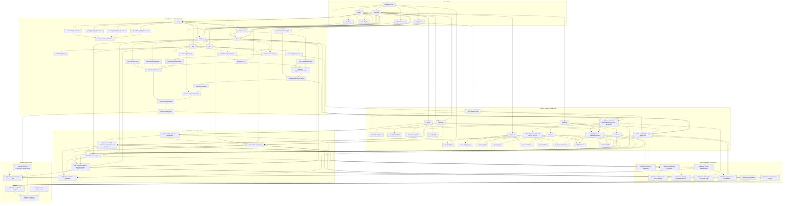

<!-- Template: antithesis_dependency_map.md -->
# Dependency Map

## Overview

Draft, 2026-09-23. How the parts of the ChainTorrent MVP fit together and in what order they are built, drawn from the [revised business case](business-case-revised.md), the [technical approach](technical-approach.md), the [workplan](../workplans/current/ChainTorrent%20MVP.md)'s build sequence, and the [MVP Application Requirements](../research/MVP%20Application%20Requirements.md). Groupings are addressed by delivery role: **foundation**, **cryptographic validation harness**, **protocol core and contract suite**, **local daemon and package serving**, **onboarding shells and services**, and **acceptance and release**.

Resolution decays with distance, deliberately. The foundation and harness groupings are mapped at **ticket** resolution: one ticket per source file, which is the node template's unit, so that each ticket is a candidate node the workplan author can promote. Inside the protocol core, the hashing, signature, and swarm milestones are also at ticket resolution, because they depend on nothing the harness measures and run beside it; the remaining protocol core milestones are mapped as **sprints** named by dependency role. Beyond that the map holds **epics**, then **milestones**, then **objectives**. The reason is that implementation of the nearest work will produce discoveries that revise the anticipated order of everything after it, and detail authored now for distant groupings would be rewritten rather than used. When the harness closes, the remaining protocol core milestones are re-mapped to ticket resolution from what was learned, and the decay shifts outward.

Tickets are candidates, not nodes. No node exists in the workplan and none is authored here; a ticket names the source file's role and its dependencies so a node can be written from it through the ordinary authoring path. Every adapter family is a factory crate owning its generic interface and capability declaration, with each implementation a private concrete beneath it, and the map names tickets accordingly: a family's factory ticket is named by its crate, a concrete's by `crate/concrete`, a function a concrete owns by `crate/concrete/function`, a function the family owns by `crate/function`, a module of the domain or workflows crate by `crate/module` with its functions beneath it, a contract by `contracts/<suite>/Contract`, and a configuration-only ticket by its directory; the [technical requirements](technical-requirements.md)' file tree spells every path, crate directories hyphenated and module directories underscored. A concrete adapter is one node, since its operations are the methods of one adapter in one file. A family's factory ticket precedes every concrete of the family, so the declarations the composition resolver reads exist from the ticket that first authors the family, and every consumer ticket depends on a factory and never on a concrete.

## Components

Grouped by role. Within a grouping at ticket resolution each row is a ticket; elsewhere each row is a sprint, epic, milestone, or objective as the decay dictates.

### Foundation, at ticket resolution

The workspace every node builds on, the encoding family everything hashed, signed, stored, or framed shares, the secret type that cannot be formatted, the randomness family every key-generating ticket draws from, and the continuous integration that proves each ticket where the completion boundary requires. No crate is created ahead of the module that first lives in it; each ticket below creates its crate when that crate does not yet exist.

| Ticket | Owns | Depends on | Proves |
| --- | --- | --- | --- |
| `workspace/cargo` | The virtual workspace manifest with the glob members `crates/*`, `adapters/*`, and `apps/*` and the lint table; `rust-toolchain.toml`; `deny.toml` with the license allowlist; `.gitignore`; configuration files with no types and no tests; each workspace dependency is pinned by the ticket that first consumes it | nothing | The root configuration every later ticket builds within; its build proof arrives with the first member |
| `domain/secret` | The secret-typed value: no formatting or serialization trait, an explicit accessor for the cryptographic operations and custody wrapping that consume it, zeroization on drop through `zeroize`, a crate dependency; creates the `domain` crate | `workspace/cargo` | CR-07 exclusion of secrets from logs, proven at compile time; the lint table's rejection of `unsafe_code`, `unwrap_used`, `expect_used`, `panic`, and `as_conversions` in the first production crate |
| `random` | The randomness family's factory: the interface that fills bytes and draws scalars, its deterministic mock for vectors and tests, the declaration, and the factory function; creates the `adapters/random` crate | `workspace/cargo` | CR-05 contract: the one interface every production draw passes through |
| `random/os` | The concrete over the operating system's generator; pins `rand_core` and `getrandom` | `random` | CR-05 production randomness, validated statistically |
| `workspace/ci` | The continuous-integration definition, edited in place in `.github/workflows/rust.yml`: `cargo fmt --check`, `cargo check`, `cargo clippy`, the unit and integration tests, `cargo-deny`, and `cargo-audit` on Windows, macOS, and Linux; a configuration file with no types and no tests; each later step, `forge`, the TypeScript linter, `cargo-fuzz`, and the clean-runner end-to-end job, is added by the ticket that first needs it | `workspace/cargo` | XA-07 facilities run in CI; NF-M07; `deny.toml` read and enforced on every supported platform |
| `encoding` | The encoding family's factory: `IEncoderAdapter` and `IDecoderAdapter` with the versioned encoding identifier, the repo-owned encoding contract each encoded type implements in its own module, the encoding types and guards, the capability declaration, and the factory function that constructs the concrete the configuration or a hash-card names; creates the `adapters/encoding` crate | `workspace/cargo` | The generic surface every hashed, signed, stored, or framed value passes through; the hash-card's encoding identifier |
| `encoding/abi` | The Ethereum ABI concrete through `alloy`'s sol types, implementing both interfaces as one adapter, with known-answer vectors the generator mirrors; untrusted bytes to the owned type or its error; pins `alloy`; carries the grouping's integration test and commit | `encoding` | ABI encoding against its vectors; round trip; malformed input rejected |

### Cryptographic validation harness, at ticket resolution

The harness builds the pairing, key-derivation, hash-to-scalar, credential KEM, envelope, and delivery proof families with their factories first, exercises the deployed verifier on Base Sepolia, and records the measurements that fix the piece-group size and confirm the curve (CD-07, AS-21). It constructs every curve and verifier-form combination through the factories, so an invalid combination is refused in the harness exactly as the daemon's resolver will refuse it. Every ticket is one Rust source file with its full support system except where the row says otherwise; a factory ticket owns its family's generic interface, declaration, and factory function, and a concrete ticket is one adapter whose operations are its methods.

| Ticket | Owns | Depends on | Proves |
| --- | --- | --- | --- |
| `pairing` | The pairing family's factory: `IPairingAdapter` with generators, add, mul, MSM, subgroup check, and the pairing-product check, the group-element and scalar types as associated types with their guards, the declaration of the curve, of second-group arithmetic at the verifier, and of precompile encodings, and the factory function that admits a curve the chain's declared precompile sets support and constructs the recorded default concrete for that curve unless the composition names one; creates the `adapters/pairing` crate | `workspace/cargo`, `encoding` | CR-10 contract; the declaration the proof and chain factories read |
| `pairing/bn254_arkworks` | The BN254 concrete on arkworks, precompile-matching encodings, declaring the curve and first-group-only arithmetic at the verifier; pins `ark-bn254` | `pairing` | CR-10 on BN254 |
| `pairing/bn254_halo2curves` | The BN254 concrete on `halo2curves`, precompile-matching encodings, declaring the curve and first-group-only arithmetic at the verifier; pins `halo2curves` | `pairing` | CR-10 on BN254 |
| `pairing/bls12_381_arkworks` | The BLS12-381 concrete on arkworks, precompile-matching encodings, subgroup checks on every input, declaring the curve and second-group arithmetic at the verifier; pins `ark-bls12-381` | `pairing` | CR-10 on BLS12-381 |
| `pairing/bls12_381_halo2curves` | The BLS12-381 concrete on `halo2curves`, precompile-matching encodings, subgroup checks on every input, declaring the curve and second-group arithmetic at the verifier | `pairing` | CR-10 on BLS12-381 |
| `harness-crypto/benchmark` | The measurement of scalar multiplication, multi-scalar multiplication, and pairing over every pairing concrete, each constructed through the pairing factory, recording the default concrete per curve; names no library; creates the `apps/harness-crypto` crate | `pairing`, `pairing/bn254_arkworks`, `pairing/bn254_halo2curves`, `pairing/bls12_381_arkworks`, `pairing/bls12_381_halo2curves` | The recorded default per curve |
| `kdf` | The key-derivation family's factory: the interface that derives a key of a stated length from key material under a context, the derivation-context types and guards, the KDF identifier declaration, and the factory function; creates the `adapters/kdf` crate | `encoding` | CR-05, CR-11 derivation contract |
| `kdf/blake3_keyed` | The BLAKE3 keyed-derivation concrete; context strings, serialization, and output lengths frozen with known-answer vectors from an independent implementation; pins `blake3` | `kdf` | CR-11 derivation vectors |
| `hash-to-scalar` | The hash-to-scalar family's factory: the interface that maps domain-tagged bytes to a scalar of the resolved pairing's field, the domain-tag types, the identifier declaration, and the factory function; creates the `adapters/hash-to-scalar` crate | `encoding`, `pairing` | CR-08 identity-mapping contract |
| `hash-to-scalar/keccak256` | The keccak256 concrete under domain tags, reduced modulo the group order, with vectors the generator mirrors | `hash-to-scalar` | CR-08, CR-09 identity-mapping and challenge vectors |
| `kem` | The credential KEM family's factory: `ICredentialKemAdapter` with setup, issue, rerandomize, isValid, encapsulate, isWellFormed, and decapsulate, the parameter-set, master-scalar, credential, capsule, identity-element, and encapsulated-value types as associated types, the interval-index and entitlement-identity types with their guards, the identity-scope declaration, and the factory function that admits a concrete by the suite's declared scope; creates the `adapters/kem` crate | `pairing`, `hash-to-scalar`, `random`, `domain/secret`, `encoding` | CR-08 contract; CD-08 declaration |
| `kem/bb1_depth_one` | The depth-one Boneh–Boyen concrete as one adapter: random master scalar and parameter set for escrow lineage, issuance with trivial identity-element refusal, seller-side rerandomization without the master scalar, the public validity check with encoding and subgroup validation, encapsulation under both identity scopes, well-formedness, and decapsulation to the encapsulated value; owns its parameter-set, credential, capsule, and identity-element types | `kem`; the pairing, hash-to-scalar, and random families through their factories | CR-08 algebraic properties, LC-08, EC-06, CD-08 |
| `envelope` | The envelope family's factory: `IKeyAgreementAdapter` with key generation under proofs of possession, wrap, and unwrap, the key-pair and envelope types as associated types with their guards, the envelope-algebra declaration, and the factory function; creates the `adapters/envelope` crate | `pairing`, `random`, `domain/secret`, `encoding` | CR-04 contract |
| `envelope/pairing_elgamal` | The pairing ElGamal concrete as one adapter: two independently keyed envelope keys with Schnorr proofs of possession, identity-element rejection, encryption of a credential with independent coins, decryption under the recipient's secrets; owns its key-pair and envelope types | `envelope`; the pairing, hash-to-scalar, and random families through their factories | CR-04; LC-08 at the algebra level |
| `proof` | The delivery proof family's factory: `IDeliveryProofAdapter` with proveMint, proveTransfer, and verify, the mint and transfer statement types with the challenge context schema and the delivery-statement version, the proof type as an associated type, the declaration of supported envelope algebras and verifier forms, and the factory function that admits a concrete only when it declares the resolved envelope's algebra and the verifier form the resolved pairing declares; creates the `adapters/proof` crate | `envelope`, `kem`, `pairing`, `encoding` | CR-09 contract; the admission rule the harness exercises |
| `proof/schnorr_fs/challenge` | The function the concrete owns: the keccak256 Fiat–Shamir challenge over the full context schema under a domain tag, through the hash-to-scalar family | `proof`, `hash-to-scalar`, `encoding` | CR-09 statement binding and fields |
| `proof/schnorr_fs` | The generalized Schnorr concrete as one adapter: the mint prover, the transfer prover from the seller's fresh decryption and total offset, and the reference verifier in both forms, second-group arithmetic and the hash-weighted pairing product with first-group arithmetic only; declares both forms | `proof`, `proof/schnorr_fs/challenge`, `random` | CR-09, CD-01, CD-02 |
| `workflows/sidecar/wrap` | The wrapping key derived through the KDF family from an encapsulated value and the context, and the XOR wrap of a piece-group key under it; creates the `workflows` crate | `kdf`, `kem`, `encoding` | CR-11 wrap |
| `workflows/sidecar/unwrap` | The unwrap of a piece-group key from its wrapped value under the derived wrapping key | `workflows/sidecar/wrap` | CR-11 cross-set agreement |
| `contracts/evm/PairingLib` | The Solidity library over the precompiles in both forms, with contract-side subgroup checks where the precompile does not perform them; creates `contracts/evm/foundry.toml` and adds the `forge build` and `forge fmt --check` steps to continuous integration | `workspace/ci`; mirrors the pairing family's declared precompile encodings | CR-10 on chain |
| `harness-crypto/generate` | The harness's generate family's factory: the interface that emits a target suite's constants and test vectors from the Rust reference, the declaration, and the factory function | `proof`, `encoding` | CR-09 parity-input contract |
| `harness-crypto/generate/evm` | The EVM concrete emitting Solidity constants and test vectors for the pairing library and the verifier, including the challenge and identity-mapping vectors | `harness-crypto/generate`, `proof/schnorr_fs`, `hash-to-scalar/keccak256` | CR-09 parity inputs; CR-11 on-chain vectors |
| `contracts/evm/DeliveryVerifier` | Solidity mint and transfer verification over the statement fields, bit-for-bit with `proof/schnorr_fs`, its constants and vectors generated | `contracts/evm/PairingLib`, `harness-crypto/generate/evm` | CD-03, CR-09 |
| `contracts/evm/deploy` | The deployment script for the verifier on each curve form to Anvil and Base Sepolia, emitting addresses to configuration; exempt from the full support structure as a deployment script | `contracts/evm/DeliveryVerifier` | CD-07 |
| `harness-crypto/verifier` | The harness's verifier family's factory: the interface that reaches a suite's deployed delivery verifier, submits a statement and proof, and reads acceptance and cost as L2 execution gas and L1 data fee, the declaration, and the factory function | `proof`, `encoding` | CD-03 cross-verification contract |
| `harness-crypto/verifier/evm` | The EVM concrete over the deployed verifier through `alloy`, pinned for the harness | `harness-crypto/verifier`, `contracts/evm/deploy` | CD-03 cross-verification |
| `harness-crypto/vectors` | Algebraic, mutation, and admission vector sets constructed through the factories: cross-holder agreement, cross-set agreement with two independently generated parameter sets unwrapping one piece-group key, rerandomized validity, non-convertibility, malformed capsules, mutated statement fields, replay, and every curve and verifier-form combination the proof factory must refuse | `kem/bb1_depth_one`, `envelope/pairing_elgamal`, `proof/schnorr_fs`, `workflows/sidecar/unwrap`; the deterministic mock of `random` | CR-08, CR-09, CR-11 vectors; AS-17 for the cryptographic families |
| `harness-crypto/measure` | Size, timing, and gas capture per curve: capsule, envelope, proof bytes; decapsulation per group; prove and verify time; mint and transfer cost as L2 execution and L1 data fee | `harness-crypto/vectors`, `harness-crypto/verifier/evm` | CD-07, RO-03 |
| `harness-crypto/report` | The release-evidence report; the piece-group size selected and the curve confirmed against the declared budget; the grouping's integration test across the whole chain and its commit | `harness-crypto/measure` | AS-21 |

### Protocol core and contract suite

The hashing, signature, and swarm milestones are at ticket resolution; they depend on nothing the harness measures and run beside it, and each begins with its family's factory ticket. The remaining milestones are sprints, re-mapped to tickets when the harness closes.

#### Hashing and commitments, at ticket resolution

| Ticket | Owns | Depends on | Proves |
| --- | --- | --- | --- |
| `hashing` | The hashing family's factory: the commitment interface with root and outboard construction over a byte stream, streaming and random-access verification against a root with an authentication path, and random chunk challenge and response; the root, outboard, path, and chunk types and guards; the commitment-scheme identifier the hash-card carries; the commitment-scheme and chunk-granularity declaration; the factory function; creates the `adapters/hashing` crate | `encoding` | CR-02 contract |
| `hashing/blake3_bao` | The BLAKE3/Bao concrete as one adapter: root and outboard construction, verification, challenge and response, and keyed mode for the keyed plaintext-root disclosure mode; pins `blake3` and `bao`; carries the milestone's integration test and commit | `hashing` | CR-02 construction, verification, and challenges; EC-02; SW-04 |

#### Signature services, at ticket resolution

| Ticket | Owns | Depends on | Proves |
| --- | --- | --- | --- |
| `signature` | The signature family's factory: `ISignatureAdapter` with sign, isValidSignature, recoverSigner, and canonicalAddress, the signature types and guards, the per-layer declaration of scheme and layers served, and the factory function that resolves a scheme per layer; creates the `adapters/signature` crate | `encoding`, `random` | CR-03 contract |
| `signature/ed25519` | The Ed25519 concrete with domain separation and complete-message binding; pins `ed25519-dalek` | `signature` | CR-03 |
| `signature/secp256k1` | The secp256k1 concrete through `alloy`, with EIP-712 typed data for registrations, bindings, and signed intents; carries the milestone's integration test and commit | `signature` | CR-03, IW-07, LC-13 intents |

#### Swarm transport, discovery, storage, and seed host, at ticket resolution

| Ticket | Owns | Depends on | Proves |
| --- | --- | --- | --- |
| `transport` | The transport family's factory: `ISwarmTransportAdapter`, the locator types and guards, the declaration of the integrity structure on the wire and of the engine capability a transport may expose for library-backed discovery, and the factory function; creates the `adapters/transport` crate | `hashing`, `encoding` | SW-01 contract |
| `transport/rqbit` | The `librqbit` concrete: the `[patch.crates-io]` overlay onto a tagged upstream release carrying the piece-completion hook, the peer-injection call, and the storage-backend trait with each hook's upstream issue; root-to-infohash translation; torrent creation per object with the ciphertext and each sidecar as its own object and locator; Bao verification of every completed piece after the library's check, through the hashing family; seeder-map peer injection; the engine capability; adds the overlay's git source to `deny.toml`'s `allow-git`; pins `librqbit` | `transport`; `workspace/cargo` for `deny.toml` | SW-01, SW-06, EC-02 |
| `discovery` | The discovery family's factory: `IPeerDiscoveryAdapter`, the peer types and guards, the declaration, and the factory function that resolves every source the composition admits; creates the `adapters/discovery` crate | `encoding` | SW-02 contract |
| `discovery/aggregate` | The family-owned aggregation: concurrent sources unioned and deduplicated, none authoritative | `discovery` | SW-02 aggregation under overlapping, conflicting, unavailable, and malicious results |
| `discovery/dht` | The library's DHT as a source, through the engine capability the transport factory's surface exposes | `discovery`, `transport` | SW-02 |
| `discovery/pex` | Peer exchange as a source, through the same engine capability | `discovery`, `transport` | SW-02 |
| `discovery/tracker` | Trackers as a source, through the same engine capability | `discovery`, `transport` | SW-02 |
| `discovery/local` | Local-network discovery as a source | `discovery` | SW-02 |
| `discovery/seeder_map` | The on-chain seeder map as a source | `discovery`; `chain/base` | SW-02 |
| `storage` | The storage-engine family's factory: the key-value store interface with tables, transactions, and checkpoints, its types and guards, the declaration, and the factory function; creates the `adapters/storage` crate | `encoding` | XA-03 and SW-05 store contract |
| `storage/redb` | The `redb` concrete; pins `redb` | `storage` | Transactions and checkpoints under interruption |
| `seed-host` | The seed host family's factory: `ISeedHostAdapter` with held-and-served, take custody, release, capacity and usage, and enumerate, the holding types and guards with the obligated-versus-voluntary distinction, the capacity and holding-reason declaration, and the factory function; creates the `adapters/seed-host` crate | `hashing`, `encoding` | SW-05 contract; ST-06 |
| `seed-host/owned` | The owned concrete: persistent seeding independent of sessions, the root-keyed ciphertext store with holding reason, quota, and eviction, its index through the storage family, settings passthrough and enforcement, archive enumeration | `seed-host`, `transport`, `storage` | SW-03, SW-05, SW-07, ST-06; PR-05 separation |
| `seed-host/rqbit` | The delegated concrete: the rqbit application driven through its HTTP API, root-to-identifier translation, and Bao custody challenges through the hashing family; carries the milestone's integration test across owned and delegated retrieval and its commit | `seed-host`, `hashing` | SW-04 |

#### Remaining milestones, as sprints

| Sprint by role | Contents | Depends on |
| --- | --- | --- |
| Domain model | The protocol's types, each authored in the node of the file that first consumes it and housed in the module that implements it, fixed when that module's ticket is written; the `domain` crate holds only the types its own modules implement | the types the harness factories own; `domain/secret` |
| Payload cipher and sidecar layer | The `cipher` factory with `IPayloadCipherAdapter`, the counter-layout and addressable-extent declarations, and the factory function, and its concrete `cipher/aes_ctr` with the counter layout and extent rules; `workflows/sidecar/build`, per live set a capsule and wrapped piece-group key per group committed by that set's Bao root, each sidecar its own object, and `workflows/sidecar/validate`, the manifest, hash-card, and sidecar validation ordering; the `sample_deployment` generator for the site demonstration, which needs the cipher and so lives here rather than in the harness | domain model; `hashing`; `workflows/sidecar/wrap`; `kem` |
| Registry and entitlement contracts, the EVM suite | Under `contracts/evm`: asset records with the per-name version index, deployments and hash-cards, attestation verification through the `IAttestationVerifier` adapter bound per source with the npm P-256 verifier as the first concrete and the source-key table it reads, later escrow deployments, parameter-set liveness with the sidecar-coverage rule and sidecar addition, the envelope-key registry, `IEntitlement` with the ERC-721 concrete carrying interval state and the ownership override that disables standard transfers, issuance and transfer calling the delivery verifier, batched grant requests readable by holders and closed by grant or withdrawal, escrow records per deployment, identity binding, the identity contract account under ERC-1271 with its device registry and the `isDeviceAdmitted` view, claim-set state layout, batch and paginated views; every identity-bound mutation taking the acting identity and a signed intent verified through the account against a signer whose permissions cover it, the contracts enforcing lock expiry and no volume limit | harness contracts; domain model |
| Chain and submission families | The `chain` factory with the chain interface, `ISettlementAdapter`, `IEntitlementStateAdapter`, the declaration, and the factory function; `chain/quorum_view`, the family-owned aggregation of two of three configured nodes at a common reference, stale ignored, divergence and views older than `τ_soft` failing closed; `chain/base` with the contract bindings, Base's tier mapping, `evaluateAuthorization` and batch with per-context bindings, and the event and calldata reader; the `submission` factory with the interface for submitting a signed intent and its concrete `submission/self_funded`, the path the daemon uses on Base Sepolia until the relayer exists | registry and entitlement contracts; `signature` |
| Adapter registry and factory, on chain | The `AdapterRegistry` governed by a single project-held key and the factory that constructor-injects the identity adapters, the signature adapters, the attestation verifier per source, and the entitlement token form, each immutable once bound | registry and entitlement contracts |

### Local daemon and package serving, as epics

| Epic by role | Contents | Depends on |
| --- | --- | --- |
| Durable jobs and configuration | `workflows/jobs`, the job engine over the storage family with checkpointing and idempotent restart; `workflows/config`, the versioned configuration registry over the storage and encoding families, and the settings catalogue; the `platform-paths` factory and its concretes for the store-root defaults; `workflows/compose`, capability resolution across every factory, failing closed; the `ipc` factory with its family-owned framing, principals, and server and its `ipc/unix_socket` and `ipc/named_pipe` concretes, with the control-principal and local-presence rules; the `lifecycle` factory with its single-instance lock as a family-owned function, its concretes following in the installation coordinator; the `telemetry` factory with the exporter interface, the declaration, and the factory function, creating the `adapters/telemetry` crate, then `telemetry/tracing`, the family-owned tracing setup carrying per-request correlation identifiers, then `telemetry/local_metrics`, the family's first concrete, over the storage family; the daemon binary | domain model; `storage` |
| Identity and custody | The `custody` factory with `IKeyCustodyAdapter` and the versioned capability set including device roles, and its family-owned `custody/holder_seed` with the control and envelope branches, `custody/device_key`, and `custody/upgrade`, the in-place migration verified against the chain; `custody/local_keystore` over `keyring` with version-headed blobs; the `wallet` factory with `wallet/eip1193` and `wallet/walletconnect`; the `identity` factory with the binding schema and `identity/publisher_authority` and `identity/escrow`; `workflows/identity` with identity creation, relayer-paid binding and contract account creation, envelope-key registration, device pairing, signer admission, and revocation | the signature tickets; the chain and submission families; `envelope`; `kdf`; durable jobs and configuration |
| Plaintext CAS, resolution orchestrator, and package host | The `cas` factory and `cas/filesystem`, verified atomic CAS of tarballs extracted per project by the package manager with nothing linking into the store, quota, pinning, eviction, its index through the storage family; `workflows/resolve` with the hedged source order under the catalogue's source deadline and grant wait, and upstream for any identity without a credential; the `package-host` factory and `package-host/npm` with its metadata store, the npm registry protocol served locally with canonical tarball URLs; per-asset independence status in `workflows/health` | durable jobs and configuration; `hashing` |
| First Finder ingest | The `ingest` factory and `ingest/npm` with attestation validation or recorded absence, metadata capture, and availability as eligibility; `workflows/first_finder` with the foreground serve, the background bootstrap job, the state-locked registration race, escrow custody of the master scalar, seeding, and the finder's grant of the asset's first entitlement to itself; `workflows/grant` | plaintext CAS and package host; the swarm tickets; the registry contracts; the chain and submission families; identity and custody; the `kem`, `envelope`, and `proof` factories with their concretes; `workflows/sidecar/build` |
| Credential delivery and per-attempt authorization | Envelope-key registration on first run; `workflows/request`, the batched grant request job and its pickup from chain events; `workflows/prefetch` with pinning, seeding, and set matching; `workflows/acquire` with mint and grant delivery, holders fulfilling requests for absent requesters, and sale delivery; credential load and recovery; `workflows/attempt` with `τ_soft` and `τ_wallet`; `workflows/decrypt` with decapsulation through the KEM factory, unwrap through `workflows/sidecar/unwrap`, and decryption through the cipher factory; `workflows/interval_end`; `workflows/gate` | the chain and submission families; identity and custody; the `kem`, `envelope`, and `proof` factories with their concretes; payload cipher and sidecar layer; First Finder ingest; `submission/relayer` once the relayer exists, `submission/self_funded` on Base Sepolia until then |
| Demonstrable milestone | No new subsystem: a second identity on a second machine profile installs a pinned closure the First Finder ingested, at the registry's speed with requests registered and ciphertext prefetched, then with the registry unavailable, through the packaged daemon and package host over the swarm, on a grant fulfilled while it was offline; the north star, first-run independence, and the latency guardrail measured on the dogfood population | credential delivery and per-attempt authorization; plaintext CAS and package host; First Finder ingest; the swarm tickets |

### Onboarding shells and services, as milestones

| Milestone by role | Contents | Depends on |
| --- | --- | --- |
| Installation coordinator | `workflows/install`, the durable install plan with platform detection, repair, update, uninstall, the health probe, the consent items, and the first-run cost disclosure; the `lifecycle` factory with `lifecycle/systemd`, `lifecycle/launchd`, `lifecycle/windows_service`, and `lifecycle/scheduled_task`; the `artifact-verifier` factory with `artifact-verifier/sigstore`, `artifact-verifier/authenticode`, and `artifact-verifier/apple_notarization`; the `redirect` factory with `redirect/npm`; the installer binary | durable jobs and configuration; identity and custody |
| Visual Studio Code extension and npm bootstrap | Thin shells over the coordinator | installation coordinator |
| Desktop application and CLI | Tauri and Rust control surfaces | installation coordinator |
| Relayer or paymaster | The relayer binary with its `bundler` factory and one concrete per provider; free-path sponsorship under a global per-window budget and maximum liability with per-identity limits as one layer; the sponsorship mechanism for the identity contract account chosen here under LC-13, with `submission/paymaster` and `submission/relayer` authored as the chosen mechanism requires; sponsored device admission and revocation; cost and budget reporting | the chain and submission families, so it may start before the daemon grouping closes |
| Explicit publisher path | `workflows/publish` with the publisher-derived lineage, swarm-native publication of the dependency closure, and the issuance policy service; the `publisher-proof` factory with `publisher-proof/provenance` and `publisher-proof/maintainer_oauth` | First Finder ingest; identity and custody |
| Claim verifier and escrow claim | The claim verifier binary with its revocable key; the `claim-verifier` factory with `claim-verifier/attestor`; `workflows/claim`; the claim set established from upstream metadata at verification; claim-set vouchers; the claimant parameter set; optional handover; sidecar addition; voluntary migration | registry contracts; explicit publisher path; credential delivery |
| Project seed host and site | Persistent first seeder of the core closure holding an entitlement and credential for every asset it seeds; static site; WebAssembly demonstration | `seed-host/owned`; explicit publisher path; payload cipher and sidecar layer, for the sample deployment |
| Observability | RO-03 metrics, RO-04 correlation, RO-05 health, latency budget evaluation; `telemetry/opentelemetry` | every component that emits |
| Demonstration harness | Controlled participants, wallets, chain state, failures, and the deliberately incompatible adapter declarations the incompatibility scenario rejects, refused by the factories and by `workflows/compose` | every component under test |

### Acceptance and release, as objectives

| Objective by role | Contents | Depends on |
| --- | --- | --- |
| Transaction flow proof | Priced primary issuance and secondary transfer through the packaged applications on the Base mainnet pilot | explicit publisher path; credential delivery; relayer; external review dispositioned |
| Acceptance scenarios | Every acceptance scenario on clean machines through packaged applications | every milestone |
| External cryptographic review closed | Findings dispositioned before any priced deployment | harness report |
| Legal prerequisites | License text, regulatory review, export confirmation | none technical |
| Dogfood baseline and release | ChainTorrent published swarm-natively; baseline metrics recorded; release evidence complete | acceptance scenarios; review; legal |

## Integration Points

Where one component's output becomes another's input across a boundary that an integration test must cross, and the milestone whose integration test crosses it.

| Integration point | Producer | Consumer | Boundary crossed | Crossed in |
| --- | --- | --- | --- | --- |
| Factory admission | each family's concretes, through their declarations | the factory of every downstream family, and `workflows/compose` | A concrete admitted only when its declaration satisfies every downstream requirement; refused at construction with no side effect | The harness, for the cryptographic families; the daemon skeleton, for the whole composition |
| Verifier parity | `proof/schnorr_fs` | `contracts/evm/DeliveryVerifier` through `harness-crypto/verifier/evm` | Rust to chain; bit-for-bit acceptance on every vector | Delivery proof and Solidity verifier |
| Precompile encoding | the pairing factory's declared encodings, produced by every pairing concrete | `contracts/evm/PairingLib` | Rust encoding to precompile input | Delivery proof and Solidity verifier |
| Piece-group key | the KEM factory's decapsulate and `workflows/sidecar/unwrap` | the cipher factory | The decapsulation-to-cipher seam preserved for a future multi-key suite | Payload cipher and sidecar layer |
| Sidecar root | the KEM factory's encapsulate and `workflows/sidecar/build` | commitments and hash-card, through the hashing factory | Per live set, capsule and wrapped key per group committed by that set's Bao root; each sidecar its own object | Payload cipher and sidecar layer |
| Discovery engine | the transport factory's engine capability | `discovery/dht`, `discovery/pex`, `discovery/tracker` | Library-backed sources reach the engine through the generic surface, never through the transport concrete | Swarm transport and seed host |
| Store | the storage factory | `workflows/jobs`, `workflows/config`, the CAS index, the ciphertext index, the metadata store, `telemetry/local_metrics` | Tables, transactions, and checkpoints with no store library named by a consumer | Swarm transport and seed host, for the ciphertext index; the daemon skeleton, for the rest |
| Envelope in settlement | the envelope factory's wrap and the proof factory's provers | registry and entitlement contracts, through the submission factory | Calldata and event; digest stored | Registry and entitlement contracts |
| Signed intent | `signature/secp256k1`, through the signature factory | registry and entitlement contracts, through the submission factory | EIP-712 intent to ECDSA or ERC-1271 verification | Registry and entitlement contracts |
| Attestation verification on chain | the source's attestation, carried by `ingest/npm` | `IAttestationVerifier` bound per source by the adapter registry | The registration refused unless the source's verifier accepts, absence admitted and recorded | Registry and entitlement contracts |
| Attempt context | domain model | `chain/quorum_view` over `chain/base`, and credential delivery | View call at the declared tier from a quorum of configured nodes | Chain and submission families |
| Resolution order | resolution orchestrator | the CAS, seed-host, transport, and ingest factories | Local, encrypted, swarm, upstream, hedged | Plaintext CAS, resolution orchestrator, and package host |
| Package-manager protocol | `package-host/npm` | npm | HTTP registry protocol; resolution stays in npm; canonical tarball URLs so lockfiles stay portable | Plaintext CAS, resolution orchestrator, and package host |
| Persistent credential | the envelope and custody factories | credential delivery | Stored only under `IKeyCustodyAdapter` | Identity and custody |
| Device admission | identity manager on a root | identity contract account; the attempt engine's wallet-control assertion | Signer admitted and revoked on chain; admission read in the same state view as authorization | Identity and custody |
| Grant request to holder | request job, through the submission factory | registry request record; any holder's grant service | Batched sponsored request; holder reads open requests and fulfils them for absent requesters | Credential delivery and per-attempt authorization |
| Grant pickup from events | registry mint and grant events, through `chain/base` | request job and credential engine | Envelope recovered from chain history on the next run; set matched against held deployments | Credential delivery and per-attempt authorization |
| Installer to daemon | installation coordinator | daemon, package host, seed host, through the lifecycle and IPC factories | Service lifecycle and IPC | Installation coordinator |
| Artifact authentication | the release's signatures | the artifact-verifier factory | Every artifact and update verified before execution, under each scheme's concrete | Installation coordinator |
| Shells to coordinator | extension, npm bootstrap, desktop, CLI | installation coordinator | One coordinator, identical postcondition | Extension and npm bootstrap; desktop and CLI |
| Relayer to contracts | relayer, through its bundler factory | identity binding, requests, mint | Sponsored transactions under policy | Relayer or paymaster |
| Verifier voucher to contract | `claim-verifier/attestor` | escrow claim contract surface | Voucher bound to claimant, set, contract, chain, nonce, expiry | Claim verifier and escrow claim |
| Site demonstration | WebAssembly build of the client crates | browser | Same crates as the client; no service on the read path | Project seed host and site |

## Conflict Flags

- **Grouping membership versus dependency order.** The hashing, signature, and swarm tickets sit in the protocol core grouping and depend on no contract sprint, so they run in parallel with the harness and before the contracts.
- **Every factory precedes its concretes.** A family's declaration type exists from its factory ticket, so the resolver in the daemon skeleton reads declarations that already exist, and no consumer ticket depends on a concrete.
- **The harness needs a verifier client before the chain family exists.** The daemon never submits a proof to the verifier, since the contracts call it inside mint, grant, and delivery, so the verifier client is the harness's own `verifier` family with an `evm` concrete, and no chain concrete carries one.
- **The wrap precedes the cipher.** The harness's cross-set vector needs the wrap and unwrap, so `workflows/sidecar/wrap` and `workflows/sidecar/unwrap` are harness tickets and create the workflows crate; `workflows/sidecar/build` and `workflows/sidecar/validate` wait for the cipher in the protocol core.
- **The benchmark follows the pairing concretes.** It constructs each through the pairing factory and names no library; what it records is the default concrete per curve, which the factory constructs when a composition names a curve alone, and every concrete remains beneath the factory whether or not it is the default.
- **The library-backed discovery sources share the transport's engine.** They reach it through the engine capability the transport factory's generic surface exposes, so no discovery concrete depends on `transport/rqbit`.
- **The demonstrable milestone needs a grant.** Resolving against the swarm with the registry down requires a second identity to hold a credential, so the milestone sits after credential delivery and per-attempt authorization, not at the package host.
- **Escrow claim is last by dependency.** The escrow record carries no maintainer commitment and the verifier establishes the claim set at verification time, so the milestone waits only on the publisher path, the registry contracts, and credential delivery.
- **Two verifier forms, one primary.** `contracts/evm/PairingLib` exists in both forms so the harness measures both; BLS12-381 ships as the primary form on Base and BN254 is retained.
- **The delivery verifier is built in the harness and consumed by the contract sprint.** It is the first shipped contract, written to production standard, with its constants and vectors generated from the Rust reference by `harness-crypto/generate/evm`.
- **The EVM suite is one concrete.** `contracts/evm` is the on-chain half of `chain/base`; a further chain form is a further suite beside it, and within the suite the adapter registry binds the entitlement token form, the attestation verifier per source, and the identity and signature adapters.
- **Identity and custody sits in the daemon grouping but the installer needs it.** The dependency runs the right way, coordinator depends on custody, and the epic is placed early in the grouping.
- **The identity is a contract account; its sponsorship mechanism is chosen at the relayer milestone.** The contract sprint builds the account with its device registry and takes every identity-bound mutation as a signed intent under LC-13, so `submission/paymaster`, `submission/relayer`, and `submission/self_funded` all remain open behind one factory.

## Dependencies

The dependency graph across the groupings. Edges point from producer to consumer. Identifiers are descriptive; nothing is numbered.

```mermaid
flowchart TB
    subgraph foundation["Foundation"]
        direction TB
        f_ws["workspace/cargo"]
        f_sec["domain/secret"]
        f_rand["random"]
        f_rand_os["random/os"]
        f_ci["workspace/ci"]
        f_enc["encoding"]
        f_abi["encoding/abi"]
        f_ws --> f_sec
        f_ws --> f_rand
        f_rand --> f_rand_os
        f_ws --> f_ci
        f_ws --> f_enc
        f_enc --> f_abi
    end

    subgraph harness["Cryptographic validation harness"]
        direction TB
        pair["pairing"]
        pair_bn_ark["pairing/bn254_arkworks"]
        pair_bn_h2c["pairing/bn254_halo2curves"]
        pair_bls_ark["pairing/bls12_381_arkworks"]
        pair_bls_h2c["pairing/bls12_381_halo2curves"]
        bench["harness-crypto/benchmark"]
        kdf["kdf"]
        kdf_b3["kdf/blake3_keyed"]
        h2s["hash-to-scalar"]
        h2s_k["hash-to-scalar/keccak256"]
        kem["kem"]
        kem_bb1["kem/bb1_depth_one"]
        env["envelope"]
        env_eg["envelope/pairing_elgamal"]
        proof["proof"]
        proof_ch["proof/schnorr_fs/challenge"]
        proof_sfs["proof/schnorr_fs"]
        sc_wrap["workflows/sidecar/wrap"]
        sc_unwrap["workflows/sidecar/unwrap"]
        sol_pair["contracts/evm/PairingLib"]
        gen["harness-crypto/generate"]
        gen_evm["harness-crypto/generate/evm"]
        sol_verify["contracts/evm/DeliveryVerifier"]
        sol_deploy["contracts/evm/deploy"]
        hv["harness-crypto/verifier"]
        hv_evm["harness-crypto/verifier/evm"]
        h_vectors["harness-crypto/vectors"]
        h_measure["harness-crypto/measure"]
        h_report["harness-crypto/report"]

        pair --> pair_bn_ark
        pair --> pair_bn_h2c
        pair --> pair_bls_ark
        pair --> pair_bls_h2c
        pair_bn_ark --> bench
        pair_bn_h2c --> bench
        pair_bls_ark --> bench
        pair_bls_h2c --> bench
        kdf --> kdf_b3
        pair --> h2s
        h2s --> h2s_k
        pair --> kem
        h2s --> kem
        kem --> kem_bb1
        pair --> env
        env --> env_eg
        env --> proof
        kem --> proof
        pair --> proof
        proof --> proof_ch
        h2s --> proof_ch
        proof_ch --> proof_sfs
        kdf --> sc_wrap
        kem --> sc_wrap
        sc_wrap --> sc_unwrap
        proof --> gen
        gen --> gen_evm
        proof_sfs --> gen_evm
        h2s_k --> gen_evm
        sol_pair --> sol_verify
        gen_evm --> sol_verify
        sol_verify --> sol_deploy
        proof --> hv
        hv --> hv_evm
        sol_deploy --> hv_evm
        kem_bb1 --> h_vectors
        env_eg --> h_vectors
        proof_sfs --> h_vectors
        sc_unwrap --> h_vectors
        h_vectors --> h_measure
        hv_evm --> h_measure
        h_measure --> h_report
    end

    subgraph core["Protocol core and contract suite"]
        direction TB
        hashing["hashing"]
        hashing_b3["hashing/blake3_bao"]
        sig["signature"]
        sig_ed["signature/ed25519"]
        sig_k1["signature/secp256k1"]
        tr["transport"]
        tr_rq["transport/rqbit"]
        disc["discovery"]
        disc_agg["discovery/aggregate"]
        disc_dht["discovery/dht"]
        disc_pex["discovery/pex"]
        disc_trk["discovery/tracker"]
        disc_local["discovery/local"]
        disc_map["discovery/seeder_map"]
        st["storage"]
        st_redb["storage/redb"]
        sh["seed-host"]
        sh_owned["seed-host/owned"]
        sh_rqbit["seed-host/rqbit"]
        s_domain["Sprint: domain model"]
        s_cipher["Sprint: payload cipher and sidecar layer"]
        s_registry["Sprint: registry and entitlement contracts, the EVM suite"]
        s_chain["Sprint: chain and submission families"]
        s_adreg["Sprint: adapter registry and factory, on chain"]

        hashing --> hashing_b3
        sig --> sig_ed
        sig --> sig_k1
        hashing --> tr
        tr --> tr_rq
        disc --> disc_agg
        disc --> disc_dht
        disc --> disc_pex
        disc --> disc_trk
        disc --> disc_local
        disc --> disc_map
        tr --> disc_dht
        tr --> disc_pex
        tr --> disc_trk
        st --> st_redb
        hashing --> sh
        sh --> sh_owned
        tr --> sh_owned
        st --> sh_owned
        sh --> sh_rqbit
        hashing --> sh_rqbit
        s_domain --> s_cipher
        hashing --> s_cipher
        s_domain --> s_registry
        s_registry --> s_chain
        sig --> s_chain
        s_registry --> s_adreg
        s_chain --> disc_map
    end

    subgraph daemon["Local daemon and package serving"]
        direction TB
        e_jobs["Epic: durable jobs and configuration"]
        e_identity["Epic: identity and custody"]
        e_cas["Epic: plaintext CAS, resolution orchestrator, and package host"]
        e_ff["Epic: First Finder ingest"]
        e_deliver["Epic: credential delivery and per-attempt authorization"]
        e_demo["Epic: demonstrable milestone"]

        e_jobs --> e_cas
        e_jobs --> e_identity
        e_cas --> e_ff
        e_identity --> e_ff
        e_identity --> e_deliver
        e_ff --> e_deliver
        e_deliver --> e_demo
        e_cas --> e_demo
        e_ff --> e_demo
    end

    subgraph shells["Onboarding shells and services"]
        direction TB
        m_installer["Milestone: installation coordinator"]
        m_ext["Milestone: extension and npm bootstrap"]
        m_desktop["Milestone: desktop application and CLI"]
        m_relayer["Milestone: relayer or paymaster"]
        m_publisher["Milestone: explicit publisher path"]
        m_claim["Milestone: claim verifier and escrow claim"]
        m_seedhost["Milestone: project seed host and site"]
        m_obs["Milestone: observability"]
        m_demo["Milestone: demonstration harness"]

        m_installer --> m_ext
        m_installer --> m_desktop
        m_publisher --> m_claim
        m_publisher --> m_seedhost
    end

    subgraph release["Acceptance and release"]
        direction TB
        o_txflow["Objective: transaction flow proof"]
        o_accept["Objective: acceptance scenarios"]
        o_review["Objective: external cryptographic review closed"]
        o_legal["Objective: legal prerequisites"]
        o_release["Objective: dogfood baseline and release"]

        o_txflow --> o_accept
        o_accept --> o_release
        o_review --> o_release
        o_legal --> o_release
    end

    f_ws --> pair
    f_ci --> sol_pair
    f_ws --> tr_rq
    f_enc --> pair
    f_enc --> kdf
    f_enc --> h2s
    f_enc --> kem
    f_enc --> env
    f_enc --> proof
    f_enc --> gen
    f_enc --> hv
    f_enc --> hashing
    f_enc --> sig
    f_enc --> disc
    f_enc --> st
    f_enc --> sc_wrap
    f_rand --> kem
    f_rand --> env
    f_rand --> proof_sfs
    f_rand --> sig
    f_sec --> s_domain
    f_sec --> kem
    f_sec --> env
    st --> e_jobs

    kem --> s_domain
    h_report --> s_registry
    sol_verify --> s_registry
    kem --> s_cipher
    sc_wrap --> s_cipher

    s_domain --> e_jobs
    hashing --> e_cas
    st --> e_cas
    sh --> e_ff
    tr --> e_ff
    s_registry --> e_ff
    s_chain --> e_ff
    kem --> e_ff
    proof --> e_ff
    env --> e_ff
    s_cipher --> e_ff
    s_chain --> e_deliver
    s_cipher --> e_deliver
    proof --> e_deliver
    env --> e_deliver
    kem --> e_deliver
    sig --> e_identity
    s_chain --> e_identity
    env --> e_identity
    kdf --> e_identity
    sh --> e_demo

    e_jobs --> m_installer
    e_identity --> m_installer
    s_chain --> m_relayer
    e_ff --> m_publisher
    e_identity --> m_publisher
    s_registry --> m_claim
    e_deliver --> m_claim
    sh --> m_seedhost
    s_cipher --> m_seedhost
    e_cas --> m_obs
    e_deliver --> m_obs
    e_cas --> m_demo

    m_publisher --> o_txflow
    e_deliver --> o_txflow
    m_relayer --> o_txflow
    o_review --> o_txflow
    m_ext --> o_accept
    m_desktop --> o_accept
    m_claim --> o_accept
    m_seedhost --> o_accept
    m_obs --> o_accept
    m_demo --> o_accept
    h_report --> o_review
```

**Reading the graph.** Everything in the foundation and harness subgraphs, and every ticket-named node in the protocol core, is one source file, except the configuration tickets `workspace/cargo` and `workspace/ci`, each of which carries its configuration files together, and the deployment script. A factory node is the family's crate root; a concrete node is one adapter beneath it, private to the crate. Every edge out of a family runs from its factory, never from a concrete: the registry sprint consumes the harness's `contracts/evm/DeliveryVerifier`, and the First Finder, credential delivery, and identity epics consume the `kem`, `envelope`, `proof`, and `kdf` factories, which construct the concretes the harness proved. The hashing, signature, and swarm tickets have no incoming edge from any contract sprint, which is the point that bytes can move before any chain exists. The relayer milestone depends only on the chain and submission families and can be built as soon as they exist. The demonstrable milestone has incoming edges from credential delivery, the package host, First Finder ingest, and the seed-host family, and nothing depends on it.

## Sequencing

`workspace/cargo` precedes everything. Within the harness the starting points are the `pairing` factory, the `kdf` factory, and `contracts/evm/PairingLib`; every other ticket has a producer, each family's factory precedes its concretes, the tracks converge at `harness-crypto/verifier/evm` and `harness-crypto/vectors`, and the grouping closes at `harness-crypto/report`, whose node carries the integration test across the whole chain and the commit. The hashing and signature tickets start from their factories on `encoding`, and the swarm tickets from the `transport`, `discovery`, `storage`, and `seed-host` factories on `hashing` and `encoding`; each of those milestones closes at the ticket its table names.

Across groupings the sequence is the [milestones](milestones.md)' order, with the parallelism the graph makes visible: the hashing, signature, and swarm tickets run beside the harness and the contract sprints; the identity and custody epic begins as soon as the signature tickets and the chain and submission families exist, before the CAS epic, because the installation coordinator needs it; the relayer milestone begins on the chain and submission families; the demonstrable milestone follows credential delivery.

The decay rule governs re-mapping. When the `harness-crypto/report` node commits, the remaining protocol core milestones are re-mapped from sprints to tickets using what the harness taught, the daemon grouping from epics to sprints, and so on outward. Each re-mapping is a revision of this document in place.

## Risk Mitigation

| Risk from the register | How the map addresses it |
| --- | --- |
| R-02, cost exceeds the latency budget | The harness grouping is entirely at ticket resolution and precedes every node that encrypts a registered deployment; `harness-crypto/report` records the piece-group size and confirms the curve before the remaining sprints are re-mapped |
| R-03, verifier flaw | `proof/schnorr_fs` and `contracts/evm/DeliveryVerifier` are separate tickets with `harness-crypto/verifier/evm` as the parity integration point and `harness-crypto/generate/evm` as the source of the contract's constants and vectors; `harness-crypto/vectors` carries the mutation and replay sets |
| R-04, execution breadth | Decaying resolution means no distant detail is authored to be rewritten; the demonstrable milestone is reachable before publishing and claims; a concrete adapter is one node, so a family's ticket count is its factory plus its concretes |
| R-09, open selections | Every node that encrypts a registered deployment waits on the harness report; the identity epic carries custody recovery UX |
| R-12, chain properties | Both curve concretes and both verifier forms are harness tickets beneath the `pairing` and `proof` factories, so a precompile change on Base selects the retained form at resolution rather than rebuilding; a further chain is a further `chain` concrete with its own suite under `contracts/` |
| R-13, escrow record | No commitment and no custodian; the claim milestone has no policy gate |
| R-14, adapter registry governance | The on-chain adapter registry sprint is separate from the registry contracts sprint, so its single project-held key can be replaced without touching entitlements; the same registry binds the attestation verifier per source and the entitlement token form |
| A consumer bound to a concrete | Every family crate exposes its factory alone, every factory ticket precedes its concretes, and the harness constructs through the factories, so no ticket can name a concrete it does not own |

## Decisions

**The adapter family form.** Every family is a factory crate owning the generic interface, the capability declaration, and the types and guards the generic surface needs; each concrete is a private module beneath the factory with its own interface implementing the generic one and owning only the types it alone produces; consumers depend on the factory's surface alone; the layout is general responsibility, then functional need, then concrete implementation. A family exists even where the MVP ships one concrete.

**Crate and path layout.** One workspace with a domain crate, a workflows crate, a crate per adapter family that is the family's factory, and a crate per deployable, each created by the ticket of the first module that lives in it; the workspace manifest lists members by glob; tickets are named by crate, concrete, and function as the technical requirements' file tree spells them.

**Canonical encoding.** The `encoding` factory owns `IEncoderAdapter` and `IDecoderAdapter` under one versioned encoding identifier, the repo-owned encoding contract that each encoded type implements in its own module, and the declaration; `encoding/abi` implements both through `alloy`'s sol types and is the only module naming `alloy` for encoding; one encoding for everything hashed, signed, stored, or framed over IPC, including the configuration registry's records.

**Tools and dependencies.** Each is pinned, configured, or added to continuous integration by the ticket that first needs it, and a vendor library is named only by the concrete that wraps it; `harness-crypto/benchmark` names none and reaches each pairing library through the pairing factory.

**Secrets.** The secret-typed value is a `domain` ticket pinning `zeroize` as a domain crate dependency; the telemetry family carries correlation and tracing setup and no redaction layer.

**Ticket granularity for a concrete adapter.** One node: the concrete's operations are the methods of one adapter in one file, and a function the concrete owns, such as the Schnorr challenge, is a node beneath it.

**Factories before concretes.** Every family's factory ticket precedes its concretes, so the declarations the resolver reads exist from the first ticket, and the harness constructs its combinations through the factories.

**The harness's own families.** `harness-crypto/generate` and `harness-crypto/verifier`, each with an `evm` concrete, because emitting a suite's vectors and reaching a suite's verifier are suite-specific and the daemon needs neither.

**The storage engine and the engines above it.** The `storage` factory with `storage/redb`; the job engine and the configuration registry are workflows modules over it, since nothing external remains in them.

**BitTorrent library.** `librqbit` compiled in as a soft fork through a `[patch.crates-io]` overlay onto tagged upstream releases, carried inside `transport/rqbit`, hooks submitted upstream, commit pinned; no owned transport in the MVP; the library's discovery sources are `discovery` concretes reached through the transport factory's engine capability; the hard-fork trigger is recorded in the product requirements.

**The contract suite.** `contracts/evm` is the on-chain concrete of `chain/base`, with Foundry inside it; a further chain form is a further suite.

**The harness's delivery verifier.** The shipped contract, written to production standard from the start.

**Milestones at ticket resolution beside the harness.** Hashing, signatures, and the swarm, because they depend on nothing the harness measures.

**The demonstrable milestone.** After credential delivery and per-attempt authorization.

**The delegated seed-host concrete** is `seed-host/rqbit`, driving the rqbit application through its HTTP API; a further external client or the project's own client is a further concrete beneath the seed-host factory; the swarm milestone's commit sits on it.

# Additional Content

**What a ticket is and is not.** A ticket here is a candidate for a workplan node: it names the source file's role, what it owns, what it depends on, and what requirement it proves. It is not a node. A node is authored through the ordinary path in the node template, with every element in the fixed order, and this document does not emit node structure. When a ticket is promoted, its row here is unchanged; the node is the instruction and this map is the overview.

**Why the harness has the tickets it has.** One source file per node, so each cryptographic family's factory and each of its concretes, one per curve per library for pairing, the benchmark, the generate and verifier families with their EVM concretes, the Solidity library and verifier, the wrap and unwrap, and the measurement driver each get their own file with full support. The `sample_deployment` generator needs the payload cipher and belongs to the protocol core grouping. That list is the honest size of the harness grouping.

**Requirement coverage of the foundation and harness groupings.** CR-03 in part, CR-04, CR-05, CR-07 in part, CR-08, CR-09, CR-10, CR-11, CD-03, CD-07, CD-08, LC-08 in part, XA-07 in part, AS-17 for the cryptographic families, and AS-21. Everything else the requirements name is in a later grouping.
