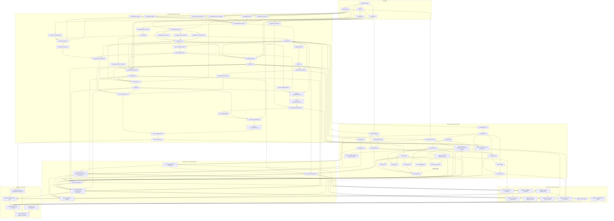

<!-- Template: antithesis_dependency_map.md -->
# Dependency Map

## Overview

How the parts of the ChainTorrent MVP fit together and in what order they are built, drawn from the [revised business case](business-case-revised.md), the [technical approach](technical-approach.md), the [workplan](../workplans/current/ChainTorrent%20MVP.md)'s build sequence, and the [MVP Application Requirements](../research/MVP%20Application%20Requirements.md). Groupings are addressed by delivery role: **foundation**, **cryptographic validation harness**, **protocol core and contract suite**, **local daemon and package serving**, **onboarding shells and services**, and **acceptance and release**.

Resolution decays with distance, deliberately. The foundation and harness groupings are mapped at **ticket** resolution: one ticket per source file, which is the node template's unit, so that each ticket is a candidate node the workplan author can promote. Inside the protocol core, the hashing, signature, and swarm milestones are also at ticket resolution, because they depend on nothing the harness measures and run beside it; the remaining protocol core milestones are mapped as **sprints** named by dependency role. Beyond that the map holds **epics**, then **milestones**, then **objectives**. The reason is that implementation of the nearest work will produce discoveries that revise the anticipated order of everything after it, and detail authored now for distant groupings would be rewritten rather than used. When the harness closes, the remaining protocol core milestones are re-mapped to ticket resolution from what was learned, and the decay shifts outward.

Tickets are candidates, not nodes. No node is authored here; a ticket names the source file's role and its dependencies so a node can be written from it through the ordinary authoring path. Every adapter family is a crate holding its `factory` module, which owns the generic interface, the capability declaration, and the factory function, and its concretes as private modules beneath it, and the map names tickets accordingly: a family's factory ticket is `crate/factory`, a concrete's `crate/concrete`, a function a concrete owns `crate/concrete/function`, a function the family owns `crate/function`, a module of the domain or workflows crate `crate/module` with its functions beneath it, a contract `contracts/<suite>/Contract`, and a configuration-only ticket its directory; the [technical requirements](technical-requirements.md)' file tree spells every path, crate directories hyphenated and module directories underscored. A concrete adapter is one node, since its operations are the methods of one adapter in one file. Within a family the first ticket, its first concrete or a family-owned function that precedes it, authors the generic interface, the declaration, and the family's mock as its producers, since it is the first source file that requires them, and creates the crate; each further concrete and family-owned function follows; the factory ticket, which constructs the concretes and so consumes them, follows every concrete of the family in this workplan and is revised in place when a later milestone adds a concrete; and every consumer ticket depends on the factory and never on a concrete. The declarations the composition resolver reads therefore exist from the family's first ticket. A family's factory ticket closes a producer, implementation, consumer chain, so it carries the family's integration test across the factory and its concretes; the commit sits on the last ticket of the milestone's chain, which for a milestone that closes at a family is that family's factory.

## Components

Grouped by role. Within a grouping at ticket resolution each row is a ticket; elsewhere each row is a sprint, epic, milestone, or objective as the decay dictates.

### Foundation, at ticket resolution

The workspace every node builds on, the secret type that cannot be formatted, the randomness family every key-generating ticket draws from, and the continuous integration that proves each ticket where the completion boundary requires. The encoding family is not a foundation member, since nothing encodable exists here; it follows the first encodable domain type at the head of the harness grouping. No crate is created ahead of the module that first lives in it; each ticket below creates its crate when that crate does not yet exist. A configuration file is authored once, complete, by the ticket that creates it, and no later ticket amends it; a crate's manifest and its `lib.rs` barrel are the exceptions by the topics' own design, since each module's ticket adds its dependencies to the manifest as its deps element and its re-export line to the barrel as its provides element.

| Ticket | Owns | Depends on | Proves |
| --- | --- | --- | --- |
| `workspace/cargo` | The virtual workspace manifest with the glob members `crates/*`, `adapters/*`, and `apps/*`, the lint table, and the `[patch.crates-io]` overlay pointing `librqbit` at the project's overlay branch `chaintorrent-overlay` in `https://github.com/tsylvester/rqbit`, which exists at a tagged upstream release before the bootstrap as external setup; `rust-toolchain.toml`; `deny.toml` with the license allowlist and that repository in `allow-git`; `.gitignore`; configuration files with no types and no tests, each authored once and complete | nothing | The root configuration every later ticket builds within; its build proof arrives with the first member |
| `domain/secret` | The secret-typed value: no formatting or serialization trait, an explicit accessor for the cryptographic operations and custody wrapping that consume it, zeroization on drop through `zeroize`, a crate dependency; creates the `domain` crate | `workspace/cargo` | CR-07 exclusion of secrets from logs, proven at compile time; the lint table's rejection of `unsafe_code`, `unwrap_used`, `expect_used`, `panic`, and `as_conversions` in the first production crate |
| `random/os` | The concrete over the operating system's generator; authors, as its producers, the randomness family's interface that fills bytes, the declaration, and the family's mock; creates the `adapters/random` crate; pins `rand_core` and `getrandom` | `workspace/cargo` | CR-05 contract; repeated draws of a fixed width pairwise distinct across a fixed count, and a filled buffer of a fixed length holding more than one distinct byte value; CR-05's per-bootstrap independence is proven at the First Finder engine and its reproducible publisher derivation at the explicit publisher path |
| `random/factory` | The randomness family's factory function, constructing the concrete a configuration names with a branch per concrete, and the crate's public surface; carries the family's integration test across factory and concrete and the grouping's commit | `random/os` | CR-05: the one surface every production draw passes through |
| `workspace/ci` | The Rust continuous-integration definition `.github/workflows/rust.yml`, authored once and complete: `cargo fmt --check`, `cargo check`, `cargo clippy`, the unit and integration tests, `cargo-deny`, and `cargo-audit` on Windows, macOS, and Linux; a configuration file with no types and no tests; the Solidity, shell, fuzz, and end-to-end checks are separate workflow files, each created once by the ticket that first needs it | `workspace/cargo` | XA-07 facilities run in CI; NF-M07; `deny.toml` read and enforced on every supported platform |

### Cryptographic validation harness, at ticket resolution

The harness begins with the domain's identifier modules and the derivation context, the first encodable domain types, followed by the encoding family that describes and encodes them, and builds the pairing, key-derivation, hash-to-scalar, credential KEM, envelope, and delivery proof families, each from its first ticket, which carries the family's interface, to its factory, which follows every concrete, exercises the deployed verifier on Base Sepolia, and records the measurements against the configured piece-group size and curve defaults with any adjustment the data supports (CD-07, AS-21). It constructs every curve and verifier-form combination through the factories, so an invalid combination is refused in the harness exactly as the daemon's resolver will refuse it. Every ticket is one Rust source file with its full support system except where the row says otherwise; a family's first ticket owns the family's generic interface, declaration, and mock beside its own implementation, a further concrete ticket is one adapter whose operations are its methods, and the factory ticket owns the factory function and the crate's public surface.

| Ticket | Owns | Depends on | Proves |
| --- | --- | --- | --- |
| `pairing/bn254_arkworks` | The BN254 concrete on arkworks, precompile-matching encodings, declaring the curve and first-group-only arithmetic at the verifier; authors, as its producers, `IPairingAdapter` with generators, add, mul, MSM, subgroup check, and the pairing-product check, the group-element and scalar associated types, the sampling bound on the scalar associated type, sample from uniform bytes, the declaration of the curve, of second-group arithmetic at the verifier, and of precompile encodings, and the family's mock; owns its scalar and group-element types, holding the library's elements as private fields behind fallible constructors that perform the subgroup and encoding checks, names them as the associated types, implements the sampling bound on its scalar type, and proves the in-range draw; creates the `adapters/pairing` crate; pins `ark-ec`, `ark-ff`, and `ark-bn254` | `workspace/cargo`, `random/factory` | CR-10 contract and CR-10 on BN254; the declaration the proof and chain factories read |
| `pairing/bn254_halo2curves` | The BN254 concrete on `halo2curves`, precompile-matching encodings, declaring the curve and first-group-only arithmetic at the verifier; owns its scalar and group-element types over its library's elements behind fallible constructors, implements the sampling bound on its scalar type, and proves the in-range draw; pins `halo2curves` | `pairing/bn254_arkworks` | CR-10 on BN254 |
| `pairing/bls12_381_arkworks` | The BLS12-381 concrete on arkworks, precompile-matching encodings, subgroup checks on every input, declaring the curve and second-group arithmetic at the verifier; owns its scalar and group-element types over its library's elements behind fallible constructors, implements the sampling bound on its scalar type, and proves the in-range draw; pins `ark-bls12-381` | `pairing/bn254_arkworks` | CR-10 on BLS12-381 |
| `pairing/bls12_381_halo2curves` | The BLS12-381 concrete on `halo2curves`, precompile-matching encodings, subgroup checks on every input, declaring the curve and second-group arithmetic at the verifier; owns its scalar and group-element types over its library's elements behind fallible constructors, implements the sampling bound on its scalar type, and proves the in-range draw | `pairing/bn254_arkworks` | CR-10 on BLS12-381 |
| `pairing/factory` | The pairing family's factory function, admitting a curve the chain's declared precompile sets support and constructing the default concrete for that curve, the arkworks concrete per the tech stack's assumption, unless the composition names one, with a branch per concrete, and the crate's public surface; the benchmark's record revises this ticket in place if it selects otherwise; carries the family's integration test across factory and concretes | `pairing/bn254_arkworks`, `pairing/bn254_halo2curves`, `pairing/bls12_381_arkworks`, `pairing/bls12_381_halo2curves` | The surface the hash-to-scalar, KEM, envelope, proof, and chain tickets consume |
| `harness-crypto/benchmark` | The measurement of scalar multiplication, multi-scalar multiplication, and pairing over every pairing concrete, each constructed through the pairing factory, recording the default per curve, which revises the factory ticket in place if it differs from the arkworks assumption; names no library; creates the `apps/harness-crypto` crate | `pairing/factory` | The recorded default per curve |
| `domain/asset_identity` | The canonical asset identity, the package name and version, with its fallible `try_new` constructor enforcing its invariants | `domain/secret` | The identity every record, hash-card, and derivation names |
| `domain/deployment_identity` | The registry-assigned deployment identity with its fallible `try_new` constructor enforcing its invariants | `domain/secret` | The deployment every derivation and object is bound to |
| `domain/suite_identifier` | The cryptographic suite identifier and version with its fallible `try_new` constructor enforcing its invariants | `domain/secret` | The suite every derivation is bound to |
| `domain/parameter_set_identifier` | The parameter-set identifier with its fallible `try_new` constructor enforcing its invariants | `domain/secret` | The set every capsule and wrapping key is bound to |
| `domain/group_index` | The piece-group index with its fallible `try_new` constructor enforcing its bounds | `domain/secret` | The group every piece-group key is bound to |
| `domain/piece_geometry` | The piece size, piece-group size, and addressable extent with their fallible `try_new` constructor enforcing alignment | `domain/secret` | The geometry every derivation and the cipher are bound to |
| `domain/asset_identity_hash` | The asset identity hash, the registry key the hash-card fixes as the BLAKE3 hash of the asset's coordinates, with its fallible `try_new` constructor refusing the all-zero value | `domain/secret` | The key every asset record, transcript, and asset-scope identity mapping names |
| `domain/derivation_context` | The derivation context composed of the asset identity, deployment identity, suite identifier, parameter-set identifier, group index, and geometry, with its fallible `try_new` constructor enforcing its invariants; the first encodable domain type | `domain/asset_identity`, `domain/deployment_identity`, `domain/suite_identifier`, `domain/parameter_set_identifier`, `domain/group_index`, `domain/piece_geometry` | The context every wrapping key and lineage derivation is domain-separated by |
| `encoding/derivation_context` | The family-owned description of the derivation context, implementing the encoding contract as its canonical field sequence, stated once and format-free; authors, as its producer, the repo-owned encoding contract in the encoding factory's interface, which names no format and no vendor; creates the `adapters/encoding` crate | `domain/derivation_context` | The contract, and the first description every encoding concrete encodes |
| `encoding/abi` | The Ethereum ABI concrete through `alloy`'s sol types, implementing both interfaces as one adapter; untrusted bytes to the owned type or its error; authors, as its producers, `IEncoderAdapter` and `IDecoderAdapter` with the versioned encoding identifier, the encoding types, the capability declaration, and the family's mock; its known-answer vectors are the derivation context's and its identifiers' encodings authored from the ABI specification, which the generator later mirrors, and its round trip and its rejections of truncated input, trailing bytes, non-canonical padding, and a wrong element count run over the same values through the description; adds to the encoding contract the byte-string kind, which carries a pairing group element's precompile encoding, encoded as ABI `bytes` against its own known-answer vector, and, for the proof family's transcript descriptions, the fixed twenty-byte and 256-bit unsigned kinds, each named as a width, mapped to its ABI type by this concrete, and encoded against its own known-answer vector with the decoder rejecting a word outside the width; pins `alloy` | `encoding/derivation_context` | ABI encoding of the derivation context against its vectors; round trip; malformed input rejected; the hash-card's encoding identifier; the byte string a statement over group elements is encoded as; the widths a transcript's parties and entitlements are encoded as |
| `encoding/factory` | The encoding family's factory function, constructing the concrete the configuration or a hash-card names with a branch per concrete, and the crate's public surface; carries the family's integration test across factory, concrete, and description | `encoding/abi` | The generic surface every hashed, signed, stored, or framed value passes through |
| `kdf/blake3_keyed` | The BLAKE3 keyed-derivation concrete; context strings, serialization, and output lengths frozen with known-answer vectors from an independent implementation; authors, as its producers, the interface that derives a key of a stated length from key material under an encoded context, the KDF identifier declaration, and the family's mock; creates the `adapters/kdf` crate; pins `blake3` | `encoding/factory`, `domain/derivation_context` | CR-05, CR-11 derivation contract and vectors |
| `kdf/factory` | The key-derivation family's factory function with a branch per concrete, and the crate's public surface; carries the family's integration test across factory and concrete | `kdf/blake3_keyed` | The surface every off-chain derivation passes through |
| `hash-to-scalar/keccak256` | The keccak256 concrete under domain tags, reduced modulo the group order, with vectors the generator mirrors; authors, as its producers, the interface that maps domain-tagged bytes to a scalar of the resolved pairing's field, the domain-tag types with their fallible constructors, the identifier declaration, and the family's mock; creates the `adapters/hash-to-scalar` crate | `encoding/factory`, `pairing/factory` | CR-08, CR-09 identity-mapping and challenge contract and vectors |
| `hash-to-scalar/factory` | The hash-to-scalar family's factory function with a branch per concrete, and the crate's public surface; carries the family's integration test across factory and concrete | `hash-to-scalar/keccak256` | The surface every value a contract recomputes passes through |
| `kem/bb1_depth_one` | The depth-one Boneh–Boyen concrete as one adapter: random master scalar and parameter set for escrow lineage, issuance with trivial identity-element refusal, seller-side rerandomization without the master scalar, the public validity check with encoding and subgroup validation, encapsulation under both identity scopes, well-formedness, and decapsulation to the encapsulated value; owns its parameter-set, credential, capsule, and identity-element types; authors, as its producers, `ICredentialKemAdapter` with setup, deriveIdentity, issue, rerandomize, isValid, encapsulate, isWellFormed, and decapsulate, the parameter-set, master-scalar, credential, capsule, identity-element, and encapsulated-value types as associated types, the identity mapping over caller-supplied canonical identity bytes, the identity-scope declaration, and the family's mock; creates the `adapters/kem` crate | `pairing/factory`, `hash-to-scalar/factory`, `random/factory`, `domain/secret`, `encoding/factory` | CR-08 contract and algebraic properties, LC-08, EC-06, CD-08 declaration |
| `kem/factory` | The credential KEM family's factory function, admitting a concrete by the suite's declared scope, with a branch per concrete, and the crate's public surface; carries the family's integration test across factory and concrete | `kem/bb1_depth_one` | CD-08 admission; the surface the sidecar, vector, and delivery tickets consume |
| `envelope/possession_statement` | The family-owned description of a proof of possession's statement, the key's and the commitment's precompile encodings as byte strings, implementing the encoding contract as its canonical field sequence; creates the `adapters/envelope` crate | `encoding/abi` | LC-08 and CR-09, the proof of possession's statement frozen as one field sequence |
| `envelope/pairing_elgamal` | The pairing ElGamal concrete as one adapter: two independently keyed envelope keys generated from caller-supplied secret draws, each with a Schnorr proof of possession whose challenge is the hash-to-scalar mapping of the encoded possession statement, identity-element and shared-secret rejection, encryption of a credential's `CredentialComponents` with independent coins drawn through the randomness family, decryption under the recipient's key pair; owns its key-pair, public-key, possession, and envelope types; authors, as its producers, `IKeyAgreementAdapter` with key generation under proofs of possession, wrap, and unwrap, the key-pair, public-key, possession, and envelope types as associated types with their fallible constructors, a recipient's public keys admitted only with their proof of possession, the envelope-algebra declaration, and the family's mock | `envelope/possession_statement`, `pairing/factory`, `hash-to-scalar/factory`, `random/factory`, `domain/secret`, `encoding/factory`, `kem/factory` | CR-04 contract; LC-08 at the algebra level |
| `envelope/factory` | The envelope family's factory function with a branch per concrete, and the crate's public surface; carries the family's integration test across factory and concrete | `envelope/pairing_elgamal` | The surface every envelope passes through |
| `proof/mint_statement` | The family-owned description of the mint transcript under delivery-statement version one, implementing the encoding contract as its canonical field sequence: the suite identifier, the chain, the entitlement contract, the asset identity hash, the parameter-set digest, the source and target entitlements, the old and new interval counters, the purpose, the issuer's identity in the seller field, the buyer's identity, the buyer's envelope keys, the new envelope, the expiry, and the mint relation's first messages, each group element as its precompile encoding; the purpose values mint, transfer, grant, and replacement as declared data with their sixteen-bit codes and relations; the version constant; generic over the chain family's identity, entitlement, interval, and chain-identifier forms, the entitlement contract taking the identity form, and authors, as its producers, the encoding family's canonical-field contract `ICanonicalField` in the encoding factory's interface with its mock form in the encoding factory's mock, a form's declared field kind, its conversion to one canonical field value, and its fallible reconstruction from one with a typed refusal, and the chain family's form interface, the trait carrying those forms as associated types each bounded by that contract, and the forms' mock, in `adapters/chain`'s factory module, creating that crate with that interface alone and a dependency on `adapters/encoding`, while `ISettlementAdapter`, `IEntitlementStateAdapter`, and the declaration wait for their first consumer in the chain and submission sprint; creates the `adapters/proof` crate | `encoding/abi`, `encoding/factory`, `domain/asset_identity_hash`, `domain/suite_identifier`, `domain/parameter_set_identifier` | CR-09 statement binding under the version the hash-card names; the mint transcript frozen as one field sequence; the chain family's declaration the resolver reads |
| `proof/transfer_statement` | The family-owned description of the transfer transcript under delivery-statement version one, serving sale and grant: the mint transcript's context with the seller's identity and envelope keys, the old envelope, and the transfer relation's first messages, the source entitlement equal to the target for a sale and the author's entitlement for a grant with the old counter the author's current interval and the new counter zero | `proof/mint_statement` | CR-09; CD-05's grant statement frozen as one field sequence |
| `proof/schnorr_fs/challenge` | The function the concrete owns: the Fiat–Shamir challenge as the hash-to-scalar mapping, under the proof's domain tag, of a transcript's encoding through the encoding and hash-to-scalar concretes the hash-card's identifiers name; creates the `schnorr_fs` module | `proof/mint_statement`, `proof/transfer_statement`, `hash-to-scalar/factory`, `encoding/factory` | CR-09 statement binding |
| `proof/schnorr_fs` | The generalized Schnorr concrete as one adapter: the mint prover, the transfer prover from the seller's fresh decryption and total offset, and the reference verifier in both forms, second-group arithmetic and the hash-weighted pairing product with first-group arithmetic only; declares both forms; authors, as its producers, `IDeliveryProofAdapter` with proveMint, proveTransfer, and verify, the algebraic mint and transfer statement types over the pairing's group elements, the proof type as an associated type, the declaration of supported envelope algebras, verifier forms, and delivery-statement versions, and the family's mock | `proof/schnorr_fs/challenge`, `pairing/factory`, `envelope/factory`, `kem/factory`, `random/factory` | CR-09, CD-01, CD-02 |
| `proof/factory` | The delivery proof family's factory function, admitting a concrete only when it declares the resolved envelope's algebra, the verifier form the resolved pairing declares, and the delivery-statement version the hash-card names, with a branch per concrete, and the crate's public surface; carries the family's integration test across factory and concrete | `proof/schnorr_fs` | CR-09 contract; the admission rule the harness exercises |
| `workflows/sidecar/wrap` | The wrapping key derived through the KDF family from an encapsulated value and the context, and the XOR wrap of a piece-group key under it; creates the `workflows` crate | `kdf/factory`, `kem/factory`, `encoding/factory` | CR-11 wrap |
| `workflows/sidecar/unwrap` | The unwrap of a piece-group key from its wrapped value under the derived wrapping key | `workflows/sidecar/wrap` | CR-11 cross-set agreement |
| `contracts/evm/PairingLib` | The Solidity library over the precompiles in both forms, with contract-side subgroup checks where the precompile does not perform them; creates `contracts/evm/foundry.toml` and the Solidity continuous-integration definition `.github/workflows/contracts.yml` with `forge build` and `forge fmt --check`, each authored once and complete | `workspace/ci`; mirrors the pairing family's declared precompile encodings | CR-10 on chain |
| `harness-crypto/generate/evm` | The EVM concrete emitting Solidity constants and test vectors for the pairing library and the verifier, including the challenge and identity-mapping vectors, through the proof and hash-to-scalar factories; authors, as its producers, the generate family's interface that emits a target suite's constants and test vectors from the Rust reference, its declaration, and its mock | `harness-crypto/benchmark`, `proof/factory`, `hash-to-scalar/factory`, `encoding/factory` | CR-09 parity inputs; CR-11 on-chain vectors |
| `harness-crypto/generate/factory` | The generate family's factory function with a branch per concrete, and its public surface; carries the family's integration test across factory and concrete | `harness-crypto/generate/evm` | CR-09 parity-input contract |
| `contracts/evm/DeliveryVerifier` | Solidity mint and transfer verification over the statement fields, bit-for-bit with `proof/schnorr_fs`, its constants and vectors generated | `contracts/evm/PairingLib`, `harness-crypto/generate/factory` | CD-03, CR-09 |
| `contracts/evm/deploy` | The deployment script for the verifier on each curve form to Anvil and Base Sepolia, emitting addresses to configuration; exempt from the full support structure as a deployment script | `contracts/evm/DeliveryVerifier` | CD-07 |
| `harness-crypto/verifier/evm` | The EVM concrete over the deployed verifier through `alloy`; authors, as its producers, the verifier family's interface that reaches a suite's deployed delivery verifier, submits a statement and proof, and reads acceptance and cost as L2 execution gas and L1 data fee, its declaration, and its mock; pins `alloy` for the harness | `contracts/evm/deploy`, `proof/factory`, `encoding/factory` | CD-03 cross-verification |
| `harness-crypto/verifier/factory` | The verifier family's factory function with a branch per concrete, and its public surface; carries the family's integration test across factory and concrete | `harness-crypto/verifier/evm` | CD-03 cross-verification contract |
| `harness-crypto/vectors` | Algebraic, mutation, and admission vector sets constructed through the factories: cross-holder agreement, cross-set agreement with two independently generated parameter sets unwrapping one piece-group key, rerandomized validity, non-convertibility, malformed capsules, mutated statement fields, replay, and every curve and verifier-form combination the proof factory must refuse | `kem/factory`, `envelope/factory`, `proof/factory`, `workflows/sidecar/unwrap`; `random/factory`, whose production concrete supplies the independent draws, the drawn values recorded with each emitted vector | CR-08, CR-09, CR-11 vectors; AS-17 for the cryptographic families |
| `harness-crypto/measure` | Size, timing, and gas capture per curve: capsule, envelope, proof bytes; decapsulation per group; prove and verify time; mint and transfer cost as L2 execution and L1 data fee | `harness-crypto/vectors`, `harness-crypto/verifier/factory` | CD-07, RO-03 |
| `harness-crypto/report` | The release-evidence report recording the measurements, the piece-group size and curve defaults in force, and any adjustment the data supports, selecting nothing against a threshold; the grouping's integration test across the whole chain and its commit | `harness-crypto/measure` | AS-21 |

### Protocol core and contract suite

The hashing, signature, and swarm milestones are at ticket resolution; they depend on nothing the harness measures and run beside it from `encoding/factory` onward, since their first tickets consume the encoding family, and each begins with the first concrete of its family, which carries the family's interface, and closes each family at its factory. The remaining milestones are sprints, re-mapped to tickets when the harness closes.

#### Hashing and commitments, at ticket resolution

| Ticket | Owns | Depends on | Proves |
| --- | --- | --- | --- |
| `hashing/blake3_bao` | The BLAKE3/Bao concrete as one adapter: root and outboard construction, verification, challenge and response, and keyed mode for the keyed plaintext-root disclosure mode; authors, as its producers, the commitment interface with root and outboard construction over a byte stream, streaming and random-access verification against a root with an authentication path, and random chunk challenge and response, the root, outboard, path, and chunk types with their fallible constructors, the commitment-scheme identifier the hash-card carries, the commitment-scheme and chunk-granularity declaration, and the family's mock; creates the `adapters/hashing` crate; pins `blake3` and `bao` | `encoding/factory` | CR-02 contract, construction, verification, and challenges; EC-02; SW-04 |
| `hashing/factory` | The hashing family's factory function with a branch per concrete, and the crate's public surface; carries the milestone's integration test and commit | `hashing/blake3_bao` | The surface every content root passes through |

#### Signature services, at ticket resolution

| Ticket | Owns | Depends on | Proves |
| --- | --- | --- | --- |
| `signature/ed25519` | The Ed25519 concrete with domain separation and complete-message binding; authors, as its producers, `ISignatureAdapter` with sign, isValidSignature, recoverSigner, and canonicalAddress, the signature types with their fallible constructors, the per-layer declaration of scheme and layers served, and the family's mock; creates the `adapters/signature` crate; pins `ed25519-dalek` | `encoding/factory`, `random/factory` | CR-03 contract and CR-03 |
| `signature/secp256k1` | The secp256k1 concrete through `alloy`, with EIP-712 typed data for registrations, bindings, and signed intents; pins `alloy` for the signature crate | `signature/ed25519` | CR-03, IW-07, LC-13 intents |
| `signature/factory` | The signature family's factory function, resolving a scheme per layer, with a branch per concrete, and the crate's public surface; carries the milestone's integration test and commit | `signature/ed25519`, `signature/secp256k1` | The surface every layer signs through |

#### Swarm transport, discovery, storage, and seed host, at ticket resolution

| Ticket | Owns | Depends on | Proves |
| --- | --- | --- | --- |
| `transport/rqbit` | The `librqbit` concrete over the overlay branch the workspace manifest names: the piece-completion hook, the peer-injection call, and the storage-backend trait on that branch with each hook's upstream issue; root-to-infohash translation; torrent creation per object with the ciphertext and each sidecar as its own object and locator; Bao verification of every completed piece after the library's check, through the hashing family; seeder-map peer injection; the engine capability; authors, as its producers, `ISwarmTransportAdapter`, the locator types with their fallible constructors, the declaration of the integrity structure on the wire and of the engine capability a transport may expose for library-backed discovery, and the family's mock; creates the `adapters/transport` crate; pins `librqbit` | `hashing/factory`, `encoding/factory` | SW-01 contract, SW-01, SW-06, EC-02 |
| `transport/factory` | The transport family's factory function with a branch per concrete, and the crate's public surface, including the engine capability; carries the family's integration test across factory and concrete | `transport/rqbit` | The surface the seed host, resolution, and library-backed discovery consume |
| `discovery/local` | Local-network discovery as a source; authors, as its producers, `IPeerDiscoveryAdapter`, the peer types with their fallible constructors, the declaration, and the family's mock; creates the `adapters/discovery` crate | `encoding/factory` | SW-02 contract; SW-02 |
| `discovery/dht` | The library's DHT as a source, through the engine capability the transport factory's surface exposes | `discovery/local`, `transport/factory` | SW-02 |
| `discovery/pex` | Peer exchange as a source, through the same engine capability | `discovery/local`, `transport/factory` | SW-02 |
| `discovery/tracker` | Trackers as a source, through the same engine capability | `discovery/local`, `transport/factory` | SW-02 |
| `discovery/aggregate` | The family-owned aggregation: concurrent sources unioned and deduplicated, none authoritative | `discovery/local` | SW-02 aggregation under overlapping, conflicting, unavailable, and malicious results |
| `discovery/factory` | The discovery family's factory function, resolving every source the composition admits behind the aggregation, with a branch per concrete, and the crate's public surface; carries the family's integration test across factory and concretes; revised in place when the chain and submission sprint adds `discovery/seeder_map` | `discovery/local`, `discovery/dht`, `discovery/pex`, `discovery/tracker`, `discovery/aggregate` | The surface the swarm engine consumes |
| `storage/redb` | The `redb` concrete; authors, as its producers, the key-value store interface with tables, transactions, and checkpoints, its types with their fallible constructors, the declaration, and the family's mock; creates the `adapters/storage` crate; pins `redb` | `encoding/factory` | XA-03 and SW-05 store contract; transactions and checkpoints under interruption |
| `storage/factory` | The storage-engine family's factory function with a branch per concrete, and the crate's public surface; carries the family's integration test across factory and concrete | `storage/redb` | The surface every index, the job engine, and the configuration registry consume |
| `seed-host/owned` | The owned concrete: persistent seeding independent of sessions, the root-keyed ciphertext store with holding reason, quota, and eviction, its index through the storage family, settings passthrough and enforcement, archive enumeration; authors, as its producers, `ISeedHostAdapter` with held-and-served, take custody, release, capacity and usage, and enumerate, the holding types with the obligated-versus-voluntary distinction and their fallible constructors, the capacity and holding-reason declaration, and the family's mock; creates the `adapters/seed-host` crate | `hashing/factory`, `encoding/factory`, `transport/factory`, `storage/factory` | SW-05 contract; SW-03, SW-05, SW-07, ST-06; PR-05 separation |
| `seed-host/rqbit` | The delegated concrete: the rqbit application driven through its HTTP API, root-to-identifier translation, and Bao custody challenges through the hashing family | `seed-host/owned`, `hashing/factory` | SW-04 |
| `seed-host/factory` | The seed host family's factory function with a branch per concrete, and the crate's public surface; carries the milestone's integration test across owned and delegated retrieval and its commit | `seed-host/owned`, `seed-host/rqbit` | The surface resolution and the First Finder consume |

#### Remaining milestones, as sprints

| Sprint by role | Contents | Depends on |
| --- | --- | --- |
| Domain model | The protocol's remaining types, each authored in the node of the file that first consumes it and housed in the module that implements it, fixed when that module's ticket is written, the identifier modules and the derivation context being harness tickets; the `domain` crate holds only the types its own modules implement; for each encoded type, its canonical description as the encoding family's module `encoding/<type>`, implementing the factory's contract for that type, one module per type, authored after the type and before the first ticket that encodes it | the types the harness families own; `domain/derivation_context`; `encoding/factory` |
| Payload cipher and sidecar layer | `cipher/aes_ctr` with the counter layout and extent rules, authoring `IPayloadCipherAdapter`, the counter-layout and addressable-extent declarations, and the family's mock as its producers and creating the `adapters/cipher` crate, then `cipher/factory`; `workflows/sidecar/build`, per live set a capsule and wrapped piece-group key per group committed by that set's Bao root, each sidecar its own object, and `workflows/sidecar/validate`, the manifest, hash-card, and sidecar validation ordering; the `sample_deployment` generator for the site demonstration, which needs the cipher and so lives here rather than in the harness and carries the configured piece-group size default | domain model; `hashing/factory`; `workflows/sidecar/wrap`; `kem/factory` |
| Registry and entitlement contracts, the EVM suite | Under `contracts/evm`: asset records with the per-name version index, deployments and hash-cards, attestation verification through the `IAttestationVerifier` adapter bound per source with the npm P-256 verifier as the first concrete and the source-key table it reads, later escrow deployments, parameter-set liveness with the sidecar-coverage rule and sidecar addition, the envelope-key registry, `IEntitlement` with the ERC-721 concrete carrying interval state and the ownership override that disables standard transfers, issuance and transfer calling the delivery verifier, batched grant requests readable by holders and closed by grant or withdrawal, escrow records per deployment, identity binding, the identity contract account under ERC-1271 with its device registry and the `isDeviceAdmitted` view, claim-set state layout, batch and paginated views; every identity-bound mutation taking the acting identity and a signed intent verified through the account against a signer whose permissions cover it, the contracts enforcing lock expiry and no volume limit | harness contracts; domain model |
| Chain and submission families | `chain/base` with the contract bindings, Base's tier mapping, `evaluateAuthorization` and batch with per-context bindings, and the event and calldata reader, authoring the chain interface, `ISettlementAdapter`, `IEntitlementStateAdapter`, the declaration, and their mock as its producers in the factory module `proof/mint_statement` created, implementing the form interface authored there, and supplying Base's identity, entitlement, interval, and chain-identifier forms; `chain/quorum_view`, the family-owned aggregation of two of three configured nodes at a common reference, stale ignored, divergence and views older than `τ_soft` failing closed; `chain/factory`; `submission/self_funded`, the path the daemon uses on Base Sepolia until the relayer exists, authoring the interface for submitting a signed intent and its declaration and creating the `adapters/submission` crate; `submission/factory`, revised in place when the relayer milestone adds `submission/paymaster` and `submission/relayer`; `discovery/seeder_map`, the on-chain seeder map as a discovery source through the chain factory, with `discovery/factory` revised in place to carry its branch | registry and entitlement contracts; `signature/factory`; `discovery/factory` |
| Adapter registry and factory, on chain | The `AdapterRegistry` governed by a single project-held key and the factory that constructor-injects the identity adapters, the signature adapters, the attestation verifier per source, and the entitlement token form, each immutable once bound | registry and entitlement contracts |

### Local daemon and package serving, as epics

| Epic by role | Contents | Depends on |
| --- | --- | --- |
| Durable jobs and configuration | `telemetry/local_metrics` over the storage family, authoring the exporter interface, the declaration, and the family's mock as its producers and creating the `adapters/telemetry` crate, then `telemetry/tracing`, the family-owned tracing setup carrying per-request correlation identifiers, then `telemetry/factory`, revised in place when observability adds `telemetry/opentelemetry`; `workflows/jobs`, the job engine over the storage family with checkpointing and idempotent restart; `workflows/config`, the versioned configuration registry over the storage and encoding families, and the settings catalogue; `platform-paths/linux`, authoring the application-directory interface and creating the crate, `platform-paths/macos`, `platform-paths/windows`, and `platform-paths/factory` for the store-root defaults; `workflows/compose`, capability resolution across every factory, failing closed; the `ipc` family's `ipc/framing` and `ipc/principals`, family-owned and creating the crate, `ipc/unix_socket` authoring the IPC transport interface, `ipc/named_pipe`, `ipc/server` with the control-principal and local-presence rules, and `ipc/factory`; `lifecycle/lock`, the single-instance lock as a family-owned function creating the `adapters/lifecycle` crate, the family's concretes and factory following in the installation coordinator; the daemon binary | domain model; `storage/factory` |
| Identity and custody | `custody/holder_seed` with the control and envelope branches, family-owned and creating the `adapters/custody` crate; `custody/device_key`; `custody/local_keystore` over `keyring` with version-headed blobs, authoring `IKeyCustodyAdapter`, the versioned capability set including device roles, and the family's mock as its producers; `custody/upgrade`, the in-place migration between concretes verified against the chain, through the interface; `custody/factory`; `wallet/eip1193`, authoring the signing-only wallet interface and creating the crate, `wallet/walletconnect`, and `wallet/factory`; `identity/publisher_authority`, authoring `IIdentityAdapter` with the binding schema and creating the crate, `identity/escrow`, and `identity/factory`; `workflows/identity` with identity creation, relayer-paid binding and contract account creation, envelope-key registration, device pairing, signer admission, and revocation | the signature tickets; the chain and submission families; `envelope/factory`; `kdf/factory`; durable jobs and configuration |
| Plaintext CAS, resolution orchestrator, and package host | `cas/filesystem`, verified atomic CAS of tarballs extracted per project by the package manager with nothing linking into the store, quota, pinning, eviction, its index through the storage family, authoring the store interface and creating the crate, then `cas/factory`; `workflows/resolve` with the hedged source order under the catalogue's source deadline and grant wait, and upstream for any identity without a credential; `package-host/npm` with its metadata store, the npm registry protocol served locally with canonical tarball URLs, authoring `IPackageHostAdapter` and creating the crate, then `package-host/factory`; per-asset independence status in `workflows/health` | durable jobs and configuration; `hashing/factory` |
| First Finder ingest | `ingest/npm` with attestation validation or recorded absence, metadata capture, and availability as eligibility, authoring `IIngestSourceAdapter` and creating the crate, then `ingest/factory`; `workflows/first_finder` with the foreground serve, the background bootstrap job, the state-locked registration race, escrow custody of the master scalar, seeding, and the finder's grant of the asset's first entitlement to itself; `workflows/grant` | plaintext CAS and package host; the swarm tickets; the registry contracts; the chain and submission families; identity and custody; `kem/factory`, `envelope/factory`, and `proof/factory`; `workflows/sidecar/build` |
| Credential delivery and per-attempt authorization | Envelope-key registration on first run; `workflows/request`, the batched grant request job and its pickup from chain events; `workflows/prefetch` with pinning, seeding, and set matching; `workflows/acquire` with mint and grant delivery, holders fulfilling requests for absent requesters, and sale delivery; credential load and recovery; `workflows/attempt` with `τ_soft` and `τ_wallet`; `workflows/decrypt` with decapsulation through the KEM factory, unwrap through `workflows/sidecar/unwrap`, and decryption through the cipher factory; `workflows/interval_end`; `workflows/gate` | the chain and submission families; identity and custody; `kem/factory`, `envelope/factory`, and `proof/factory`; payload cipher and sidecar layer; First Finder ingest; the submission factory's relayer concrete once the relayer exists, its self-funded concrete on Base Sepolia until then |
| Demonstrable milestone | No new subsystem: a second identity on a second machine profile installs a pinned closure the First Finder ingested, at the registry's speed with requests registered and ciphertext prefetched, then with the registry unavailable, through the packaged daemon and package host over the swarm, on a grant fulfilled while it was offline; the north star, first-run independence, and install wall-clock measured on the dogfood population | credential delivery and per-attempt authorization; plaintext CAS and package host; First Finder ingest; the swarm tickets |

### Onboarding shells and services, as milestones

| Milestone by role | Contents | Depends on |
| --- | --- | --- |
| Installation coordinator | `workflows/install`, the durable install plan with platform detection, repair, update, uninstall, the health probe, the consent items, and the first-run cost disclosure; `lifecycle/systemd`, authoring the service-lifecycle interface, `lifecycle/launchd`, `lifecycle/windows_service`, `lifecycle/scheduled_task`, and `lifecycle/factory`; `artifact-verifier/sigstore`, authoring the signed-artifact verification interface and creating the crate, `artifact-verifier/authenticode`, `artifact-verifier/apple_notarization`, and `artifact-verifier/factory`; `redirect/npm`, authoring the detect, redirect, back-up, and restore interface and creating the crate, then `redirect/factory`; the installer binary | durable jobs and configuration; identity and custody |
| Visual Studio Code extension and npm bootstrap | Thin shells over the coordinator | installation coordinator |
| Desktop application and CLI | Tauri and Rust control surfaces | installation coordinator |
| Relayer or paymaster | The relayer binary with the chosen provider's bundler concrete, authoring the bundler-provider interface, and `relayer/bundler/factory`; free-path sponsorship under a global per-window budget and maximum liability with per-identity limits as one layer; the sponsorship mechanism for the identity contract account chosen here under LC-13, with `submission/paymaster` and `submission/relayer` authored as the chosen mechanism requires and `submission/factory` revised in place to carry their branches; sponsored device admission and revocation; cost and budget reporting | the chain and submission families, so it may start before the daemon grouping closes |
| Explicit publisher path | `workflows/publish` with the publisher-derived lineage, swarm-native publication of the dependency closure, and the issuance policy service; `publisher-proof/provenance`, authoring `IPublisherProofAdapter` and creating the crate, `publisher-proof/maintainer_oauth`, and `publisher-proof/factory` | First Finder ingest; identity and custody |
| Claim verifier and escrow claim | The claim verifier binary with its revocable key; `claim-verifier/attestor`, authoring `IClaimVerifierAdapter` and creating the crate, then `claim-verifier/factory`; `workflows/claim`; the claim set established from upstream metadata at verification; claim-set vouchers; the claimant parameter set; optional handover; sidecar addition; voluntary migration | registry contracts; explicit publisher path; credential delivery |
| Project seed host and site | Persistent first seeder of the core closure holding an entitlement and credential for every asset it seeds; static site; WebAssembly demonstration | `seed-host/factory`; explicit publisher path; payload cipher and sidecar layer, for the sample deployment |
| Observability | RO-03 metrics, RO-04 correlation, RO-05 health, RO-06 attempt latency and install wall-clock reported against the values in force; `telemetry/opentelemetry`, with `telemetry/factory` revised in place to carry its branch | every component that emits |
| Demonstration harness | Controlled participants, wallets, chain state, failures, and the deliberately incompatible adapter declarations the incompatibility scenario rejects, refused by the factories and by `workflows/compose` | every component under test |

### Acceptance and release, as objectives

| Objective by role | Contents | Depends on |
| --- | --- | --- |
| Transaction flow proof | Priced primary issuance and secondary transfer through the packaged applications on the Base mainnet pilot | explicit publisher path; credential delivery; relayer; external review dispositioned |
| Acceptance scenarios | Every acceptance scenario on clean machines through packaged applications | every milestone |
| External cryptographic review closed | Findings dispositioned before any priced deployment | harness report |
| Legal prerequisites | License text, regulatory review, export confirmation | none technical |
| Dogfood baseline and release | ChainTorrent published swarm-natively; baseline metrics recorded; release evidence complete | acceptance scenarios; review; legal |

## Integration Points

Where one component's output becomes another's input across a boundary that an integration test must cross, and the milestone whose integration test crosses it.

| Integration point | Producer | Consumer | Boundary crossed | Crossed in |
| --- | --- | --- | --- | --- |
| Factory admission | each family's concretes, through their declarations | the factory of every downstream family, and `workflows/compose` | A concrete admitted only when its declaration satisfies every downstream requirement; refused at construction with no side effect | The harness, for the cryptographic families; the daemon skeleton, for the whole composition |
| Verifier parity | `proof/schnorr_fs` | `contracts/evm/DeliveryVerifier` through `harness-crypto/verifier/evm` | Rust to chain; bit-for-bit acceptance on every vector | Delivery proof and Solidity verifier |
| Precompile encoding | the pairing factory's declared encodings, produced by every pairing concrete | `contracts/evm/PairingLib` | Rust encoding to precompile input | Delivery proof and Solidity verifier |
| Piece-group key | the KEM factory's decapsulate and `workflows/sidecar/unwrap` | the cipher factory | The decapsulation-to-cipher seam preserved for a future multi-key suite | Payload cipher and sidecar layer |
| Sidecar root | the KEM factory's encapsulate and `workflows/sidecar/build` | commitments and hash-card, through the hashing factory | Per live set, capsule and wrapped key per group committed by that set's Bao root; each sidecar its own object | Payload cipher and sidecar layer |
| Discovery engine | the transport factory's engine capability | `discovery/dht`, `discovery/pex`, `discovery/tracker` | Library-backed sources reach the engine through the generic surface, never through the transport concrete | Swarm transport and seed host |
| Store | the storage factory | `workflows/jobs`, `workflows/config`, the CAS index, the ciphertext index, the metadata store, `telemetry/local_metrics` | Tables, transactions, and checkpoints with no store library named by a consumer | Swarm transport and seed host, for the ciphertext index; the daemon skeleton, for the rest |
| Envelope in settlement | the envelope factory's wrap and the proof factory's provers | registry and entitlement contracts, through the submission factory | Calldata and event; digest stored | Registry and entitlement contracts |
| Signed intent | `signature/secp256k1`, through the signature factory | registry and entitlement contracts, through the submission factory | EIP-712 intent to ECDSA or ERC-1271 verification | Registry and entitlement contracts |
| Attestation verification on chain | the source's attestation, carried by `ingest/npm` | `IAttestationVerifier` bound per source by the adapter registry | The registration refused unless the source's verifier accepts, absence admitted and recorded | Registry and entitlement contracts |
| Attempt context | domain model | `chain/quorum_view` over `chain/base`, and credential delivery | View call at the declared tier from a quorum of configured nodes | Chain and submission families |
| Resolution order | resolution orchestrator | the CAS, seed-host, transport, and ingest factories | Local, encrypted, swarm, upstream, hedged | Plaintext CAS, resolution orchestrator, and package host |
| Package-manager protocol | `package-host/npm` | npm | HTTP registry protocol; resolution stays in npm; canonical tarball URLs so lockfiles stay portable | Plaintext CAS, resolution orchestrator, and package host |
| Persistent credential | the envelope and custody factories | credential delivery | Stored only under `IKeyCustodyAdapter` | Identity and custody |
| Device admission | identity manager on a root | identity contract account; the attempt engine's wallet-control assertion | Signer admitted and revoked on chain; admission read in the same state view as authorization | Identity and custody |
| Grant request to holder | request job, through the submission factory | registry request record; any holder's grant service | Batched sponsored request; holder reads open requests and fulfils them for absent requesters | Credential delivery and per-attempt authorization |
| Grant pickup from events | registry mint and grant events, through `chain/base` | request job and credential engine | Envelope recovered from chain history on the next run; set matched against held deployments | Credential delivery and per-attempt authorization |
| Installer to daemon | installation coordinator | daemon, package host, seed host, through the lifecycle and IPC factories | Service lifecycle and IPC | Installation coordinator |
| Artifact authentication | the release's signatures | the artifact-verifier factory | Every artifact and update verified before execution, under each scheme's concrete | Installation coordinator |
| Shells to coordinator | extension, npm bootstrap, desktop, CLI | installation coordinator | One coordinator, identical postcondition | Extension and npm bootstrap; desktop and CLI |
| Relayer to contracts | relayer, through its bundler factory | identity binding, requests, mint | Sponsored transactions under policy | Relayer or paymaster |
| Verifier voucher to contract | `claim-verifier/attestor` | escrow claim contract surface | Voucher bound to claimant, set, contract, chain, nonce, expiry | Claim verifier and escrow claim |
| Site demonstration | WebAssembly build of the client crates | browser | Same crates as the client; no service on the read path | Project seed host and site |

## Conflict Flags

- **Grouping membership versus dependency order.** The hashing, signature, and swarm tickets sit in the protocol core grouping and depend on no contract sprint, so they run in parallel with the harness and before the contracts.
- **Every factory follows its concretes.** A family's generic interface, declaration, and mock are authored in its first ticket, so the declarations the resolver reads exist from the family's first ticket; the factory function consumes the concretes it constructs and is authored once after every concrete of the family in this workplan; and no consumer ticket depends on a concrete.
- **A concrete a later milestone adds revises its factory's ticket in place.** `discovery/seeder_map` in the chain and submission sprint, `submission/paymaster` and `submission/relayer` at the relayer, and `telemetry/opentelemetry` at observability each add a branch by revising the family's factory ticket, which remains one ticket, per the workplan-structure rule that an existing node is copied and revised rather than followed by a second node editing the same file; the lifecycle family's lock precedes its concretes and factory, which arrive together at the installation coordinator.
- **The harness needs a verifier client before the chain family exists.** The daemon never submits a proof to the verifier, since the contracts call it inside mint, grant, and delivery, so the verifier client is the harness's own `verifier` family with an `evm` concrete, and no chain concrete carries one.
- **The chain family's interface precedes its concrete by a grouping.** The proof family's transcript descriptions are generic over the chain family's identity, entitlement, interval, and chain-identifier forms, so `proof/mint_statement`, their first consumer, authors the family's form interface and the forms' mock in `adapters/chain`'s factory module and creates that crate with that interface alone; `chain/base`, the first consumer of the settlement and entitlement-state operations and of the declaration, authors those as its producers, implements the form interface, and supplies Base's forms in the chain and submission sprint.
- **The wrap precedes the cipher.** The harness's cross-set vector needs the wrap and unwrap, so `workflows/sidecar/wrap` and `workflows/sidecar/unwrap` are harness tickets and create the workflows crate; `workflows/sidecar/build` and `workflows/sidecar/validate` wait for the cipher in the protocol core.
- **The benchmark follows the pairing concretes.** It constructs each through the pairing factory and names no library; what it records is the default concrete per curve, which the factory constructs when a composition names a curve alone, and every concrete remains beneath the factory whether or not it is the default.
- **The library-backed discovery sources share the transport's engine.** They reach it through the engine capability the transport factory's generic surface exposes, so no discovery concrete depends on `transport/rqbit`.
- **The demonstrable milestone needs a grant.** Resolving against the swarm with the registry down requires a second identity to hold a credential, so the milestone sits after credential delivery and per-attempt authorization, not at the package host.
- **Escrow claim is last by dependency.** The escrow record carries no maintainer commitment and the verifier establishes the claim set at verification time, so the milestone waits only on the publisher path, the registry contracts, and credential delivery.
- **Two verifier forms, one primary.** `contracts/evm/PairingLib` exists in both forms so the harness measures both; BLS12-381 ships as the primary form on Base and BN254 is retained.
- **The delivery verifier is built in the harness and consumed by the contract sprint.** It is the first shipped contract, written to production standard, with its constants and vectors generated from the Rust reference by `harness-crypto/generate/evm`.
- **The EVM suite is one concrete.** `contracts/evm` is the on-chain half of `chain/base`; a further chain form is a further suite beside it, and within the suite the adapter registry binds the entitlement token form, the attestation verifier per source, and the identity and signature adapters.
- **Identity and custody sits in the daemon grouping but the installer needs it.** The dependency runs the right way, coordinator depends on custody, and the epic is placed early in the grouping.
- **The identity is a contract account; its sponsorship mechanism is chosen at the relayer milestone.** The contract sprint builds the account with its device registry and takes every identity-bound mutation as a signed intent under LC-13, so `submission/paymaster`, `submission/relayer`, and `submission/self_funded` all remain open behind one factory.

## Dependencies

The dependency graph across the groupings. Edges point from producer to consumer. Identifiers are descriptive; nothing is numbered.

```mermaid
flowchart TB
    subgraph foundation["Foundation"]
        direction TB
        f_ws["workspace/cargo"]
        f_sec["domain/secret"]
        f_rand_os["random/os"]
        f_rand["random/factory"]
        f_ci["workspace/ci"]
        f_ws --> f_sec
        f_ws --> f_rand_os
        f_rand_os --> f_rand
        f_ws --> f_ci
    end

    subgraph harness["Cryptographic validation harness"]
        direction TB
        pair_bn_ark["pairing/bn254_arkworks"]
        pair_bn_h2c["pairing/bn254_halo2curves"]
        pair_bls_ark["pairing/bls12_381_arkworks"]
        pair_bls_h2c["pairing/bls12_381_halo2curves"]
        pair["pairing/factory"]
        bench["harness-crypto/benchmark"]
        dom_asset["domain/asset_identity"]
        dom_dep["domain/deployment_identity"]
        dom_suite["domain/suite_identifier"]
        dom_pset["domain/parameter_set_identifier"]
        dom_group["domain/group_index"]
        dom_geom["domain/piece_geometry"]
        dom_ctx["domain/derivation_context"]
        dom_hash["domain/asset_identity_hash"]
        enc_desc["encoding/derivation_context"]
        f_abi["encoding/abi"]
        f_enc["encoding/factory"]
        kdf_b3["kdf/blake3_keyed"]
        kdf["kdf/factory"]
        h2s_k["hash-to-scalar/keccak256"]
        h2s["hash-to-scalar/factory"]
        kem_bb1["kem/bb1_depth_one"]
        kem["kem/factory"]
        env_ps["envelope/possession_statement"]
        env_eg["envelope/pairing_elgamal"]
        env["envelope/factory"]
        proof_ms["proof/mint_statement"]
        proof_ts["proof/transfer_statement"]
        proof_ch["proof/schnorr_fs/challenge"]
        proof_sfs["proof/schnorr_fs"]
        proof["proof/factory"]
        sc_wrap["workflows/sidecar/wrap"]
        sc_unwrap["workflows/sidecar/unwrap"]
        sol_pair["contracts/evm/PairingLib"]
        gen_evm["harness-crypto/generate/evm"]
        gen["harness-crypto/generate/factory"]
        sol_verify["contracts/evm/DeliveryVerifier"]
        sol_deploy["contracts/evm/deploy"]
        hv_evm["harness-crypto/verifier/evm"]
        hv["harness-crypto/verifier/factory"]
        h_vectors["harness-crypto/vectors"]
        h_measure["harness-crypto/measure"]
        h_report["harness-crypto/report"]

        pair_bn_ark --> pair_bn_h2c
        pair_bn_ark --> pair_bls_ark
        pair_bn_ark --> pair_bls_h2c
        pair_bn_ark --> pair
        pair_bn_h2c --> pair
        pair_bls_ark --> pair
        pair_bls_h2c --> pair
        pair --> bench
        dom_asset --> dom_ctx
        dom_dep --> dom_ctx
        dom_suite --> dom_ctx
        dom_pset --> dom_ctx
        dom_group --> dom_ctx
        dom_geom --> dom_ctx
        dom_ctx --> enc_desc
        enc_desc --> f_abi
        f_abi --> f_enc
        dom_ctx --> kdf_b3
        kdf_b3 --> kdf
        pair --> h2s_k
        h2s_k --> h2s
        pair --> kem_bb1
        h2s --> kem_bb1
        kem_bb1 --> kem
        f_abi --> env_ps
        env_ps --> env_eg
        pair --> env_eg
        h2s --> env_eg
        kem --> env_eg
        env_eg --> env
        f_abi --> proof_ms
        dom_hash --> proof_ms
        dom_suite --> proof_ms
        dom_pset --> proof_ms
        proof_ms --> proof_ts
        proof_ts --> proof_ch
        h2s --> proof_ch
        proof_ch --> proof_sfs
        pair --> proof_sfs
        env --> proof_sfs
        kem --> proof_sfs
        proof_sfs --> proof
        kdf --> sc_wrap
        kem --> sc_wrap
        sc_wrap --> sc_unwrap
        bench --> gen_evm
        proof --> gen_evm
        h2s --> gen_evm
        gen_evm --> gen
        sol_pair --> sol_verify
        gen --> sol_verify
        sol_verify --> sol_deploy
        sol_deploy --> hv_evm
        proof --> hv_evm
        hv_evm --> hv
        kem --> h_vectors
        env --> h_vectors
        proof --> h_vectors
        sc_unwrap --> h_vectors
        h_vectors --> h_measure
        hv --> h_measure
        h_measure --> h_report
    end

    subgraph core["Protocol core and contract suite"]
        direction TB
        hashing_b3["hashing/blake3_bao"]
        hashing["hashing/factory"]
        sig_ed["signature/ed25519"]
        sig_k1["signature/secp256k1"]
        sig["signature/factory"]
        tr_rq["transport/rqbit"]
        tr["transport/factory"]
        disc_local["discovery/local"]
        disc_dht["discovery/dht"]
        disc_pex["discovery/pex"]
        disc_trk["discovery/tracker"]
        disc_agg["discovery/aggregate"]
        disc["discovery/factory"]
        disc_map["discovery/seeder_map"]
        st_redb["storage/redb"]
        st["storage/factory"]
        sh_owned["seed-host/owned"]
        sh_rqbit["seed-host/rqbit"]
        sh["seed-host/factory"]
        s_domain["Sprint: domain model"]
        s_cipher["Sprint: payload cipher and sidecar layer"]
        s_registry["Sprint: registry and entitlement contracts, the EVM suite"]
        s_chain["Sprint: chain and submission families"]
        s_adreg["Sprint: adapter registry and factory, on chain"]

        hashing_b3 --> hashing
        sig_ed --> sig_k1
        sig_ed --> sig
        sig_k1 --> sig
        hashing --> tr_rq
        tr_rq --> tr
        disc_local --> disc_dht
        disc_local --> disc_pex
        disc_local --> disc_trk
        disc_local --> disc_agg
        tr --> disc_dht
        tr --> disc_pex
        tr --> disc_trk
        disc_local --> disc
        disc_dht --> disc
        disc_pex --> disc
        disc_trk --> disc
        disc_agg --> disc
        st_redb --> st
        hashing --> sh_owned
        tr --> sh_owned
        st --> sh_owned
        sh_owned --> sh_rqbit
        hashing --> sh_rqbit
        sh_owned --> sh
        sh_rqbit --> sh
        s_domain --> s_cipher
        hashing --> s_cipher
        s_domain --> s_registry
        s_registry --> s_chain
        sig --> s_chain
        s_registry --> s_adreg
        s_chain --> disc_map
        disc_local --> disc_map
        disc_map -.->|"revises in place"| disc
    end

    subgraph daemon["Local daemon and package serving"]
        direction TB
        e_jobs["Epic: durable jobs and configuration"]
        e_identity["Epic: identity and custody"]
        e_cas["Epic: plaintext CAS, resolution orchestrator, and package host"]
        e_ff["Epic: First Finder ingest"]
        e_deliver["Epic: credential delivery and per-attempt authorization"]
        e_demo["Epic: demonstrable milestone"]

        e_jobs --> e_cas
        e_jobs --> e_identity
        e_cas --> e_ff
        e_identity --> e_ff
        e_identity --> e_deliver
        e_ff --> e_deliver
        e_deliver --> e_demo
        e_cas --> e_demo
        e_ff --> e_demo
    end

    subgraph shells["Onboarding shells and services"]
        direction TB
        m_installer["Milestone: installation coordinator"]
        m_ext["Milestone: extension and npm bootstrap"]
        m_desktop["Milestone: desktop application and CLI"]
        m_relayer["Milestone: relayer or paymaster"]
        m_publisher["Milestone: explicit publisher path"]
        m_claim["Milestone: claim verifier and escrow claim"]
        m_seedhost["Milestone: project seed host and site"]
        m_obs["Milestone: observability"]
        m_demo["Milestone: demonstration harness"]

        m_installer --> m_ext
        m_installer --> m_desktop
        m_publisher --> m_claim
        m_publisher --> m_seedhost
    end

    subgraph release["Acceptance and release"]
        direction TB
        o_txflow["Objective: transaction flow proof"]
        o_accept["Objective: acceptance scenarios"]
        o_review["Objective: external cryptographic review closed"]
        o_legal["Objective: legal prerequisites"]
        o_release["Objective: dogfood baseline and release"]

        o_txflow --> o_accept
        o_accept --> o_release
        o_review --> o_release
        o_legal --> o_release
    end

    f_ws --> pair_bn_ark
    f_rand --> pair_bn_ark
    f_ci --> sol_pair
    f_sec --> dom_asset
    f_sec --> dom_dep
    f_sec --> dom_suite
    f_sec --> dom_pset
    f_sec --> dom_group
    f_sec --> dom_geom
    f_sec --> dom_hash
    f_enc --> kdf_b3
    f_enc --> h2s_k
    f_enc --> kem_bb1
    f_enc --> env_eg
    f_enc --> proof_ch
    f_enc --> gen_evm
    f_enc --> hv_evm
    f_enc --> hashing_b3
    f_enc --> sig_ed
    f_enc --> disc_local
    f_enc --> st_redb
    f_enc --> sc_wrap
    f_rand --> kem_bb1
    f_rand --> env_eg
    f_rand --> proof_sfs
    f_rand --> sig_ed
    f_sec --> s_domain
    f_sec --> kem_bb1
    f_sec --> env_eg
    st --> e_jobs

    kem --> s_domain
    h_report --> s_registry
    sol_verify --> s_registry
    kem --> s_cipher
    sc_wrap --> s_cipher

    s_domain --> e_jobs
    hashing --> e_cas
    st --> e_cas
    sh --> e_ff
    tr --> e_ff
    s_registry --> e_ff
    s_chain --> e_ff
    kem --> e_ff
    proof --> e_ff
    env --> e_ff
    s_cipher --> e_ff
    s_chain --> e_deliver
    s_cipher --> e_deliver
    proof --> e_deliver
    env --> e_deliver
    kem --> e_deliver
    sig --> e_identity
    s_chain --> e_identity
    env --> e_identity
    kdf --> e_identity
    sh --> e_demo

    e_jobs --> m_installer
    e_identity --> m_installer
    s_chain --> m_relayer
    e_ff --> m_publisher
    e_identity --> m_publisher
    s_registry --> m_claim
    e_deliver --> m_claim
    sh --> m_seedhost
    s_cipher --> m_seedhost
    e_cas --> m_obs
    e_deliver --> m_obs
    e_cas --> m_demo

    m_publisher --> o_txflow
    e_deliver --> o_txflow
    m_relayer --> o_txflow
    o_review --> o_txflow
    m_ext --> o_accept
    m_desktop --> o_accept
    m_claim --> o_accept
    m_seedhost --> o_accept
    m_obs --> o_accept
    m_demo --> o_accept
    h_report --> o_review
```

**Reading the graph.** Everything in the foundation and harness subgraphs, and every ticket-named node in the protocol core, is one source file, except the configuration tickets `workspace/cargo` and `workspace/ci`, each of which carries its configuration files together, and the deployment script. A factory node is the family's `factory` module; a concrete node is one adapter beneath it, private to the crate; a family's first ticket, its first concrete or a family-owned function preceding it, carries the family's interface and creates the crate, and the factory follows every concrete. Every edge out of a family runs from its factory, never from a concrete: the registry sprint consumes the harness's `contracts/evm/DeliveryVerifier`, and the First Finder, credential delivery, and identity epics consume the KEM, envelope, proof, and KDF factories, which construct the concretes the harness proved. The hashing, signature, and swarm tickets have no incoming edge from any contract sprint, which is the point that bytes can move before any chain exists. The relayer milestone depends only on the chain and submission families and can be built as soon as they exist. The demonstrable milestone has incoming edges from credential delivery, the package host, First Finder ingest, and the seed-host family, and nothing depends on it.

## Sequencing

`workspace/cargo` precedes everything. Within the harness the starting points are `pairing/bn254_arkworks`, which carries the pairing interface with its sampling bound, the domain's identifier modules on `domain/secret`, and `contracts/evm/PairingLib`; the derivation context follows the identifiers, `encoding/derivation_context` carries the encoding contract and precedes `encoding/abi` and `encoding/factory`, and `kdf/blake3_keyed`, the first ticket that encodes, follows the encoding factory; every other ticket has a producer, each family's first ticket precedes its further concretes and its factory follows them all, the tracks converge at `harness-crypto/verifier/factory` and `harness-crypto/vectors`, and the grouping closes at `harness-crypto/report`, whose node carries the integration test across the whole chain and the commit. The hashing and signature tickets start from `hashing/blake3_bao` and `signature/ed25519` on `encoding/factory`, and the swarm tickets from `transport/rqbit`, `discovery/local`, and `storage/redb` on `hashing/factory` and `encoding/factory`; each of those milestones closes at the factory its table names.

Across groupings the sequence is the [milestones](milestones.md)' order, with the parallelism the graph makes visible: the hashing, signature, and swarm tickets run beside the harness and the contract sprints from `encoding/factory` onward; the identity and custody epic begins as soon as the signature tickets and the chain and submission families exist, before the CAS epic, because the installation coordinator needs it; the relayer milestone begins on the chain and submission families; the demonstrable milestone follows credential delivery.

The decay rule governs re-mapping. When the `harness-crypto/report` node commits, the remaining protocol core milestones are re-mapped from sprints to tickets using what the harness taught, the daemon grouping from epics to sprints, and so on outward. Each re-mapping is a revision of this document in place.

## Risk Mitigation

| Risk from the register | How the map addresses it |
| --- | --- |
| R-02, cost makes installs noticeably slower | The harness grouping is entirely at ticket resolution; `harness-crypto/report` records the measurements against the configured piece-group size and curve defaults and any adjustment the data supports, and every ticket that encrypts reads the piece-group size from the deployment record and waits on nothing |
| R-03, verifier flaw | `proof/schnorr_fs` and `contracts/evm/DeliveryVerifier` are separate tickets with `harness-crypto/verifier/evm` as the parity integration point and `harness-crypto/generate/evm` as the source of the contract's constants and vectors; `harness-crypto/vectors` carries the mutation and replay sets |
| R-04, execution breadth | Decaying resolution means no distant detail is authored to be rewritten; the demonstrable milestone is reachable before publishing and claims; a concrete adapter is one node, so a family's ticket count is its factory plus its concretes |
| R-09, open selections | The identity epic carries custody recovery UX; the license gates release and no ticket |
| R-12, chain properties | Every pairing concrete and both verifier forms are harness tickets beneath the pairing and proof factories, so a precompile change on Base selects the retained form at resolution rather than rebuilding; a further chain is a further `chain` concrete with its own suite under `contracts/` |
| R-13, escrow record | No commitment and no custodian; the claim milestone has no policy gate |
| R-14, adapter registry governance | The on-chain adapter registry sprint is separate from the registry contracts sprint, so its single project-held key can be replaced without touching entitlements; the same registry binds the attestation verifier per source and the entitlement token form |
| A consumer bound to a concrete | Every family crate exposes its factory alone, every consumer ticket follows the factory it names, and the harness constructs through the factories, so no ticket can name a concrete it does not own |

## Decisions

**The adapter family form.** Every family is a factory crate owning the generic interface, the capability declaration, and the types the generic surface needs; each concrete is a private module beneath the factory with its own interface implementing the generic one and owning only the types it alone produces; consumers depend on the factory's surface alone; the layout is general responsibility, then functional need, then concrete implementation. A family exists even where the MVP ships one concrete.

**Crate and path layout.** One workspace with a domain crate, a workflows crate, a crate per adapter family holding its `factory` module and its private concretes, and a crate per deployable, each created by the ticket of the first module that lives in it, which for a family is its first ticket; the workspace manifest lists members by glob; tickets are named by crate, factory, concrete, and function as the technical requirements' file tree spells them.

**Canonical encoding.** The `encoding` factory owns `IEncoderAdapter` and `IDecoderAdapter` under one versioned encoding identifier, the repo-owned encoding contract, and the declaration; the family owns one description module per encoded domain type, `encoding/<type>`, implementing the contract for that type, so the domain crate depends on nothing and the encoding crate depends on the domain crate; the family follows the first encodable domain type, the derivation context, at the head of the harness grouping, its first description authoring the contract and creating the crate; `encoding/abi` implements both through `alloy`'s sol types and is the only module naming `alloy` for encoding; one encoding for everything hashed, signed, stored, or framed over IPC, including the configuration registry's records.

**Tools and dependencies.** A configuration file is authored once, complete, by the ticket that creates it: the workspace manifest with the `librqbit` overlay and `deny.toml` with the overlay repository's source at `workspace/cargo`, the Rust continuous-integration definition at `workspace/ci`, `contracts/evm/foundry.toml` and the Solidity continuous-integration definition at `contracts/evm/PairingLib`, and the shell, fuzz, and end-to-end continuous-integration definitions each at the ticket that first needs it, as separate files. A crate's manifest and its `lib.rs` barrel accumulate one entry per module, each added by that module's ticket as its deps and provides elements. A vendor library is named only by the concrete that wraps it; `harness-crypto/benchmark` names none and reaches each pairing library through the pairing factory.

**Secrets.** The secret-typed value is a `domain` ticket pinning `zeroize` as a domain crate dependency; the telemetry family carries correlation and tracing setup and no redaction layer.

**Ticket granularity for a concrete adapter.** One node: the concrete's operations are the methods of one adapter in one file, and a function the concrete owns, such as the Schnorr challenge, is a node beneath it.

**Interfaces first, factories last.** A family's generic interface, declaration, and mock are authored in the ticket of its first concrete, the first source file that requires them; each further concrete and family-owned function follows; the factory function, which consumes the concretes, is authored once after every concrete of the family in this workplan and revised in place when a later milestone adds one; every consumer follows the factory, and the harness constructs its combinations through the factories.

**The harness's own families.** The harness's `generate` and `verifier` families, each with an `evm` concrete carrying the family's interface and a factory following it, because emitting a suite's vectors and reaching a suite's verifier are suite-specific and the daemon needs neither.

**The storage engine and the engines above it.** The `storage` factory with `storage/redb`; the job engine and the configuration registry are workflows modules over it, since nothing external remains in them.

**BitTorrent library.** `librqbit` compiled in as a soft fork through the workspace manifest's `[patch.crates-io]` overlay onto the project's overlay branch `chaintorrent-overlay` in `https://github.com/tsylvester/rqbit`, which tracks tagged upstream releases and exists before the bootstrap, with the hooks authored inside `transport/rqbit`, submitted upstream, and the commit pinned; no owned transport in the MVP; the library's discovery sources are `discovery` concretes reached through the transport factory's engine capability; the hard-fork trigger is recorded in the product requirements.

**The contract suite.** `contracts/evm` is the on-chain concrete of `chain/base`, with Foundry inside it; a further chain form is a further suite.

**The harness's delivery verifier.** The shipped contract, written to production standard from the start.

**Milestones at ticket resolution beside the harness.** Hashing, signatures, and the swarm, because they depend on nothing the harness measures; they start once `encoding/factory` closes, since their first tickets encode.

**The demonstrable milestone.** After credential delivery and per-attempt authorization.

**The delegated seed-host concrete** is `seed-host/rqbit`, driving the rqbit application through its HTTP API; a further external client or the project's own client is a further concrete beneath the seed-host factory; the swarm milestone's commit sits on it.

# Additional Content

**What a ticket is and is not.** A ticket here is a candidate for a workplan node: it names the source file's role, what it owns, what it depends on, and what requirement it proves. It is not a node. A node is authored through the ordinary path in the node template, with every element in the fixed order, and this document does not emit node structure. When a ticket is promoted, its row here is unchanged; the node is the instruction and this map is the overview.

**Why the harness has the tickets it has.** One source file per node, so each cryptographic family's concretes, one per curve per library for pairing, and its factory, the benchmark, the generate and verifier families with their EVM concretes, the transcript descriptions, the Solidity library and verifier, the wrap and unwrap, and the measurement driver each get their own file with full support. The `sample_deployment` generator needs the payload cipher and belongs to the protocol core grouping. That list is the honest size of the harness grouping.

**Requirement coverage of the foundation and harness groupings.** CR-03 in part, CR-04, CR-05, CR-07 in part, CR-08, CR-09, CR-10, CR-11, CD-03, CD-07, CD-08, LC-08 in part, XA-07 in part, AS-17 for the cryptographic families, and AS-21. Everything else the requirements name is in a later grouping.
