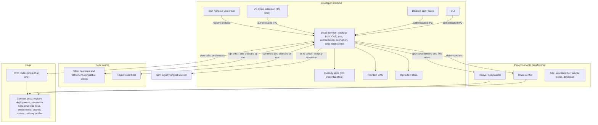
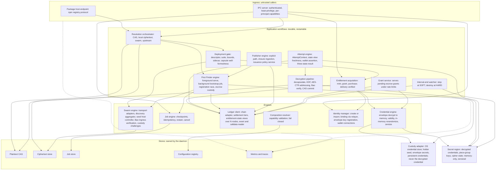
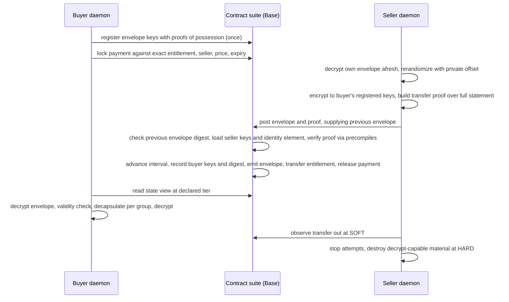
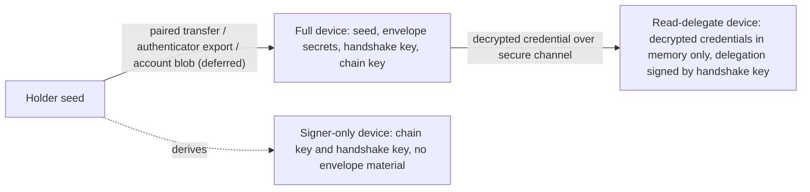

<!-- Template: synthesis_system_architecture.md -->
# Architecture Summary
Draft, 2026-09-23. How the ChainTorrent MVP is designed, synthesized from [cryptography.md](../research/cryptography.md), [MVP Scope](../research/MVP%20Scope.md), [MVP Application Requirements](../research/MVP%20Application%20Requirements.md), the [MVP Execution Trace](../research/MVP%20Execution%20Trace.md), and the planning documents that derive from them, in particular the [technical approach](technical-approach.md), [tech stack](tech-stack.md), [dependency map](dependency-map.md), [product requirements](product-requirements.md), and [risk register](risk-register.md). Those documents are authoritative; this one arranges them as a system design and adds no rule. Where a decision is the user's, it is cited from the product requirements' Resolved Positions; where a choice is a recommendation, it says so.

The system is a protocol client and its supporting services. One canonical ciphertext per deployment plus one public header sidecar per live parameter set is seeded to a peer swarm and committed on chain by three BLAKE3/Bao roots. An entitlement is a single-owner bearer asset on Base, bound to the asset rather than to any deployment. Each ownership interval receives a native credential delivered inside the settlement that creates it, verified by a proof the contract checks through the chain's pairing precompiles. A conforming client authorizes every decryption attempt from a fresh view of consensus state, decrypts locally, and destroys decrypt-capable material when the entitlement leaves it. No service sits on the read path. The MVP applies this to JavaScript dependencies through a local daemon that serves npm's own registry protocol, backed by a machine-wide plaintext cache, the swarm, and the upstream registry, in that order.

# Architecture

## Layers and the decentralization boundary

The specification defines decentralization per layer and draws one boundary from it: a centralized service may exist as a convenience, business, gateway, indexer, or application, but no service may become an unavoidable authority over a property the protocol defines as decentralized. Content distribution, entitlement ownership and transfer, transaction ordering, decryption authorization, content governance, and discovery are decentralized in stated senses; content identity is rights-holder asserted. The relayer, claim verifier, and project seed host are permitted by that rule and named as scaffolding.

## Implementation rings

Three dependency rings with dependencies pointing inward, fixed by the Application Requirements. The protocol and domain ring holds pure Rust types and rules and depends on no host, chain SDK, wallet, transport, or storage engine. The application workflow ring holds Rust use cases as durable restartable jobs and depends on capability contracts, never on an adapter's identity. The adapters and host shells ring holds Rust adapters for every external system and the thin TypeScript shells for Visual Studio Code and npm. Crate boundaries are ring boundaries, so a violation fails to compile.

## Context view



## The cryptographic construction, stated once

Type-3 pairing groups on BLS12-381 primary and BN254 retained, per the launch decision. A parameter set is `g1, u0, u1` in the first group and `g2, hpub = g2^α` in the second; the master scalar `α` is the issuer's. The entitlement's identity element is `F_I = u0 · u1^I`. A credential is `(g1^α · F_I^r, g2^r)`, rerandomized by the seller as `(A · F_I^s, B · g2^s)` without the master scalar, valid under a public pairing check. A capsule is `(g2^t, u0^t, u1^t)`, well-formed under two pairing checks, encapsulating `e(g1, hpub)^t`; decapsulation is two pairings and one scalar multiplication, and the piece-group key is a domain-separated KDF of that value and the context. Envelopes are ElGamal in each source group to the recipient's two independently keyed envelope keys. Delivery proofs are generalized Schnorr under Fiat–Shamir over the full statement. Under the escrow suite the identity element is fixed per asset and any holder authors grants. Security rests on SXDH, decisional BDH-3b, and the random-oracle model; the composition is closed at the research level with proof sketches, concrete loss terms, and an independent re-derivation.

# Services

Every service the project runs is scaffolding no client depends on.

| Service | Runtime | Responsibility | What it must never become |
| --- | --- | --- | --- |
| Local daemon and package host | Rust, single instance per machine | Registry endpoint, CAS orchestration, encrypted acquisition, credential custody, per-attempt authorization, decryption, durable jobs, seed host control, authenticated IPC | A component another machine depends on |
| Relayer or paymaster | Rust service, ERC-4337 EntryPoint v0.7 on Base | Sponsors the free path and the one-time identity binding under per-identity rate limits; reports cost | Anything on the paid path or the read path |
| Claim verifier | Rust service | Authenticates claimants against npm metadata, provenance attestations, and GitHub OAuth; signs vouchers over committed claim sets under a key registered on chain with rotation and revocation | A party a claim depends on being available; it is one implementation behind `IClaimVerifierAdapter` |
| Project seed host and site | Rust daemon instance plus static site with a WebAssembly demonstration | First seeder of the core closure; optional relayer and discovery host; education tier and download | A privileged seeder or a host any client must reach |
| Cryptographic validation harness | Rust binary against Base Sepolia | Measures sizes, timings, and gas; records piece-group size and curve selection | A throwaway; its delivery verifier is the shipped contract |
| Demonstration harness | Rust | Controlled participants, wallets, chain state, and induced failures | Test tooling that can be skipped; the completion boundary makes it load-bearing |

Deferred services, recorded so their boundaries are designed now: an account service owning onboarding state, preferences, a device roster, and optionally an end-to-end encrypted holder seed blob, never an entitlement; a rendezvous relaying end-to-end encrypted sessions between a browser and a daemon that dialed out; a remote head over the daemon's IPC; and a hosted instance as a separate product mode with a service on its read path.

# Components

Grouped by ring. Each row names the module family in the Application Requirements and the interface it implements or consumes.

**Protocol and domain ring.** Canonical identity `BLAKE3(name@version)`; authenticated hash-card and immutable deployment suite; parameter set, master scalar, credential, envelope key pair, envelope, capsule, delivery statement with the challenge context schema; `AttemptContext`; entitlement and interval state; custody state including device roles; manifest and sidecar bounds; claim sets; lifecycle transitions. Guards on every type at every boundary.

**Application workflow ring.** Installation coordinator with a durable checkpointed plan; package serving and resolution orchestrator; First Finder bootstrap as a durable idempotent job; encrypted acquisition; credential delivery at mint, grant, and sale; per-attempt authorization; decryption and CAS commit; seeding; explicit publishing with dependency-closure ingestion; escrow claim; transfer; repair; recovery.

**Adapter ring.** One adapter family per external concern, each declaring capabilities, version, and compatibility:

| Interface | MVP implementation | Declares |
| --- | --- | --- |
| `IPayloadCipherAdapter` | `AesCtrAdapter`, 64-bit IV, 64-bit counter | Counter layouts, `maxAddressableBytes` |
| `IPairingAdapter` | `Bls12381PairingAdapter` primary, `Bn254PairingAdapter` retained | Second-group arithmetic at the verifier, encodings |
| `ICredentialKemAdapter` | `Bb1DepthOneKemAdapter` | Identity scope: entitlement for explicit publishers, asset for escrow |
| `IKeyAgreementAdapter` | `PairingElGamalAdapter` | Envelope algebra |
| `IDeliveryProofAdapter` | `SchnorrFsDeliveryProofAdapter` | Supported envelope algebra, both verifier forms |
| `ISignatureAdapter` | `Ed25519Adapter` at handshake and content layers, `Secp256k1Adapter` at the chain layer | Scheme per layer |
| `ISettlementAdapter` | Base tier mapping: INCLUDED sequencer inclusion, SOFT safe head, HARD L1-finalized, SETTLED fault-proof resolution | Tier vocabulary, reference age |
| `IEntitlementStateAdapter` | Registry views, single and paginated batch, over more than one RPC node | Batch ceiling |
| `IIdentityAdapter`, `IPublisherProofAdapter`, `IClaimVerifierAdapter` | Publisher authority and escrow identity adapters; provenance-then-OAuth proof ordering; attestor verifier | Proof classes |
| `IIngestSourceAdapter` | npm, as-is tarball with integrity attestation, public availability as eligibility | Attestation presence |
| `IPackageHostAdapter` | npm registry protocol served locally | Ecosystem |
| `ISwarmTransportAdapter` | BitTorrent through embedded `librqbit`, pinned, the MVP's sole transport; BLAKE3-native transport reserved for V2 | Integrity structure on the wire |
| `IPeerDiscoveryAdapter` | DHT, tracker, PEX, local, on-chain seeder map | Source, non-authoritative |
| `ISeedHostAdapter` | Owned daemon; delegation to an external client with Bao custody challenges | Capacity, obligated versus voluntary |
| `IKeyCustodyAdapter` | Local keystore under the OS credential store, holder-seed derived | Signing, envelope keys, issuance material, device roles, multi-device, recovery, user presence, publisher seed |

**Host shells.** Visual Studio Code extension and npm bootstrap package as thin TypeScript over the installer and IPC; Tauri desktop and Rust CLI as control surfaces.

## The local daemon, broken out

The daemon is the one process every requirement family meets. It is a single machine-level instance, Rust on `tokio`, that owns the two content stores, the job store, the configuration registry, and the only path to custody, and that exposes exactly two ingress surfaces: npm's registry protocol to package managers and an authenticated IPC to the project's own control surfaces. Everything below is derived from the Application Requirements' module catalogue; each subsystem names the rows that define it. What the sources do not fix, the IPC framing, worker pool sizing, and process supervision details, is marked as decided at the node.

### Internal structure



### Subsystems, what each owns, and what defines it

| Subsystem | Responsibility | Owns | Defined by |
| --- | --- | --- | --- |
| Package host endpoint | Serves npm-compatible metadata and tarball responses; maps coordinates deterministically to the identity hash and authenticated deployment records; leaves dependency resolution, peers, workspaces, overrides, and lockfiles to npm | The registry-protocol listener; nothing else | PR-01, PR-02 |
| IPC server | Authenticated, least-privilege local API for the extension, desktop, CLI, and later a remote head; per-principal capabilities so a project process that requests a package gains no custody, credential, key, or authority; request classes for package, status, control, and administration | The local socket or named pipe; the principal-to-capability table | XA-02, RO-05, IC-08 |
| Resolution orchestrator | Applies the fixed order, local plaintext CAS, local encrypted store, remote encrypted swarm, then upstream ingest; records the chosen path; never falls through a forbidden step | The resolution plan per request | PR-03, PR-06, PR-07 |
| Plaintext CAS | Verified content addressing, atomic temp-then-rename commit, hardlinks or symlinks into `node_modules`, quota, pinning of linked artifacts, eviction with a warning before removing anything not re-authorizable; never evicts ciphertext | The plaintext directory and its index | PR-04, PR-05, PR-06; MVP Scope, Local CAS |
| Deployment gate | Authenticates the canonical record and hash-card, resolves the complete immutable suite, validates piece geometry, piece-group size, addressable extent, and index range, authenticates the sidecar root and each capsule's well-formedness; halts before any credential is exercised | Nothing persistent; a validated descriptor handed to acquisition | EC-01, CR-06; cryptography.md, Manifest Bounds Validation |
| Swarm engine | Runs the resolved transport adapters and concurrent discovery adapters, unions and deduplicates peers, verifies every ingress chunk against the ciphertext or sidecar root before storage, drives the seed host controller in owned or delegated mode, issues Bao custody challenges to a delegated client, resumes transfers after failure | The ciphertext store through `ISeedHostAdapter`, keyed by root with holding reason | SW-01 through SW-07, EC-02 |
| Ledger client | Chain adapter bindings; settlement adapter exposing Base's tiers, the references at which the attempt rule reads and destroys, and reference age; entitlement-state views single and paginated over more than one RPC node, failing closed on disagreement; event and calldata reader for envelope recovery | RPC endpoint set and the per-node view cache | LC-04, LC-06, XA-06, CD-04 |
| Identity manager | Creates or imports the identity; completes the relayer-paid handshake-key binding once; registers envelope keys with proofs of possession once; connects external wallets through EIP-1193 or WalletConnect for signing only; derives keys from the holder seed through the custody adapter | Nothing secret; it calls custody | IW-01, IW-03, IW-05, IW-07 |
| Entitlement acquisition | Inspects the wallet, skips held targets, and acquires the rest: relayer-paid free mint, escrow grant from any online holder, or funded purchase with a payment lock; verifies the delivery proof result and records the persistent credential under custody | The acquisition queue | EC-03, CD-01, CD-02, CD-05, RO-01, RO-02 |
| Credential engine | Decrypts the envelope under the identity's own envelope secrets into the secret region at start-up or on delivery; checks the parameter set's validity equation; may rerandomize in memory; hands the decrypted credential to the attempt engine and to a sale; zeroizes on every terminal transition | The secret region's credential entries | EC-06, CR-04, CR-07, CR-08 |
| Attempt engine | Before every piece-group key derivation, constructs the `AttemptContext`, obtains a state view at the declared tier no older than `τ_soft` and a wallet-control assertion no older than `τ_wallet`, evaluates `AUTHORIZED`, `PENDING_SETTLEMENT` with bounded retry, or `DENIED` with terminal refusal, in single or paginated batch form without losing per-context bindings | The attempt queue and freshness clocks | EC-04, EC-05, LC-06 |
| Decryption pipeline | Decapsulates the group's capsule, derives the piece-group key, decrypts at continuous-stream offsets under the suite's counter layout, verifies plaintext against the authenticated root per Bao chunk, commits atomically to the CAS, and serves the exact upstream tarball; streams while further pieces arrive | Transient decryption contexts in the secret region | EC-07, CR-01, CR-02 |
| Interval-end watcher | Observes a transfer out at SOFT and stops new attempts; at HARD destroys the decrypted credential, piece-group keys, cipher state, keystream, and every live context; leaves the persistent envelope and keys in custody; never strands a still-owner on a reorganization | Subscription to entitlement events | EC-08, LC-05; cryptography.md, Phase 2 step 6 |
| First Finder engine | Foreground: fetch the exact upstream tarball, validate the integrity attestation, commit, serve. Background durable job: allocate the deployment identity under state lock, generate master scalar and parameter set if none is live, capsule randomness and IV, encrypt per group, build sidecar and hash-card, race the escrow registration, on loss destroy everything and follow the winner, on win register and hand off to the seed host, retain the master scalar under custody as escrow custodian | The bootstrap job's checkpoints | FF-01 through FF-08, CR-05, PC-02 |
| Publisher engine | Explicit publisher path with keys derived from the publisher hierarchy; ingests the dependency closure, bootstrapping absent dependencies as First Finder; runs the issuance policy service that serves priced mints automatically under the publisher's configuration, with per-request approval where configured | Publisher configuration and issuance policy | PC-01, FF-09; MVP Scope, Paid Monetization |
| Grant service | Under the escrow suite, authors credentials for pending zero-price grants of assets this identity holds, from its own credential, with the transfer proof against its own envelope, automatically as it seeds and under rate limits | The grant queue | CD-05, CD-08 |
| Job engine | Durable, checkpointed, idempotent, cancellable-where-safe jobs that survive process and machine failure with exactly-once effects or safe compensation; hosts bootstrap, acquisition, seeding, publication, claim, repair, and migration jobs | The job store | XA-03, FF-03, IC-07 |
| Composition resolver | Validates the full adapter composition against declared capabilities and the deployment suite before any operation; refuses incompatible pairs with no side effect | The resolved capability graph | IC-05, SI-10; MVP Scope, Adapter Composition |
| Configuration registry | Versioned defaults, user overrides, secret references, adapter capabilities, endpoints; schema-aware reversible migrations; no raw secrets | The configuration store | IC-04, SI-17 |
| Health and diagnostics | Installed, configured, degraded, incompatible, ready, from active probes; recovery actions; identical facts to every control surface | The health state machine | SI-13, IC-08, RO-05, XA-04 |
| Telemetry | RO-03 metrics without secrets; per-request correlation across every subsystem; redaction at the tracing layer so secret-typed values cannot be formatted; attempt latency against the declared budget | The metrics store and trace exporter | RO-03, RO-04, RO-06, CR-07 |
| Lifecycle and single instance | Single-instance lock per machine; start, stop, restart, and repair hooks the installation coordinator drives; survival across reboot under the platform service manager or a persistent user service | The instance lock and service registration | IC-03, SI-06, SI-16 |

### Trust boundaries inside the process

Five boundaries, each with one rule.

- **Ingress is untrusted.** Every package-host request and every IPC request is validated at the boundary and carries a principal whose capabilities bound what it may cause. A package request can cause resolution and serving and nothing else.
- **The network is untrusted.** No chunk enters the ciphertext store without a Bao authentication path against the authenticated root; no peer or discovery result is authoritative; a delegated seed host's reports are verified by challenge, not believed.
- **The chain is authenticated by agreement.** A state view is accepted only when more than one configured node agrees at the required tier; disagreement fails closed. The upstream registry is authenticated by its integrity attestation as provenance, never as safety.
- **Custody is the only durable home for secrets.** The holder seed, envelope secrets, chain and handshake keys, master scalars, publisher seeds, and per-entitlement persistent credentials live there and nowhere else. The daemon holds a handle, not a copy.
- **The secret region is memory-only.** Decrypted credentials, piece-group keys, expanded cipher state, buffered keystream, and live decryption contexts exist only inside `zeroize`-guarded types that cannot be serialized, logged, or formatted, and are destroyed on success, interval end, cancellation, loss, and error. Nothing from this region crosses IPC, reaches the job store, or reaches telemetry.

### Process and concurrency model

One process, one `tokio` runtime, task groups per ingress and engine: the package-host listener, the IPC server, the swarm engine's transport and discovery tasks, the job engine's workers, the ledger client's view and event tasks, and a bounded worker pool for attempts and decryption so that a large closure does not starve the IPC or the seed host. Pool sizes, backpressure limits, and the IPC framing are decided at their nodes. The secret region is process-local; there is no multi-process split in the MVP, which is why a single-instance lock is load-bearing. A crash anywhere loses only memory-only material, which is by design, and every durable effect resumes from its checkpoint.

### Storage ownership

| Store | Owner subsystem | Keyed by | What never goes in it |
| --- | --- | --- | --- |
| Plaintext CAS | Plaintext CAS | Content hash | Ciphertext, secrets |
| Ciphertext store | Swarm engine via `ISeedHostAdapter` | Ciphertext root, with holding reason | Plaintext, secrets |
| Job store | Job engine | Job identity and checkpoint | Decrypted credentials, keys |
| Configuration registry | Configuration registry | Version | Raw secrets; only references into custody |
| Metrics and traces | Telemetry | Request correlation | Any secret-typed value; any identifying data beyond what the ledger publishes |
| Custody store | Custody adapter, outside the daemon's process memory model | Identity | The decrypted credential, piece-group keys |

### What the daemon exposes to later tiers without change

A remote head drives the same authenticated IPC with a principal whose capabilities exclude value-moving operations. A read-delegate device receives decrypted credentials from the credential engine over a secure channel under a delegation the identity manager signs. A signer-only device connects as an external wallet through the identity manager. The account-link step is a consent-flow entry the installation coordinator already reserves. None of these adds a third ingress surface; each is a capability on one of the two that exist.

### What is not yet specified

Worker pool sizing and backpressure policy; the exact checkpoint schema of each job; the per-principal capability table's contents beyond the rule that a package request confers nothing; and the supervision behavior when a subsystem task panics. Each is decided at the first node that needs it, under the repository's standards, and none changes the boundaries above.

# Data Flows

**Package request.** The [MVP Execution Trace](../research/MVP%20Execution%20Trace.md) holds the complete state machine and is not redrawn here. In summary: plaintext CAS hit serves immediately; otherwise the ledger is consulted; an absent asset takes the First Finder path, serving verified upstream bytes at once and bootstrapping in the background; a present asset passes the manifest gate, acquires and Bao-verifies ciphertext and sidecar, seeds them, acquires an entitlement if absent with delivery verified on chain, loads the credential into memory, and then per piece group reads a state view and decapsulates, finally verifying the plaintext root and committing to the CAS.

**Credential delivery at a sale.** The flow that carries the protocol's hardest invariant.



**First Finder bootstrap.** Foreground: fetch, verify attestation, commit to CAS, serve. Background durable job: allocate deployment identity under state lock, generate master scalar and parameter set if none is live, capsule randomness and IV, encrypt per group, build sidecar and hash-card, race the escrow registration, on loss destroy everything and follow the winner, on win register the parameter set and sidecar root, retain the master scalar as escrow custodian, hand ciphertext and sidecar to the seed host.

**Device roles under one identity.** The multi-device design as decided, with the MVP declaring only the full role.



# Interfaces

The specification fixes signatures for the interfaces it defines; the rest are contracts the nodes author. Fixed signatures:

```
ISettlementAdapter
    currentReferenceAt(tier) -> ref
    tierOf(ref) -> tier

ISignatureAdapter
    isValidSignature(pubkey, message, signature) -> bool
    recoverSigner(message, signature) -> address
    canonicalAddress(pubkey) -> address

IPairingAdapter
    g1, g2
    mul(P, k), add(P, Q)
    pairingProductIsOne([(P_i, Q_i)]) -> bool
    subgroupCheck(P) -> bool

IKeyAgreementAdapter
    wrapTo(recipientPubkey, plaintext) -> cyphertext
    unwrap(recipientPrivkey, cyphertext) -> plaintext

ICredentialKemAdapter
    setup() -> (parameterSet, masterScalar)
    issue(masterScalar, entitlementId) -> credential
    rerandomize(credential) -> credential
    isValid(parameterSet, entitlementId, credential) -> bool
    encapsulate(parameterSet) -> (capsule, K)
    isWellFormed(parameterSet, capsule) -> bool
    decapsulate(credential, entitlementId, capsule) -> K

IDeliveryProofAdapter
    proveMint(masterScalar, coins, statement) -> proof
    proveTransfer(sellerSecrets, offset, coins, statement) -> proof
    verify(statement, proof) -> bool

IEntitlementStateAdapter
    evaluateAuthorization(context) -> AUTHORIZED | PENDING_SETTLEMENT | DENIED
    evaluateAuthorizationBatch(contexts) -> paginated results
```

Contracts every node implements regardless of family, from the repository's standards: dependencies injected at the boundary through a context slice; functions shaped as deps, params, payload, and a `Success | Error` return union; guards on entry for every owned type; `unknown` only at a boundary.

Local IPC is an authenticated, least-privilege request interface; a project process that can request a package gains no custody, credential, key, or authority. The package host exposes npm's registry protocol and nothing else to the package manager.

# Integration Points

| Boundary | Producer | Consumer | Integration test crosses |
| --- | --- | --- | --- |
| Verifier parity | Rust `proof/verify` | Solidity delivery verifier via the chain client | Rust to chain, bit for bit on every vector |
| Precompile encoding | Pairing adapters | Solidity pairing library | Rust encoding to EIP-196, EIP-197, EIP-2537 input formats |
| Decapsulation to cipher | KEM and KDF | Payload cipher | The seam preserved for a future multi-key suite |
| Sidecar commitment | KEM encapsulation | Commitments and hash-card | Capsules under their own Bao root |
| Envelope in settlement | Envelope and proof | Contract suite | Calldata and event; digest stored |
| Attempt context | Domain | Entitlement-state adapter | View call at the declared tier from more than one node |
| Resolution order | Orchestrator | CAS, ciphertext store, transport, ingest | Local, encrypted, swarm, upstream |
| Package-manager protocol | Package host | npm | HTTP registry protocol; resolution stays in npm |
| Persistent credential | Envelope and custody | Credential delivery | Stored only under custody |
| Installer to daemon | Coordinator | Daemon, package host, seed host | Service lifecycle and IPC |
| Shells to coordinator | Extension, npm bootstrap, desktop, CLI | Coordinator | One coordinator, identical postcondition |
| Relayer to contracts | Relayer | Binding and mint | Sponsored transactions under policy |
| Voucher to contract | Claim verifier | Escrow claim surface | Voucher bound to claimant, set, contract, chain, nonce, expiry |
| Site demonstration | WebAssembly build of the client crates | Browser | Same crates as the client; no service on the read path |

# Dependency Resolution

Resolution is the security property, not a convenience. It runs once at installation and again whenever configuration changes, before any credential is exercised, chain mutation sent, or swarm transfer started.

- **Declaration.** Every adapter implementation declares its capabilities, version, and compatibility as data the resolver reads; a consumer never branches on an implementation's name.
- **Composition.** The resolver assembles package-host, ingest, chain, pairing, credential-KEM, key-agreement, delivery-proof, wallet, identity, custody, settlement, entitlement, transport, discovery, and seed-host implementations and validates the complete composition: a delivery-proof adapter is admissible only if it declares the chosen envelope algebra; a custody adapter only if it declares the capabilities the identity needs; a transport only if it can carry what discovery advertises.
- **Suite binding.** For any deployment the client resolves only implementations declared compatible with every field of the authenticated hash-card: pairing adapter, KEM and live parameter sets, cipher and piece-group size, key-agreement, delivery-proof, KDF and hash-to-scalar, delivery-statement version, attempt-rule parameters, settlement tier.
- **Fail closed.** An incompatible composition is refused with no network, chain, authorization, or secret side effect, and readiness is an active health probe, never file or process presence.
- **On chain.** Contracts resolve adapters from a governance-controlled registry through a factory, constructor-injected and immutable once bound; governance of that registry is a single project-held key for the MVP, recorded as scaffolding.

# Conflict Flags

- **Delivery verifier is built in the harness and consumed by the contract suite.** It is production code from the first ticket.
- **Two verifier forms, one shipped.** Both are built and measured; BLS12-381 ships on Base; BN254 is retained.
- **Swarm sprint precedes the contract sprint by dependency but follows it in the business case's grouping.** The dependency map records the parallelism; the groupings are by role.
- **Custody is in the daemon phase but the installer needs it.** The dependency runs the right way; identity and custody are built early in that phase.
- **The escrow record carries no maintainer commitment**, so the escrow claim milestone has no policy gate and the verifier establishes the claim set at verification time.
- **The account-link step exists in the installer's consent flow and does nothing in the MVP.** It is shown as unavailable and the consent trace records it; a reviewer should not read it as dead code.
- **The Tauri stable line is 2; 3 is alpha.** The desktop targets 2.
- **The chain adapter carries no migration.** Entitlements do not move to a second chain; a migration mechanism is a workplan To-Do item and must exist before any second adapter carries live entitlements.

# Sequencing

The [dependency map](dependency-map.md) holds the sequence at decaying resolution and its Mermaid graph. By role: the cryptographic validation harness at ticket resolution, thirty-two source files with four independent starts, closing at the report that fixes piece-group size and curve; the protocol core and contract suite with the swarm sprint in parallel; the local daemon and package serving to the demonstrable milestone where an ordinary `npm install` resolves against the swarm; credential delivery and per-attempt authorization closing the read path; onboarding shells and services with escrow claim last; acceptance and release. External review and legal work start with the harness. Resolution is re-mapped one phase outward as each phase closes.

# Risk Mitigations

Architecture-level mitigations, with the register identifier.

| Risk | Architectural mitigation |
| --- | --- |
| R-02 cost against the latency budget | Harness before any node that encrypts; budget declared before measurement; install-once content crosses the attempt boundary rarely |
| R-03 verifier or composition flaw | One Rust reference verifier; Solidity constants and vectors generated from it; both forms cross-verified; external review gates the priced deployment |
| R-06 consumption privacy | Reads from the client's own node where available; disclosure at first run; account-to-identity mapping never on chain; identity functional without an account |
| R-07 daemon as supply-chain surface | Authenticated artifacts before execution; verified content addressing before serving; authenticated least-privilege IPC; fuzzing at every boundary; signing-key custody |
| R-11 First Finder race | State-locked registration; loser destroys ciphertext, sidecar, master scalar, and derivatives; the plaintext root proves equivalence |
| R-12 chain properties | Chain behind an adapter with settlement as tiers; multi-node reads failing closed; both precompile sets confirmed on Base; sequencer stalls writes only |
| R-14 scaffolding | Every project service behind an interface with a replacement path; default configuration with more than one discovery and RPC source |
| R-15 settlement reversal | Reads at SOFT, destruction at HARD; exposure is one entitlement's credential |
| R-17 secret leakage | Decrypt-capable material memory-only with zeroization; redaction at the tracing layer; custody inspected after decryption and transfer |
| R-19 accepted residuals | Piece-group size bounds exposure; decapsulation-to-cipher seam preserved for a multi-key suite |
| R-21 rendezvous | Outbound-only, end-to-end under a daemon-pinned key, keys never leave, local presence for value-moving operations; deferred |
| R-22 account mapping | Held only by the account service, never on chain, optional, deletable; deferred |

# Risk Signals

Authorization fraction of install wall-clock rising toward the budget. Decapsulation time per group times groups per package approaching the budget. L1 data-fee component of delivery cost rising against the dogfood baseline. Bootstrap completion below the ingest rate. Seeding discontinuity across restart. Grant fulfilment slowing with the First Finder offline. `PENDING_SETTLEMENT` dwell rising. Any sensitive field in a telemetry scan. Any divergence between Rust and on-chain verification. Any IPC call from an unprivileged principal succeeding beyond a package request. Host configuration differing from the pre-install snapshot after a failed install. Attempts halting on node disagreement beyond what one failed node explains. Subsidy consumption outpacing identity creation. A node's dependency declaration naming an adapter with no capability declaration.

# Security Measures

- **Confidentiality** under SXDH, decisional BDH-3b, and the random-oracle model; no party without a credential derives capability from ciphertext, sidecar, envelopes, or proofs.
- **Delivery soundness and replay resistance**: every proof hashes its complete statement; a proof is valid for exactly one settlement; the contract rejects an advanced counter.
- **Per-attempt authorization** from a fresh state view at the declared tier; never a cached view, a prior session, or another interval's credential.
- **No selective withholding**: reading needs no party but the holder; transfer needs seller and buyer only; no step requires a single third party's live action.
- **Secret lifecycle**: decrypted credential, piece-group keys, cipher state, and keystream memory-only and zeroized at every transition; persistent credential only under custody; secret-typed values unformattable at the tracing layer.
- **Boundary validation**: every input untrusted until validated; manifest, hash-card, and sidecar authenticated before any credential is exercised; fuzzing at every adapter contract and IPC request.
- **Local API**: authenticated and least-privileged; a package request confers nothing.
- **Artifacts**: authenticated before execution; platform signing plus Sigstore; signing keys under custody discipline with rotation.
- **Keys**: envelope keys never wallet keys; independent envelope secrets; identity-element keys and trivial identity elements rejected at registration and mint.
- **Claims**: proofs bound to the claimant's chain identity; verifier key revocable on chain.
- **Blast radius**: a leaked credential exposes one asset; a leaked piece-group key one group of one deployment; no number of credentials recovers a master scalar.
- **Stated residuals**: modified-client retention and common piece-group keys, bounded and not overclaimed.

# Observability Strategy

Metrics without secrets: CAS hit and cross-project reuse, install wall-clock and authorization fraction, resolution path, state-read volume and latency, decapsulation time per group, proof generation and verification time, delivery cost as L2 execution and L1 data fee, swarm and ingest bytes, relayer gas, job outcome, adapter health. Structured logs and traces correlate one package request across package host, CAS, swarm, chain, custody, decryption, and background First Finder work. Health states, installed, configured, degraded, incompatible, ready, exposed identically through CLI, desktop, extension, and the daemon API, with recovery actions. Attempt latency evaluated against a budget declared before the run, producing a pass or fail. Telemetry scanned for sensitive fields as a release gate. `tracing` with an OpenTelemetry exporter is the recommended implementation; a local append-only metrics store under the daemon; no external metrics service required.

# Scalability Plan

Credential size is constant across any number of sales; capsule cost is independent of the number of entitlements; issuance is unbounded with no setup-time count. Sidecar overhead is proportional to payload at one capsule per piece group, estimated below one percent at 16 KiB groups and unmeasured until the harness. On-chain state per entitlement is constant per interval; envelopes and proofs are calldata and events. Batch reads paginate with an adapter-advertised ceiling, so a thousand-package closure is one traversal. Deployments are multi-homed across transports as one object; discovery aggregates across concurrent sources. The plaintext CAS and ciphertext store are sized and retained independently. Relayer cost scales with identities and free mints under rate limits, with the grant pool sized from measured Base gas. Streaming content, which would exercise per-attempt authorization continuously, is out of scope; decapsulation time per group is recorded as its baseline. Replication of the swarm object is a constructed factor under the retention obligation, whose enforcement is deferred.

# Resilience Strategy

Long-running operations are durable, restartable, idempotent jobs with exactly-once effects or safe compensation. The daemon and seed host survive reboot and editor closure. Installation, update, repair, and uninstall are checkpointed with rollback to the prior coherent state. Transport and storage failures leave resumable jobs exposing no unauthenticated partial data. The per-attempt state view comes from more than one node; one unreachable node does not deny and inconsistent views fail closed. No single operator's unavailability denies reading, transfer, grant, or claim: reads are local, escrow grants come from any holder, and a claim never needs the First Finder. A reorganized transfer never strands a still-owner because destruction waits for HARD. A lost envelope is recoverable from any honest full-history node. A Base sequencer outage stalls writes and leaves reads untouched. Availability of the swarm object itself rests in the MVP on the project seed host for the core closure and on voluntary seeding for the rest, which is a stated boundary.

# Compliance Controls

Ingest eligibility is free public distribution by the rights holder's choice, implemented as public npm availability, with the residual, unauthorized public redistribution and irrevocability, stated rather than denied revenue; a further license check is an optional policy narrowing held in the workplan. Entitlement records are public by design for public content, and the individual case is disclosed at first run and mitigated by own-node reads. The escrow record publishes no bare hash of an enumerable email; the salt commitment is dropped by default. Telemetry records no secrets and no identifying data beyond what the ledger publishes. User interaction is limited to the permitted consent set and a consent trace fails on anything else. Governance is advisory metadata against a local trust set; no takedown. The software license is source-available with a conformance clause, unstarted; legal review of the license, the eligibility principle, priced entitlements, the paymaster, and export constraints runs in parallel with the harness. Accessibility baselines for the desktop and extension are a proposed non-functional requirement.

# Open Questions

Those with architectural consequence, each carrying a Feedback block; the product requirements hold the full list.

**Multi-device custody sync mechanism.** Recommended: holder-seed derivation of envelope secrets and handshake key, with paired local transfer as the MVP's declared capability and the authenticator export and account blob as later custody adapters; device roles full, read-delegate, and signer-only as versioned custody capabilities, with only the full role declared in the MVP. Assumption if blank: as recommended.

Feedback:

**Pairing library.** arkworks over both curves, with `halo2curves` benchmarked for comparison in the harness. Assumption if blank: arkworks.

Feedback:

**Embedded database for jobs and indexes.** `redb`, with SQLite as the alternative. Assumption if blank: `redb`.

Feedback:

**BitTorrent compatibility base.** `librqbit` evaluated behind the transport adapter, or a from-scratch owned transport. Assumption if blank: evaluate `librqbit` first.

Feedback:

**RPC provider strategy on Base.** Two providers in the default configuration, a project-run node added with the seed host. Assumption if blank: as stated.

Feedback:

**Rendezvous operator, when the deferred tier is scoped.** The project seed host and site, or a separate operator. Assumption if blank: decided when the tier is scoped; no MVP impact.

Feedback:

# Rationale

**Why nothing sits on the read path.** Every system that enforces rights by putting a service or device on the read path inherits its liveness, centralization, and trust costs at every read, and every system that avoids the read path enforces no rights. The credential construction removes the trade-off: a sale delivers the buyer's credential from the seller's own, the contract verifies rather than decides, and reading is local against a state view. The research that reached this closed on 2026-09-22 after excluding threshold provisioning, wrapped shared keys, hardware enclaves, and public-witness constructions, each for a recorded reason.

**Why rings and adapters.** The project intends to own its chain, tokens, keystore, and swarm client, so every touchpoint is an interface with declared capabilities from the first implementation; retrofitting an adapter once deployments exist on chain is the expensive path. Rings make a dependency violation a compile error rather than a review finding.

**Why the immutable suite.** Reinterpreting existing ciphertext under a different construction is how a protocol acquires an undocumented compatibility matrix; a successor deployment with a sidecar per live parameter set is the one path, and entitlements survive it because they bind to the asset.

**Why resolution fails closed before anything happens.** The ordering is the security property: validating before decryption means a malformed manifest never causes a credential to be exercised, and validating a composition before an operation means no key material, state traffic, or swarm activity is spent on a composition that was never going to complete.

**Why the daemon and not a library.** Seeding must survive the editor; the read path must not depend on a browser; a single machine-level instance owns the CAS, the ciphertext store, the jobs, and the IPC, and every control surface attaches to it rather than containing it.

**Why the harness first and why it ships.** Every parameter that gates encryption depends on measurements nobody has; its delivery verifier is the contract the registry calls; and its throughput is the only calibration the project can obtain for everything after it.

**Why Base.** Both precompile sets are live since Isthmus, L2 execution is cheap and the L1 data fee is measurable, bundlers and paymasters exist, and the sequencer is a write-path dependency only. Ethereum mainnet remains a later adapter, and no chain migration exists yet, which is recorded as debt.

**Why the deferred tier is designed now.** An account, a remote head, and a hosted instance would each be easy to build in a way that makes the account the principal, puts a service on the read path, or publishes the deanonymizing mapping. Stating that the account owns onboarding state and never an entitlement, that devices have declared roles under one seed, and that the remote head is a view over local IPC costs nothing in the MVP and prevents the wrong shape later.

# Additional Content

**Relationship to the other documents.** The technical approach describes the components, data, deployment, and sequencing in more detail; the tech stack names the libraries and their verification dates; the dependency map holds the tickets and the graph; the feature spec holds the acceptance criteria and the anticipated capabilities that constrain design choices; the risk register, non-functional review, and success metrics hold what this document cites under risks, security, observability, and compliance. This document is the design view over all of them and states nothing they do not.

**What is not designed here.** Crate and path layout beyond the accepted default, the webview UI framework, the bundler provider, the concrete IPC framing, the exact holder-seed derivation domain strings, and the challenge-hash encodings are decided at the nodes that first need them, under the repository's standards, not in this document.
