# The MVP Execution Trace

When a package manager requests `somePackage` from the host adapter:

```mermaid
flowchart TD
    START([Package request]) --> LOCAL_CACHE{LOCAL_CACHE<br/>Plaintext in CAS?}
    LOCAL_CACHE -- Hit --> SERVE_RETAINED([SERVE_RETAINED<br/>Serve retained plaintext])
    LOCAL_CACHE -- Miss --> MODE_CHECK{MODE_CHECK<br/>Cache-only mode?}
    MODE_CHECK -- Yes --> UPSTREAM_FETCH[UPSTREAM_FETCH<br/>Fetch exact NPM tgz]
    MODE_CHECK -- No --> LEDGER_LOOKUP{LEDGER_LOOKUP<br/>Canonical asset present?}

    LEDGER_LOOKUP -- Absent --> FF_FETCH[FF_FETCH<br/>Fetch exact NPM tgz]
    FF_FETCH --> FF_VERIFY{FF_VERIFY<br/>Release attestation valid or absent?}
    FF_VERIFY -- No --> HALT([HALT<br/>Hard failure])
    FF_VERIFY -- Yes --> UPSTREAM_READY[UPSTREAM_READY<br/>Verified NPM plaintext available]
    UPSTREAM_READY --> CAS_COMMIT_UPSTREAM[CAS_COMMIT_UPSTREAM<br/>Persist upstream plaintext in global CAS]
    CAS_COMMIT_UPSTREAM --> SERVE_UPSTREAM([SERVE_UPSTREAM<br/>Serve initiating install])
    UPSTREAM_READY -. Start asynchronous bootstrap .-> FF_BUILD[FF_BUILD<br/>Allocate deployment identity, generate master scalar,<br/>parameter set, piece-group keys, capsule randomness, and IV,<br/>encrypt per piece group, build sidecar and hash-card]
    FF_BUILD --> REGISTRATION_RACE{REGISTRATION_RACE<br/>State-locked registration result}
    REGISTRATION_RACE -- Lost --> RACE_LOSS_DESTROY[RACE_LOSS_DESTROY<br/>Destroy local ciphertext, sidecar,<br/>master scalar, and decrypt-capable state]
    RACE_LOSS_DESTROY --> REQUEST_REGISTER
    REGISTRATION_RACE -- Won --> PARAMSET_REGISTER[PARAMSET_REGISTER<br/>Parameter set marked live, sidecar root registered]
    PARAMSET_REGISTER --> ESCROW_CUSTODY[ESCROW_CUSTODY<br/>First Finder retains master scalar as escrow custodian]
    ESCROW_CUSTODY --> FF_SEED[FF_SEED<br/>Hand ciphertext and sidecar to seed host]
    FF_SEED --> FIRST_GRANT[FIRST_GRANT<br/>Author the first grant to self under the escrow set]
    FIRST_GRANT --> INDEPENDENT

    LEDGER_LOOKUP -- Present --> LOAD_DEPLOYMENT[LOAD_DEPLOYMENT<br/>Load authenticated descriptor, hash-card, and live parameter sets]
    LOAD_DEPLOYMENT --> MANIFEST_GATE{MANIFEST_GATE<br/>Suite compatible, manifest valid, sidecar authenticated?}
    MANIFEST_GATE -- No --> HALT
    MANIFEST_GATE -- Yes --> ENTITLEMENT_CHECK{ENTITLEMENT_CHECK<br/>Asset-bound entitlement held?}
    ENTITLEMENT_CHECK -- Yes --> CIPHERTEXT_ACQUIRE[CIPHERTEXT_ACQUIRE<br/>Use local ciphertext and sidecar or fetch from peers]
    ENTITLEMENT_CHECK -- No --> ENVELOPE_KEYS{ENVELOPE_KEYS<br/>Envelope keys registered?}
    ENVELOPE_KEYS -- No --> KEY_REGISTER[KEY_REGISTER<br/>Register envelope key pair with proofs of possession]
    KEY_REGISTER --> REQUEST_REGISTER
    ENVELOPE_KEYS -- Yes --> REQUEST_REGISTER[REQUEST_REGISTER<br/>Register a durable grant request,<br/>batched per install, queued until submittable]
    REQUEST_REGISTER --> UPSTREAM_CHECK{UPSTREAM_CHECK<br/>Ingest source available?}
    UPSTREAM_CHECK -- Yes --> UPSTREAM_FETCH
    UPSTREAM_FETCH --> UPSTREAM_VERIFY{UPSTREAM_VERIFY<br/>Release attestation valid or absent,<br/>plaintext root matches the record?}
    UPSTREAM_VERIFY -- Attestation forged --> HALT
    UPSTREAM_VERIFY -- Valid --> CAS_COMMIT_UPSTREAM
    UPSTREAM_VERIFY -- Root mismatch --> DEPLOYMENT_DEAD[DEPLOYMENT_DEAD<br/>Mark deployment unverifiable, withdraw request against its set]
    DEPLOYMENT_DEAD --> CAS_COMMIT_UPSTREAM
    DEPLOYMENT_DEAD -. Start asynchronous bootstrap .-> FF_BUILD
    UPSTREAM_CHECK -- No --> GRANT_WAIT{GRANT_WAIT<br/>Grant fulfilled within the declared budget?}
    GRANT_WAIT -- Yes --> CIPHERTEXT_ACQUIRE
    GRANT_WAIT -- No --> FAIL_PENDING([FAIL_PENDING<br/>Actionable failure, request stays pending,<br/>acquisition continues in background])

    REQUEST_REGISTER -. Background .-> PREFETCH[PREFETCH<br/>Fetch and verify ciphertext and sidecar,<br/>pin until the grant lands, seed blindly]
    PREFETCH --> ENTITLEMENT_ACQUIRE[ENTITLEMENT_ACQUIRE<br/>A holder or the issuance policy authors the credential<br/>and posts envelope and delivery proof, purchase is user-initiated]
    ENTITLEMENT_ACQUIRE --> DELIVERY_VERIFY{DELIVERY_VERIFY<br/>Contract verifies proof, records interval, transfers}
    DELIVERY_VERIFY -- Rejected --> ENTITLEMENT_ACQUIRE
    DELIVERY_VERIFY -- Settled --> GRANT_LANDED[GRANT_LANDED<br/>Mint observed in chain events, envelope recovered,<br/>credential loaded, on this run or the next]
    GRANT_LANDED --> SET_MATCH{SET_MATCH<br/>Held deployment carries the granted set?}
    SET_MATCH -- No --> PREFETCH
    SET_MATCH -- Yes --> INDEPENDENT([INDEPENDENT<br/>Plaintext, ciphertext, and credential held])

    CIPHERTEXT_ACQUIRE --> CIPHERTEXT_VERIFY{CIPHERTEXT_VERIFY<br/>Bao paths match ciphertext and sidecar roots?}
    CIPHERTEXT_VERIFY -- No --> HALT
    CIPHERTEXT_VERIFY -- Yes --> SEED_CIPHERTEXT[SEED_CIPHERTEXT<br/>Persist ciphertext and sidecar in seed host]
    SEED_CIPHERTEXT --> CREDENTIAL_LOAD[CREDENTIAL_LOAD<br/>Decrypt envelope into memory, check validity]
    CREDENTIAL_LOAD --> ATTEMPT_CONTEXT[ATTEMPT_CONTEXT<br/>Construct AttemptContext for this piece group]
    ATTEMPT_CONTEXT --> STATE_VIEW{STATE_VIEW<br/>Quorum view at declared tier, age within τ_soft?}
    STATE_VIEW -- PENDING_SETTLEMENT --> SETTLEMENT_WAIT[SETTLEMENT_WAIT<br/>Wait, then re-read]
    SETTLEMENT_WAIT --> STATE_VIEW
    STATE_VIEW -- DENIED --> HALT
    STATE_VIEW -- AUTHORIZED --> DECAPSULATE[DECAPSULATE<br/>Decapsulate this group's capsule, derive the wrapping key, unwrap the piece-group key]
    DECAPSULATE --> DECRYPT_GROUP[DECRYPT_GROUP<br/>Decrypt and verify the group's pieces]
    DECRYPT_GROUP -- More groups --> ATTEMPT_CONTEXT
    DECRYPT_GROUP -- Asset complete --> PLAINTEXT_VERIFY{PLAINTEXT_VERIFY<br/>Plaintext root valid?}
    PLAINTEXT_VERIFY -- No --> HALT
    PLAINTEXT_VERIFY -- Yes --> CAS_COMMIT[CAS_COMMIT<br/>Persist plaintext in global CAS]
    CAS_COMMIT --> SERVE_DECRYPTED([SERVE_DECRYPTED<br/>Serve newly decrypted plaintext])
    SERVE_DECRYPTED -. Transfer out observed later .-> INTERVAL_END[INTERVAL_END<br/>Stop attempts at declared tier,<br/>destroy decrypt-capable state at HARD]

    ESCROW_CUSTODY -. Maintainer claim presented later .-> CLAIM_VERIFY{CLAIM_VERIFY<br/>Claim valid and settled?}
    CLAIM_VERIFY -- No --> ESCROW_CUSTODY
    CLAIM_VERIFY -- Yes --> AUTHORITY_TRANSFER[AUTHORITY_TRANSFER<br/>Transfer administration, issuance,<br/>and standing to supersede, register claimant parameter set]
    AUTHORITY_TRANSFER --> ESCROW_ERA_CONTINUES[ESCROW_ERA_CONTINUES<br/>Escrow-era credentials keep working,<br/>live deployments gain the claimant's sidecar by addition,<br/>later bodies carry a sidecar per live set, handover optional]
```

The graph's state identifiers define the execution trace; the descriptions below specify what each state does:

* **`LOCAL_CACHE` / `SERVE_RETAINED`.** If the plaintext CAS contains the asset, serve it without network access or authorization. Retained plaintext is outside the authorization boundary.
* **`MODE_CHECK`.** In cache-only mode there is no chain identity, no request, and no prefetch; a miss goes straight to the ingest source and the install is the registry's own with a shared local cache in front of it. In the default mode a miss consults the ledger.
* **`LEDGER_LOOKUP` / `LOAD_DEPLOYMENT`.** Compute `BLAKE3(packageName@version)` and resolve the canonical asset record. An existing record supplies the authenticated deployment descriptor, hash-card, live parameter sets with their sidecar roots, and transport locator set.
* **`FF_FETCH` / `FF_VERIFY` / `UPSTREAM_READY`.** If the asset is absent, require only that the supported NPM adapter can retrieve it. Fetch the exact `.tgz` and verify its release attestation, the registry signature and the digest it covers, as provenance rather than a safety attestation, or record its absence where the source provides none. Successful verification makes the upstream plaintext available simultaneously to the foreground install and the asynchronous First Finder bootstrap.
* **`CAS_COMMIT_UPSTREAM` / `SERVE_UPSTREAM`.** Persist the verified NPM plaintext in the global CAS and serve the initiating installation. This foreground path waits only for the NPM response and its verification; it does not wait for encryption, registration, seeding, request registration, prefetch, credential delivery, grant pickup, or decryption.
* **`FF_BUILD`.** Asynchronous to the initiating install, obtain a registry-assigned deployment identity under state lock, generate a random master scalar and parameter set if none is live for the asset, a random piece-group key and random capsule randomness per piece group and a random IV, encrypt with `AesCtrAdapter` keyed per piece group, wrap each piece-group key under every live set, and construct the header sidecars, the commitments, and the authenticated hash-card.
* **`REGISTRATION_RACE` / `RACE_LOSS_DESTROY`.** The first state-locked escrow registration wins the asset record. A loser destroys its local ciphertext, sidecar, master scalar, expanded cipher state, buffered keystream, and other decrypt-capable derivatives, then registers a grant request against the winner's asset like any new identity. Neither result affects the plaintext already supplied to the initiating install.
* **`PARAMSET_REGISTER` / `ESCROW_CUSTODY` / `FF_SEED` / `FIRST_GRANT`.** The winner's parameter set is marked live for the asset and the sidecar root is registered under it. The First Finder retains the master scalar under `IKeyCustodyAdapter` as escrow custodian, hands ciphertext and sidecar to `ISeedHostAdapter`, and authors the first grant, to itself, which makes it a holder and leaves it independent for the asset. The First Finder never obtains publisher authority, nobody contacts it to read or transfer, and none of these states block the initiating install.
* **`MANIFEST_GATE`.** Authenticate the canonical record and hash-card, resolve every suite component, validate piece geometry, piece-group size, addressable extent, and index bounds, and authenticate the header sidecar for the relevant set against its root with each capsule's well-formedness check. Any failure reaches `HALT` before acquisition or any credential is exercised.
* **`ENTITLEMENT_CHECK` / `ENVELOPE_KEYS` / `KEY_REGISTER` / `REQUEST_REGISTER`.** Check for an asset-bound entitlement. A holder proceeds to acquire ciphertext and decrypt. An identity without one registers its envelope key pair once, with proofs of possession under a wallet signature, and then registers a durable grant request: on chain, batched with every other unheld asset of the same install into one sponsored operation, queued behind the identity's own binding and key registration and while the chain, the relayer, or its budget is unavailable, and fulfillable while the requester is offline. No request is made for an asset already held, for an asset absent from the ledger, or for a priced asset, whose request becomes a notice; a request for an explicit-publisher asset goes to its issuance policy, whose refusal is discretion.
* **`UPSTREAM_CHECK` / `UPSTREAM_FETCH` / `UPSTREAM_VERIFY`.** With the request registered, an identity without a credential is served by the ingest source whenever it is available, because a grant is a chain transaction and waiting for it would make the install slower than the registry. Fetch the exact `.tgz`, verify its release attestation, and check its plaintext root against the canonical record: a valid or absent attestation with a matching root commits and serves; a forged attestation halts.
* **`DEPLOYMENT_DEAD`.** A valid attestation whose bytes do not match the record's plaintext root proves the deployment unverifiable. Mark it so with an advisory, withdraw the request against its set, serve the verified upstream bytes, and bootstrap a fresh escrow deployment of the asset from them through `FF_BUILD`; the identity is never poisoned.
* **`GRANT_WAIT` / `FAIL_PENDING`.** With the ingest source unavailable, wait a bounded time, within the declared budget, for a holder to fulfil the request; a fulfilled grant proceeds to acquire ciphertext and decrypt. Otherwise fail the install with an actionable result: the request stays pending, prefetch and pickup continue in the background, and a retry succeeds the moment a holder appears, without the registry.
* **`PREFETCH`.** In the background, at low priority, under the bandwidth, metered, and battery settings and the ciphertext store's quota, fetch and Bao-verify the deployment's ciphertext and sidecar, pin them until the grant lands, and seed them meanwhile, so the machine is a seeder before it is a holder.
* **`ENTITLEMENT_ACQUIRE` / `DELIVERY_VERIFY`.** The credential author, any holder under an escrow set or the issuance policy for an explicit-publisher asset, posts the envelope encrypted to the requester's registered keys with a delivery proof; the contract verifies the proof through the pairing precompiles, records the interval, the recipient's keys, and the envelope digest, emits the envelope, and transfers the entitlement in one settlement, sponsored by the relayer for the free path. A purchase is user-initiated and follows its declared paid settlement policy; a rejected delivery is the author's to retry and leaves the request open.
* **`GRANT_LANDED` / `SET_MATCH` / `INDEPENDENT`.** The daemon watches chain events for mints to its identity, recovers the envelope from chain history if it was offline when the grant was authored, and loads the credential. If the deployment it holds carries the granted set the asset is independent: plaintext, ciphertext, and credential are all local, and every later action against it needs neither the registry nor any other participant, and nothing at all while plaintext is retained. If the grant is under another live set, prefetch a deployment carrying it first.
* **`CIPHERTEXT_ACQUIRE` / `CIPHERTEXT_VERIFY` / `SEED_CIPHERTEXT`.** Use locally held ciphertext and sidecar or fetch them through the active transport and discovery adapters, verify Bao authentication paths against the ciphertext and sidecar roots, and persist the verified objects in the seed host.
* **`CREDENTIAL_LOAD`.** Decrypt the envelope under the identity's own envelope keys into memory, check the credential against the parameter set's validity equation, and keep the envelope, keys, and interval index as the persistent credential. A missing envelope is recovered from chain history.
* **`ATTEMPT_CONTEXT` / `STATE_VIEW` / `SETTLEMENT_WAIT`.** For each piece group construct the `AttemptContext` and read `evaluateAuthorization` or its semantics-preserving paginated batch form at the deployment's declared tier from a quorum of configured nodes at a common reference, requiring a view no older than `τ_soft` and a wallet-control assertion no older than `τ_wallet`. `PENDING_SETTLEMENT` waits and re-reads, `DENIED` reaches `HALT`, and only `AUTHORIZED` reaches decapsulation.
* **`DECAPSULATE` / `DECRYPT_GROUP`.** Decapsulate the group's capsule under the credential's set with the credential, derive that set's wrapping key, unwrap the piece-group key, decrypt the group's pieces at their continuous-stream offsets, and verify them. More groups cycle back through a fresh attempt; completing the asset moves to plaintext verification.
* **`PLAINTEXT_VERIFY` / `CAS_COMMIT` / `SERVE_DECRYPTED`.** Verify the plaintext root, store the plaintext in the global CAS, and serve it. Ciphertext and sidecar remain separately in the seed host.
* **`INTERVAL_END`.** When a transfer out of the identity is observed at the declared tier, stop new attempts; when it reaches `HARD`, destroy the decrypted credential, piece-group keys, expanded cipher state, buffered keystream, and every live context. The persistent envelope and keys may remain, since the ledger authorizes nothing they decrypt.
* **`CLAIM_VERIFY` / `AUTHORITY_TRANSFER` / `ESCROW_ERA_CONTINUES`.** A later valid, settled maintainer claim transfers administration, issuance control, and standing to supersede, and registers the claimant's own parameter set as live; the First Finder need not be present. Escrow-era credentials keep working, live escrow deployments gain the claimant's sidecar by addition, every later body carries a sidecar for each live set, escrow-era holders may voluntarily migrate to the claimant's set, and handover of the escrow master scalar is an optional encrypted shortcut after which the First Finder erases its copy.
